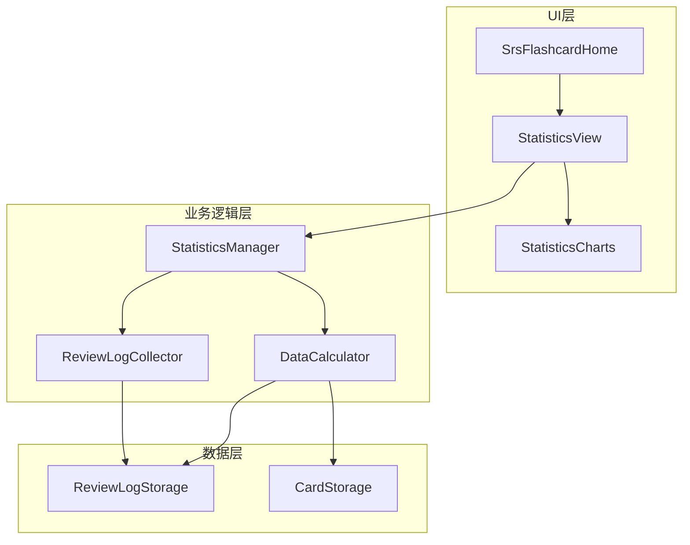

# 设计文档

## 概述

本设计文档描述了为 Flash Home 添加类似 Anki 统计功能的技术实现方案。该功能将提供全面的学习数据可视化，包括今日统计、未来预测、历史回顾、卡片分布等多个维度的数据展示。

### 设计目标

1. **数据完整性** - 准确记录和计算所有复习数据
2. **性能优化** - 大量数据下保持流畅的用户体验
3. **可扩展性** - 便于未来添加新的统计维度
4. **用户友好** - 直观的图表展示和交互体验

## 架构



### 数据流

1. **复习记录流**: 用户复习 → ReviewLogCollector 记录 → ReviewLogStorage 持久化
2. **统计计算流**: StatisticsView 请求 → StatisticsManager 协调 → DataCalculator 计算 → 返回统计数据
3. **展示流**: 统计数据 → StatisticsCharts 渲染 → 用户查看

## 组件和接口

### 1. StatisticsManager (统计管理器)

负责协调统计数据的收集和计算。

```typescript
// src/srs/statisticsManager.ts

export interface StatisticsManager {
  // 获取今日统计
  getTodayStatistics(): Promise<TodayStatistics>
  
  // 获取未来到期预测
  getFutureForecast(days: number): Promise<FutureForecast>
  
  // 获取复习历史
  getReviewHistory(range: TimeRange): Promise<ReviewHistory>
  
  // 获取卡片状态分布
  getCardStateDistribution(): Promise<CardStateDistribution>
  
  // 获取复习时间统计
  getReviewTimeStats(range: TimeRange): Promise<ReviewTimeStats>
  
  // 获取卡片间隔分布
  getIntervalDistribution(): Promise<IntervalDistribution>
  
  // 获取答题按钮统计
  getAnswerButtonStats(range: TimeRange): Promise<AnswerButtonStats>
  
  // 获取卡片难度分布
  getDifficultyDistribution(): Promise<DifficultyDistribution>
}
```

### 2. ReviewLogCollector (复习记录收集器)

负责在复习时记录详细信息。

```typescript
// src/srs/reviewLogCollector.ts

export interface ReviewLogCollector {
  // 记录一次复习
  logReview(log: ReviewLogEntry): Promise<void>
  
  // 获取指定时间范围的复习记录
  getReviewLogs(startDate: Date, endDate: Date): Promise<ReviewLogEntry[]>
  
  // 清理旧记录
  cleanupOldLogs(beforeDate: Date): Promise<number>
}
```

### 3. StatisticsView (统计视图组件)

React 组件，负责统计页面的整体布局和交互。

```typescript
// src/components/StatisticsView.tsx

interface StatisticsViewProps {
  panelId: string
  pluginName: string
  onBack: () => void
}
```

### 4. 图表组件

使用 SVG 实现轻量级图表，避免引入大型图表库。

```typescript
// src/components/charts/BarChart.tsx
// src/components/charts/PieChart.tsx
// src/components/charts/StackedBarChart.tsx
// src/components/charts/LineChart.tsx
```

## 数据模型

### ReviewLogEntry (复习记录条目)

```typescript
export interface ReviewLogEntry {
  id: string                    // 唯一标识 (timestamp + cardId)
  cardId: DbId                  // 卡片 ID
  deckName: string              // 牌组名称
  timestamp: number             // 复习时间戳 (毫秒)
  grade: Grade                  // 评分 (again/hard/good/easy)
  duration: number              // 复习耗时 (毫秒)
  previousInterval: number      // 复习前的间隔天数
  newInterval: number           // 复习后的间隔天数
  previousState: CardState      // 复习前的卡片状态
  newState: CardState           // 复习后的卡片状态
}

export type CardState = "new" | "learning" | "review" | "relearning"
```

### TodayStatistics (今日统计)

```typescript
export interface TodayStatistics {
  reviewedCount: number         // 已复习卡片数
  newLearnedCount: number       // 新学卡片数
  relearnedCount: number        // 重学卡片数 (按了 Again)
  totalTime: number             // 总复习时间 (毫秒)
  gradeDistribution: {          // 评分分布
    again: number
    hard: number
    good: number
    easy: number
  }
}
```

### FutureForecast (未来预测)

```typescript
export interface FutureForecast {
  days: ForecastDay[]           // 每天的预测数据
}

export interface ForecastDay {
  date: Date                    // 日期
  reviewDue: number             // 复习卡到期数
  newAvailable: number          // 可学新卡数
  cumulative: number            // 累计到期数
}
```

### ReviewHistory (复习历史)

```typescript
export interface ReviewHistory {
  days: HistoryDay[]            // 每天的历史数据
  totalReviews: number          // 总复习次数
  averagePerDay: number         // 日均复习数
}

export interface HistoryDay {
  date: Date                    // 日期
  again: number                 // Again 次数
  hard: number                  // Hard 次数
  good: number                  // Good 次数
  easy: number                  // Easy 次数
  total: number                 // 总次数
}
```

### CardStateDistribution (卡片状态分布)

```typescript
export interface CardStateDistribution {
  new: number                   // 新卡数量
  learning: number              // 学习中数量
  review: number                // 复习中数量 (已掌握)
  suspended: number             // 暂停数量
  total: number                 // 总数量
}
```

### IntervalDistribution (间隔分布)

```typescript
export interface IntervalDistribution {
  buckets: IntervalBucket[]     // 间隔分组
  averageInterval: number       // 平均间隔
  maxInterval: number           // 最大间隔
}

export interface IntervalBucket {
  label: string                 // 分组标签 (如 "1-3天")
  minDays: number               // 最小天数
  maxDays: number               // 最大天数
  count: number                 // 卡片数量
}
```

### AnswerButtonStats (答题按钮统计)

```typescript
export interface AnswerButtonStats {
  again: number
  hard: number
  good: number
  easy: number
  total: number
  correctRate: number           // 正确率 (good + easy) / total
}
```

### DifficultyDistribution (难度分布)

```typescript
export interface DifficultyDistribution {
  buckets: DifficultyBucket[]   // 难度分组
  averageDifficulty: number     // 平均难度
  minDifficulty: number         // 最小难度
  maxDifficulty: number         // 最大难度
}

export interface DifficultyBucket {
  label: string                 // 分组标签 (如 "1-2")
  minValue: number              // 最小值
  maxValue: number              // 最大值
  count: number                 // 卡片数量
}
```

### TimeRange (时间范围)

```typescript
export type TimeRange = "1month" | "3months" | "1year" | "all"

export function getTimeRangeStartDate(range: TimeRange): Date {
  const now = new Date()
  switch (range) {
    case "1month":
      return new Date(now.getFullYear(), now.getMonth() - 1, now.getDate())
    case "3months":
      return new Date(now.getFullYear(), now.getMonth() - 3, now.getDate())
    case "1year":
      return new Date(now.getFullYear() - 1, now.getMonth(), now.getDate())
    case "all":
      return new Date(0)
  }
}
```

## 存储设计

### 复习记录存储

使用 `orca.plugins.setData` 存储复习记录，按月份分片存储以优化性能。

```typescript
// 存储键格式: "reviewLogs_YYYY_MM"
// 例如: "reviewLogs_2024_12"

// 存储结构
interface ReviewLogStorage {
  version: number               // 数据版本号
  logs: ReviewLogEntry[]        // 该月的复习记录
}
```

### 存储优化策略

1. **按月分片**: 每月的记录存储在独立的键中，避免单个键数据过大
2. **延迟写入**: 批量收集复习记录，定期写入存储
3. **自动清理**: 超过 1 年的记录自动清理
4. **索引缓存**: 在内存中维护日期索引，加速查询


## 正确性属性

*A property is a characteristic or behavior that should hold true across all valid executions of a system-essentially, a formal statement about what the system should do. Properties serve as the bridge between human-readable specifications and machine-verifiable correctness guarantees.*

### Property 1: 今日统计计算正确性

*For any* 复习记录集合，今日统计的各项数值（已复习数、各评分次数、总时间、新学数、重学数）应该等于对应条件的记录数量之和。

**Validates: Requirements 1.1, 1.2, 1.3, 1.4, 1.5**

### Property 2: 未来预测累计一致性

*For any* 卡片集合和预测天数 N，第 N 天的累计到期数应该等于第 1 天到第 N 天每日到期数的总和。

**Validates: Requirements 2.1, 2.3**

### Property 3: 复习历史评分总和一致性

*For any* 复习历史数据，每天的 again + hard + good + easy 应该等于该天的 total。

**Validates: Requirements 3.1, 3.2**

### Property 4: 时间范围过滤正确性

*For any* 复习记录集合和时间范围，过滤后的记录应该只包含时间范围内的记录，且不遗漏任何符合条件的记录。

**Validates: Requirements 3.3, 5.4, 7.3, 8.2**

### Property 5: 卡片状态分布总和一致性

*For any* 卡片集合，new + learning + review + suspended 应该等于 total。

**Validates: Requirements 4.1, 4.3**

### Property 6: 复习时间平均值正确性

*For any* 复习时间统计数据，averagePerDay 应该等于 totalTime / numberOfDays。

**Validates: Requirements 5.2, 5.3**

### Property 7: 间隔分布分组完整性

*For any* 卡片集合，所有分组的卡片数量之和应该等于总卡片数。

**Validates: Requirements 6.1, 6.2**

### Property 8: 间隔平均值正确性

*For any* 卡片集合，平均间隔应该等于所有卡片间隔之和除以卡片数量。

**Validates: Requirements 6.3**

### Property 9: 答题按钮正确率计算

*For any* 答题按钮统计数据，correctRate 应该等于 (good + easy) / total。

**Validates: Requirements 7.1, 7.4**

### Property 10: 牌组过滤正确性

*For any* 复习记录集合和牌组名称，过滤后的记录应该只包含该牌组的记录，且不遗漏任何符合条件的记录。

**Validates: Requirements 9.2, 9.3, 9.4**

### Property 11: 难度分布统计正确性

*For any* 卡片集合，平均难度应该等于所有卡片难度之和除以卡片数量，且最小值和最大值应该正确反映实际范围。

**Validates: Requirements 10.1, 10.2, 10.3**

### Property 12: 复习记录往返一致性

*For any* 复习记录，序列化后再反序列化应该得到等价的记录对象。

**Validates: Requirements 11.2, 11.3**

### Property 13: 旧记录清理正确性

*For any* 复习记录集合和清理日期，清理后应该只保留清理日期之后的记录。

**Validates: Requirements 11.4**

## 错误处理

### 数据加载错误

1. **存储读取失败**: 显示友好的错误提示，提供重试按钮
2. **数据格式损坏**: 尝试恢复部分数据，记录错误日志
3. **计算超时**: 对大数据集使用分批计算，显示加载进度

### 边界情况

1. **无复习记录**: 显示空状态提示，引导用户开始学习
2. **单条记录**: 正确处理平均值计算（避免除零）
3. **跨时区**: 使用本地时区进行日期计算

### 错误恢复

```typescript
// 错误边界组件
function StatisticsErrorBoundary({ children }: { children: React.ReactNode }) {
  const [hasError, setHasError] = useState(false)
  const [errorMessage, setErrorMessage] = useState("")
  
  // 错误处理逻辑
  if (hasError) {
    return (
      <div className="statistics-error">
        <p>统计数据加载失败: {errorMessage}</p>
        <Button onClick={() => setHasError(false)}>重试</Button>
      </div>
    )
  }
  
  return children
}
```

## 测试策略

### 双重测试方法

本功能采用单元测试和属性测试相结合的方式：

1. **单元测试**: 验证具体示例和边界情况
2. **属性测试**: 验证通用属性在所有输入下都成立

### 属性测试框架

使用 `fast-check` 作为属性测试库，配置每个属性测试运行至少 100 次迭代。

```typescript
import fc from "fast-check"

// 示例：测试今日统计计算
describe("TodayStatistics", () => {
  it("should correctly count reviews by grade", () => {
    fc.assert(
      fc.property(
        fc.array(reviewLogEntryArbitrary()),
        (logs) => {
          const stats = calculateTodayStatistics(logs)
          const expectedTotal = logs.filter(l => isToday(l.timestamp)).length
          return stats.reviewedCount === expectedTotal
        }
      ),
      { numRuns: 100 }
    )
  })
})
```

### 测试数据生成器

```typescript
// 复习记录生成器
const reviewLogEntryArbitrary = () => fc.record({
  id: fc.string(),
  cardId: fc.integer({ min: 1 }),
  deckName: fc.string({ minLength: 1 }),
  timestamp: fc.integer({ min: 0, max: Date.now() }),
  grade: fc.constantFrom("again", "hard", "good", "easy"),
  duration: fc.integer({ min: 0, max: 300000 }),
  previousInterval: fc.integer({ min: 0 }),
  newInterval: fc.integer({ min: 0 }),
  previousState: fc.constantFrom("new", "learning", "review", "relearning"),
  newState: fc.constantFrom("new", "learning", "review", "relearning")
})

// 卡片生成器
const reviewCardArbitrary = () => fc.record({
  id: fc.integer({ min: 1 }),
  deck: fc.string({ minLength: 1 }),
  isNew: fc.boolean(),
  srs: fc.record({
    interval: fc.integer({ min: 0, max: 365 }),
    difficulty: fc.float({ min: 1, max: 10 }),
    due: fc.date(),
    stability: fc.float({ min: 0 }),
    lastReviewed: fc.option(fc.date()),
    reps: fc.integer({ min: 0 }),
    lapses: fc.integer({ min: 0 })
  })
})
```

### 单元测试覆盖

1. **边界情况测试**:
   - 空数据集
   - 单条记录
   - 跨日期边界的记录

2. **集成测试**:
   - 存储读写流程
   - 统计计算流程
   - UI 组件渲染

### 属性测试标注格式

每个属性测试必须使用以下格式标注：

```typescript
/**
 * **Feature: anki-statistics, Property 1: 今日统计计算正确性**
 */
it("should correctly calculate today statistics", () => {
  // 测试实现
})
```

