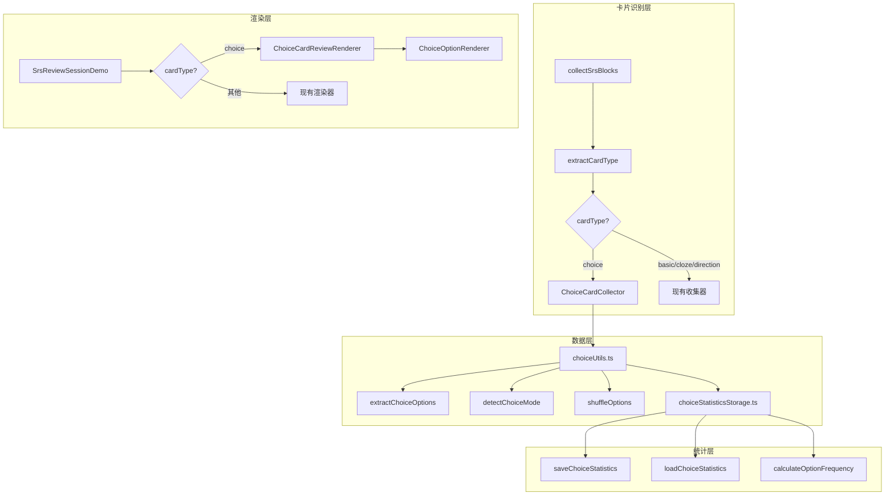

# Design Document: Choice Card (选择题卡片)

## Overview

本设计为 SRS 闪卡系统添加选择题卡片类型。选择题卡片通过 `#choice` + `#card` 标签组合识别，支持单选和多选模式，具有智能乱序、自动评分建议、选择统计等功能。

核心设计原则：
1. **最小侵入** - 复用现有的卡片收集、存储、渲染架构
2. **类型扩展** - 在现有 CardType 枚举中添加 "choice" 类型
3. **统一交互** - 复习流程与现有卡片类型保持一致，仅扩展选项交互

## Architecture



## Components and Interfaces

### 1. 类型定义扩展 (types.ts)

```typescript
// 扩展 CardType
export type CardType = "basic" | "cloze" | "direction" | "excerpt" | "choice"

// 选择题模式
export type ChoiceMode = "single" | "multiple" | "undefined"

// 选择项信息
export interface ChoiceOption {
  blockId: DbId           // 选项块 ID
  text: string            // 选项文本
  content: ContentFragment[]  // 完整内容（用于块渲染）
  isCorrect: boolean      // 是否为正确选项
  isAnchor: boolean       // 是否为锚定选项（"以上"等）
}

// 选择题卡片扩展
export interface ChoiceCardData {
  options: ChoiceOption[]     // 选项列表
  mode: ChoiceMode            // 单选/多选模式
  shuffledOrder: number[]     // 乱序后的索引顺序
}

// 选择统计记录
export interface ChoiceStatisticsEntry {
  timestamp: number           // 选择时间戳
  selectedBlockIds: DbId[]    // 选中的选项 Block IDs
  correctBlockIds: DbId[]     // 正确选项 Block IDs
  isCorrect: boolean          // 是否全部正确
}

// 选择统计存储
export interface ChoiceStatisticsStorage {
  version: number
  entries: ChoiceStatisticsEntry[]
}
```

### 2. 选择题工具模块 (choiceUtils.ts)

```typescript
// 检测是否为选择题标签
export function isChoiceTag(alias: string | undefined): boolean

// 检测是否为正确选项标签
export function isCorrectTag(alias: string | undefined): boolean

// 检测是否为有序标签
export function isOrderedTag(alias: string | undefined): boolean

// 检测是否为锚定选项（包含"以上"等关键词）
export function isAnchorOption(text: string): boolean

// 从块中提取选择项
export function extractChoiceOptions(block: Block): ChoiceOption[]

// 检测选择题模式
export function detectChoiceMode(options: ChoiceOption[]): ChoiceMode

// 智能乱序选项（分段合并算法）
export function shuffleOptions(
  options: ChoiceOption[], 
  isOrdered: boolean
): { options: ChoiceOption[], shuffledOrder: number[] }

// 计算自动评分
// 评分策略：
// - 全对（选中所有正确选项且无错选）-> Good
// - 部分对（多选题：漏选但无错选）-> Hard
// - 有错选或单选题答错 -> Again
// - 无正确答案定义 -> null（跳过自动评分）
export function calculateAutoGrade(
  selectedIds: DbId[],
  correctIds: DbId[],
  mode: ChoiceMode
): Grade | null
```

### 3. 选择统计存储模块 (choiceStatisticsStorage.ts)

```typescript
// 保存选择统计
export async function saveChoiceStatistics(
  blockId: DbId,
  entry: ChoiceStatisticsEntry
): Promise<void>

// 加载选择统计
export async function loadChoiceStatistics(
  blockId: DbId
): Promise<ChoiceStatisticsEntry[]>

// 计算选项选择频率
export function calculateOptionFrequency(
  entries: ChoiceStatisticsEntry[],
  optionBlockIds: DbId[]
): Map<DbId, { total: number, incorrect: number }>

// 序列化统计数据
export function serializeStatistics(storage: ChoiceStatisticsStorage): string

// 反序列化统计数据
export function deserializeStatistics(json: string): ChoiceStatisticsStorage
```

### 4. 选择题渲染组件 (ChoiceCardReviewRenderer.tsx)

```typescript
interface ChoiceCardReviewRendererProps {
  card: ReviewCard
  choiceData: ChoiceCardData
  onAnswer: (selectedIds: DbId[]) => void
  onGrade: (grade: Grade) => void
  isAnswerRevealed: boolean
  suggestedGrade: Grade | null
}
```

### 5. 选项渲染组件 (ChoiceOptionRenderer.tsx)

```typescript
interface ChoiceOptionRendererProps {
  option: ChoiceOption
  index: number
  isSelected: boolean
  isCorrect: boolean
  isAnswerRevealed: boolean
  mode: ChoiceMode
  onClick: () => void
}
```

**样式处理要点：**
- 使用 `overflow: hidden` 和 `text-overflow: ellipsis` 处理长文本
- 图片使用 `max-width: 100%` 和 `max-height: 200px` 限制尺寸
- 代码块使用 `overflow-x: auto` 支持横向滚动
- 嵌套列表使用 `padding-left` 缩进但限制最大深度
- 整体选项容器使用 `min-height` 确保可点击区域

## Data Models

### 块属性存储结构

选择统计存储在卡片块的属性中：

```
属性名: srs.choice.statistics
类型: 1 (文本)
值: JSON 字符串
```

JSON 结构：
```json
{
  "version": 1,
  "entries": [
    {
      "timestamp": 1703404800000,
      "selectedBlockIds": [123, 456],
      "correctBlockIds": [123],
      "isCorrect": false
    }
  ]
}
```

### 锚定关键词列表

```typescript
const ANCHOR_KEYWORDS = [
  "以上", "皆非", "都是", "都不是",
  "all of the above", "none of the above",
  "all above", "none above"
]
```

## Correctness Properties

*A property is a characteristic or behavior that should hold true across all valid executions of a system-essentially, a formal statement about what the system should do. Properties serve as the bridge between human-readable specifications and machine-verifiable correctness guarantees.*

### Property 1: Choice Card Identification
*For any* block with tags, the system should identify it as a choice card if and only if it has both `#card` and `#choice` tags (case-insensitive).
**Validates: Requirements 1.1, 1.2, 1.4**

### Property 2: Correct Option Detection and Mode
*For any* choice card with child blocks, the system should correctly identify options with `#correct` or `#正确` tags (case-insensitive) as correct answers, and determine the mode as "single" when exactly one correct option exists, "multiple" when more than one exists, and "undefined" when none exists.
**Validates: Requirements 2.1, 2.2, 2.3, 2.4**

### Property 3: Direct Child Options Only
*For any* choice card, only direct child blocks should be recognized as options, and nested content within options should be rendered but not treated as independent options.
**Validates: Requirements 1.3, 3.2, 3.3**

### Property 4: Shuffle Algorithm Correctness
*For any* choice card without `#ordered` tag, shuffling should produce a random order where non-anchor options are shuffled and anchor options (containing keywords like "以上", "皆非") are appended at the end in their original order.
**Validates: Requirements 4.1, 4.2, 4.3, 4.4, 4.5**

### Property 5: Auto-Grading Logic
*For any* choice card with defined correct answers:
- Selecting all correct options and no incorrect options should suggest "Good" grade
- In multiple-choice mode, selecting some correct options with no incorrect options should suggest "Hard" grade
- Selecting any incorrect option or (in single-choice mode) selecting wrong option should suggest "Again" grade
**Validates: Requirements 6.1, 6.2**

### Property 6: Statistics Round-Trip
*For any* choice statistics entry, serializing to JSON and deserializing should produce an equivalent entry with the same timestamp, selectedBlockIds, correctBlockIds, and isCorrect values.
**Validates: Requirements 7.5, 7.6**

### Property 7: Statistics Persistence with Block ID
*For any* choice card review, the stored statistics should use Block IDs (not indices) for selected options, and loading should gracefully handle deleted blocks.
**Validates: Requirements 7.1, 7.2, 7.7, 7.8**

### Property 8: SRS Integration
*For any* choice card, it should be collected with the same deck assignment logic, update SRS state with the same algorithm, be included in deck statistics, and be excluded from review queue when suspended.
**Validates: Requirements 9.1, 9.2, 9.3, 9.4**

## Error Handling

### 标签检测错误
- 块无 refs 属性：返回空数组，不识别为选择题
- 标签格式异常：使用 try-catch 包装，记录日志并跳过

### 选项提取错误
- 无子块：返回空选项列表，卡片仍可显示但无选项
- 子块加载失败：记录错误，跳过该选项

### 统计存储错误
- JSON 解析失败：返回空统计，记录警告日志
- 属性写入失败：显示错误通知，不阻塞复习流程

### 渲染错误
- 块内容渲染失败：使用 ErrorBoundary 包装，显示降级文本

## Testing Strategy

### 单元测试

使用 Vitest 进行单元测试：

1. **choiceUtils.test.ts**
   - 标签检测函数（isChoiceTag, isCorrectTag, isOrderedTag）
   - 锚定选项检测（isAnchorOption）
   - 选项提取（extractChoiceOptions）
   - 模式检测（detectChoiceMode）
   - 乱序算法（shuffleOptions）
   - 自动评分（calculateAutoGrade）

2. **choiceStatisticsStorage.test.ts**
   - 序列化/反序列化
   - 频率计算
   - 已删除块处理

### 属性测试

使用 fast-check 进行属性测试：

1. **选择题识别属性测试**
   - 生成随机标签组合，验证识别逻辑

2. **乱序算法属性测试**
   - 生成随机选项列表，验证锚定选项位置

3. **统计序列化属性测试**
   - 生成随机统计数据，验证 round-trip

4. **自动评分属性测试**
   - 生成随机选择场景，验证评分逻辑

### 测试标注格式

每个属性测试必须包含注释：
```typescript
/**
 * **Feature: choice-card, Property 1: Choice Card Identification**
 * **Validates: Requirements 1.1, 1.2, 1.4**
 */
```
