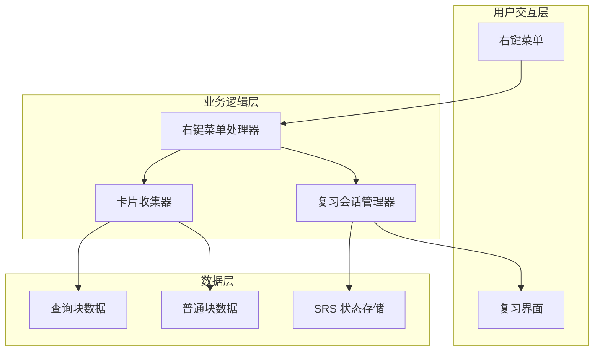

# 设计文档

## 概述

本功能为虎鲸笔记 SRS 闪卡插件添加右键菜单复习功能，允许用户通过右键点击块来启动针对性的复习会话。功能支持两种场景：
1. 查询块：收集查询结果中带 #Card 标签的块进行复习
2. 普通块：递归遍历子块，收集带 #Card 标签的块进行复习

该功能引入"重复复习模式"，允许用户在同一会话中多次复习卡片，不受常规复习队列的到期时间限制。

## 架构



## 组件和接口

### 1. 右键菜单注册模块 (contextMenuRegistry.ts)

负责注册和管理右键菜单项。

```typescript
interface ContextMenuConfig {
  id: string
  label: string
  icon?: string
  condition: (blockId: DbId) => boolean
  action: (blockId: DbId) => Promise<void>
  badge?: (blockId: DbId) => Promise<string | null>
}

// 注册右键菜单
function registerContextMenu(pluginName: string): void

// 注销右键菜单
function unregisterContextMenu(pluginName: string): void
```

### 2. 块卡片收集器 (blockCardCollector.ts)

负责从指定块收集卡片。

```typescript
interface CollectOptions {
  includeChildren?: boolean  // 是否包含子块
  recursive?: boolean        // 是否递归遍历
}

// 从查询块收集卡片
async function collectCardsFromQueryBlock(
  blockId: DbId,
  pluginName: string
): Promise<ReviewCard[]>

// 从普通块收集子块卡片
async function collectCardsFromChildren(
  blockId: DbId,
  pluginName: string,
  options?: CollectOptions
): Promise<ReviewCard[]>

// 判断块是否为查询块
function isQueryBlock(block: Block): boolean

// 获取查询块的结果列表
async function getQueryResults(blockId: DbId): Promise<DbId[]>

// 递归获取所有子块 ID
async function getAllDescendantIds(blockId: DbId): Promise<DbId[]>
```

### 3. 重复复习会话管理器 (repeatReviewManager.ts)

管理重复复习模式的会话状态。

```typescript
interface RepeatReviewSession {
  cards: ReviewCard[]
  currentRound: number
  totalRounds: number
  isRepeatMode: boolean
  sourceBlockId: DbId
  sourceType: 'query' | 'children'
}

// 创建重复复习会话
async function createRepeatReviewSession(
  cards: ReviewCard[],
  sourceBlockId: DbId,
  sourceType: 'query' | 'children'
): Promise<RepeatReviewSession>

// 重置当前轮次（再复习一轮）
function resetCurrentRound(session: RepeatReviewSession): RepeatReviewSession

// 获取当前会话状态
function getRepeatReviewSession(): RepeatReviewSession | null
```

### 4. 复习会话渲染器扩展 (SrsRepeatReviewRenderer.tsx)

扩展现有复习会话渲染器，支持重复复习模式。

```typescript
interface RepeatReviewProps {
  cards: ReviewCard[]
  isRepeatMode: boolean
  sourceBlockId: DbId
  sourceType: 'query' | 'children'
  onClose?: () => void
  onRepeatRound?: () => void
}
```

## 数据模型

### 扩展 ReviewCard 类型

```typescript
// 现有 ReviewCard 类型无需修改，复用现有定义
type ReviewCard = {
  id: DbId
  front: string
  back: string
  srs: SrsState
  isNew: boolean
  deck: string
  clozeNumber?: number
  directionType?: "forward" | "backward"
  content?: ContentFragment[]
  tags?: TagInfo[]
}
```

### 重复复习会话状态

```typescript
type RepeatReviewSessionState = {
  cards: ReviewCard[]
  originalCards: ReviewCard[]  // 原始卡片列表（用于重置）
  currentIndex: number
  currentRound: number
  isRepeatMode: true
  sourceBlockId: DbId
  sourceType: 'query' | 'children'
}
```

## 正确性属性

*属性是系统在所有有效执行中应保持为真的特征或行为——本质上是关于系统应该做什么的形式化陈述。属性作为人类可读规范和机器可验证正确性保证之间的桥梁。*

### Property 1: 查询块卡片收集完整性
*对于任意*查询块及其结果列表，收集函数返回的卡片集合应该等于结果列表中所有带 #Card 标签块的集合
**Validates: Requirements 1.2**

### Property 2: 子块递归遍历完整性
*对于任意*块及其子块树，递归遍历函数应该访问树中的每一个节点
**Validates: Requirements 2.2, 2.3**

### Property 3: 卡片转换一致性
*对于任意*带 #Card 标签的块，转换为 ReviewCard 后应保留原始块的 ID、内容和 SRS 状态
**Validates: Requirements 1.3, 2.4**

### Property 4: 重复复习队列重置
*对于任意*重复复习会话，重置后的卡片队列应该与原始卡片队列相同
**Validates: Requirements 3.2**

### Property 5: SRS 状态更新正确性
*对于任意*卡片和评分，评分后的 SRS 状态应该根据 FSRS 算法正确更新
**Validates: Requirements 3.4**

### Property 6: Cloze 卡片展开
*对于任意* Cloze 卡片，生成的 ReviewCard 数量应该等于卡片中填空编号的数量
**Validates: Requirements 5.4**

### Property 7: Direction 卡片展开
*对于任意* Direction 卡片，生成的 ReviewCard 数量应该根据方向类型为 1（单向）或 2（双向）
**Validates: Requirements 5.5**

## 错误处理

### 块不存在
- 当右键点击的块已被删除时，显示错误提示"块不存在"
- 不启动复习会话

### 查询结果为空
- 当查询块没有结果时，显示提示"查询结果为空"
- 菜单项显示为禁用状态

### 无卡片可复习
- 当收集到的卡片数量为 0 时，显示提示"没有找到卡片"
- 不启动复习会话

### 卡片加载失败
- 当卡片数据加载失败时，显示错误提示并提供重试选项
- 记录错误日志

## 测试策略

### 单元测试

使用 Vitest 进行单元测试：

1. **块类型判断测试**
   - 测试 `isQueryBlock` 函数对各种块类型的判断
   - 测试边界情况：空块、无 _repr 属性的块

2. **卡片收集测试**
   - 测试从查询块收集卡片
   - 测试从普通块递归收集子块卡片
   - 测试空结果处理

3. **重复复习会话测试**
   - 测试会话创建
   - 测试队列重置
   - 测试轮次计数

### 属性测试

使用 fast-check 进行属性测试，每个属性测试运行至少 100 次迭代：

1. **Property 1 测试**: 生成随机查询结果列表，验证收集完整性
2. **Property 2 测试**: 生成随机深度的块树，验证遍历完整性
3. **Property 3 测试**: 生成随机卡片块，验证转换一致性
4. **Property 4 测试**: 生成随机卡片队列，验证重置后相等
5. **Property 5 测试**: 生成随机评分，验证 SRS 状态更新
6. **Property 6 测试**: 生成随机 Cloze 卡片，验证展开数量
7. **Property 7 测试**: 生成随机 Direction 卡片，验证展开数量

### 测试框架配置

```typescript
// vitest.config.ts
export default {
  test: {
    globals: true,
    environment: 'jsdom',
    include: ['src/**/*.test.ts', 'src/**/*.test.tsx']
  }
}
```
