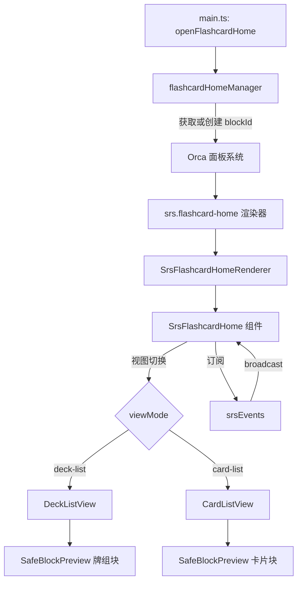

# 设计文档

## 概述

Flash Home（闪卡主页）是 SRS 插件的卡片浏览器和仪表板功能。它以块渲染器的形式嵌入 Orca 面板系统，提供统计概览、Deck 管理和卡片列表浏览功能。

核心设计原则：
- 使用 Orca 原生 Block 组件渲染牌组和卡片，保持与编辑器一致的风格
- 通过事件订阅实现与复习面板的数据同步
- 确保 React Hooks 调用顺序一致，避免 Error #185

## 架构



## 组件和接口

### 1. SrsFlashcardHomeRenderer

块渲染器包装组件，负责：
- 接收 Orca 块渲染器 props
- 加载数据并传递给主组件
- 使用 ErrorBoundary 包裹

```typescript
type RendererProps = {
  panelId: string
  blockId: DbId
  rndId: string
  blockLevel: number
  indentLevel: number
  mirrorId?: DbId
  initiallyCollapsed?: boolean
  renderingMode?: "normal" | "simple" | "simple-children"
}
```

### 2. SrsFlashcardHome

主界面组件，管理视图状态和数据加载。

```typescript
type SrsFlashcardHomeProps = {
  panelId: string
  pluginName: string
  onClose?: () => void
}

type ViewMode = "deck-list" | "card-list"

// 组件内部状态
type FlashcardHomeState = {
  viewMode: ViewMode
  selectedDeck: string | null
  cards: ReviewCard[]
  deckStats: DeckStats
  todayStats: TodayStats
  isLoading: boolean
  errorMessage: string | null
  currentFilter: FilterType
}
```

### 3. flashcardHomeManager

块管理模块，负责创建、复用和清理 Flash Home 块。

```typescript
// 获取或创建 Flash Home 块
async function getOrCreateFlashcardHomeBlock(pluginName: string): Promise<DbId>

// 清理块记录
async function cleanupFlashcardHomeBlock(pluginName: string): Promise<void>
```

### 4. 统计计算函数

```typescript
// 计算首页统计数据
function calculateHomeStats(cards: ReviewCard[]): TodayStats {
  // todayCount: 今天到期的复习卡片（不含新卡）
  // newCount: 新卡数量
  // pendingCount: 所有待复习卡片（<= 今天）
  // totalCount: 总卡片数
}
```

## 数据模型

### TodayStats（首页统计）

```typescript
type TodayStats = {
  pendingCount: number  // 待复习卡片数（<= 今天，不含新卡）
  todayCount: number    // 今天到期的复习卡片数
  newCount: number      // 新卡数量
  totalCount: number    // 总卡片数
}
```

### FilterType（卡片筛选类型）

```typescript
type FilterType = "all" | "overdue" | "today" | "future" | "new"
```

### 视图状态

```typescript
type ViewState = {
  viewMode: "deck-list" | "card-list"
  selectedDeck: string | null
  currentFilter: FilterType
}
```

## 正确性属性

*属性是系统在所有有效执行中应保持为真的特征或行为——本质上是关于系统应该做什么的形式化陈述。属性作为人类可读规范和机器可验证正确性保证之间的桥梁。*

### Property 1: 统计数据一致性

*对于任意* ReviewCard 数组，calculateHomeStats 返回的 todayCount + newCount + futureCount 应等于 totalCount 减去 overdueCount
**验证: 需求 1.1, 1.2, 1.3**

### Property 2: 筛选结果正确性

*对于任意* 卡片列表和筛选条件，筛选后的卡片列表中每张卡片都应满足该筛选条件
**验证: 需求 4.3**

### Property 3: 块复用一致性

*对于任意* 连续两次调用 getOrCreateFlashcardHomeBlock，如果第一次创建的块仍然存在，则第二次应返回相同的 blockId
**验证: 需求 5.2**

### Property 4: 视图状态保持

*对于任意* 刷新操作，刷新前后的 viewMode 和 selectedDeck 应保持不变
**验证: 需求 6.3**

### Property 5: 牌组统计完整性

*对于任意* DeckInfo，其 totalCount 应等于 newCount + overdueCount + todayCount + futureCount
**验证: 需求 3.2**

## 错误处理

### React Error #185 预防

1. **Hooks 调用顺序一致**：所有 useState/useEffect 必须在组件顶层无条件调用
2. **条件渲染在 Hooks 之后**：先声明所有 Hooks，再进行条件判断
3. **避免在回调中调用 Hooks**：Hooks 只能在函数组件顶层调用

```typescript
// ✅ 正确示例
function SrsFlashcardHome(props) {
  // 1. 所有 Hooks 在顶层声明
  const [viewMode, setViewMode] = useState<ViewMode>("deck-list")
  const [cards, setCards] = useState<ReviewCard[]>([])
  const [isLoading, setIsLoading] = useState(true)
  
  useEffect(() => { /* ... */ }, [])
  
  // 2. 条件渲染在 Hooks 之后
  if (isLoading) return <Loading />
  if (errorMessage) return <Error />
  
  return <Content />
}
```

### ErrorBoundary 包裹

```typescript
<SrsErrorBoundary componentName="Flash Home" errorTitle="Flash Home 加载出错">
  <SrsFlashcardHome {...props} />
</SrsErrorBoundary>
```

### BlockPreview 降级策略

```typescript
function SafeDeckBlock({ deckBlockId, deckInfo }) {
  try {
    return <SafeBlockPreview blockId={deckBlockId} panelId={virtualPanelId} />
  } catch (error) {
    // 降级到简单文本显示
    return <BlockTextPreview blockId={deckBlockId} />
  }
}
```

## 测试策略

### 单元测试

1. **calculateHomeStats 函数**：验证统计计算逻辑
2. **筛选函数**：验证各筛选条件的正确性
3. **flashcardHomeManager**：验证块创建和复用逻辑

### 属性测试

使用 fast-check 库进行属性测试，每个属性测试运行至少 100 次迭代。

```typescript
// 示例：统计数据一致性测试
// **Feature: flash-home, Property 1: 统计数据一致性**
test.prop([fc.array(reviewCardArbitrary)])('统计数据一致性', (cards) => {
  const stats = calculateHomeStats(cards)
  // 验证属性
})
```

### 测试框架

- 单元测试：Vitest
- 属性测试：fast-check

