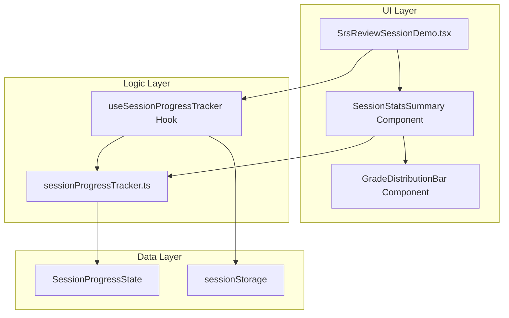

# Design Document: Review Progress Tracking

## Overview

本设计为 SRS 复习系统添加会话级别的进度追踪功能。核心目标是在复习会话中实时追踪用户的复习进度，并在会话结束时提供详细的统计摘要。

主要功能包括：
- 评分分布追踪（Again/Hard/Good/Easy 计数）
- 准确率计算（记忆保留率）
- 时间统计（会话总时长、有效复习时长、平均耗时）
- 会话结束统计摘要展示
- 进度数据序列化/反序列化

## Architecture



### 架构说明

采用 **Hook 模式** 实现逻辑与视图分离：

1. **sessionProgressTracker.ts** - 纯函数模块，包含所有计算逻辑，便于单元测试
2. **useSessionProgressTracker Hook** - 封装状态管理和副作用，连接纯函数与 React 组件
3. **UI 组件** - 仅负责渲染，从 Hook 获取数据

这种设计的优点：
- **可测试性**：纯函数可独立测试，无需渲染 UI
- **复用性**：Hook 可在不同复习界面复用
- **关注点分离**：计算逻辑、状态管理、UI 渲染各司其职

## Components and Interfaces

### 1. SessionProgressTracker (src/srs/sessionProgressTracker.ts)

核心进度追踪模块，**纯函数实现**，负责所有计算逻辑。

```typescript
/**
 * 会话进度状态
 */
export interface SessionProgressState {
  version: number                    // 数据版本号
  sessionStartTime: number           // 会话开始时间戳
  gradeDistribution: GradeDistribution  // 评分分布
  totalGradedCards: number           // 已评分卡片总数
  effectiveReviewTime: number        // 有效复习时长（毫秒）
  cardDurations: number[]            // 每张卡片的复习时长（用于计算）
}

/**
 * 评分分布
 */
export interface GradeDistribution {
  again: number
  hard: number
  good: number
  easy: number
}

/**
 * 会话统计摘要
 */
export interface SessionStatsSummary {
  totalReviewed: number              // 已复习卡片数
  totalSessionTime: number           // 会话总时长（毫秒）
  effectiveReviewTime: number        // 有效复习时长（毫秒）
  averageTimePerCard: number         // 平均每卡耗时（毫秒）
  accuracyRate: number               // 准确率（0-1）
  gradeDistribution: GradeDistribution
}

/**
 * 序列化数据结构
 */
export interface SerializedSessionData {
  version: number
  data: SessionProgressState
}

// 闲置超时阈值（毫秒）
export const IDLE_TIMEOUT_THRESHOLD = 60 * 1000  // 60秒

// 当前数据版本
export const CURRENT_VERSION = 1

/**
 * 创建初始进度状态
 */
export function createInitialProgressState(): SessionProgressState

/**
 * 记录一次评分（纯函数，返回新状态）
 * @param state - 当前进度状态
 * @param grade - 评分
 * @param duration - 本次复习耗时（毫秒）
 * @returns 更新后的进度状态
 */
export function recordGrade(
  state: SessionProgressState,
  grade: Grade,
  duration: number
): SessionProgressState

/**
 * 计算准确率
 * @param distribution - 评分分布
 * @returns 准确率（0-1），无评分时返回 0
 */
export function calculateAccuracyRate(distribution: GradeDistribution): number

/**
 * 计算有效复习时长（应用闲置超时阈值）
 * @param duration - 原始耗时
 * @returns 有效耗时（不超过阈值）
 */
export function calculateEffectiveDuration(duration: number): number

/**
 * 生成会话统计摘要
 * @param state - 进度状态
 * @param sessionEndTime - 会话结束时间戳
 * @returns 统计摘要
 */
export function generateStatsSummary(
  state: SessionProgressState,
  sessionEndTime: number
): SessionStatsSummary

/**
 * 格式化时长为 HH:MM:SS
 * @param milliseconds - 毫秒数
 * @returns 格式化字符串
 */
export function formatDuration(milliseconds: number): string

/**
 * 格式化准确率为百分比字符串
 * @param rate - 准确率（0-1）
 * @returns 百分比字符串，如 "85.5%"
 */
export function formatAccuracyRate(rate: number): string

/**
 * 序列化进度状态
 * @param state - 进度状态
 * @returns JSON 字符串
 */
export function serializeProgressState(state: SessionProgressState): string

/**
 * 反序列化进度状态
 * @param json - JSON 字符串
 * @returns 进度状态，版本不匹配时抛出错误
 */
export function deserializeProgressState(json: string): SessionProgressState
```

### 2. useSessionProgressTracker Hook (src/hooks/useSessionProgressTracker.ts)

封装状态管理和副作用的 React Hook。

```typescript
interface UseSessionProgressTrackerOptions {
  autoSave?: boolean           // 是否自动保存到 sessionStorage
  storageKey?: string          // sessionStorage 键名
}

interface UseSessionProgressTrackerReturn {
  // 状态
  progressState: SessionProgressState
  statsSummary: SessionStatsSummary | null
  accuracyRate: number         // 实时准确率（useMemo 派生）
  
  // 操作
  recordGrade: (grade: Grade, duration: number) => void
  resetSession: () => void
  finishSession: () => SessionStatsSummary
  
  // 序列化
  serialize: () => string
  restore: (json: string) => boolean
}

export function useSessionProgressTracker(
  options?: UseSessionProgressTrackerOptions
): UseSessionProgressTrackerReturn
```

**实现要点：**

1. 使用 `useRef` 记录 `cardStartTime`，避免不必要的重渲染
2. 使用 `useMemo` 派生 `accuracyRate`，避免冗余状态
3. 使用 `useEffect` 实现自动保存到 `sessionStorage`
4. 组件挂载时尝试从 `sessionStorage` 恢复状态

### 3. SessionStatsSummary Component

会话结束时显示的统计摘要组件。

```typescript
type SessionStatsSummaryProps = {
  stats: SessionStatsSummary
  onClose?: () => void
  onRepeatRound?: () => void
  isRepeatMode?: boolean
  currentRound?: number
}
```

### 4. GradeDistributionBar Component

评分分布可视化组件（颜色条），使用 CSS Flex 布局实现，无需图表库。

```typescript
type GradeDistributionBarProps = {
  distribution: GradeDistribution
  showLabels?: boolean  // 是否显示数字标签
}
```

**实现方式：**
- 容器 `div` 使用 `display: flex`
- 4 个子 `div`，宽度按百分比 `flex-basis`
- 颜色：Again(红) / Hard(黄) / Good(绿) / Easy(蓝)

## Data Models

### SessionProgressState

| 字段 | 类型 | 说明 |
|------|------|------|
| version | number | 数据版本号，当前为 1 |
| sessionStartTime | number | 会话开始时间戳（毫秒） |
| gradeDistribution | GradeDistribution | 评分分布对象 |
| totalGradedCards | number | 已评分卡片总数 |
| effectiveReviewTime | number | 有效复习时长（毫秒） |
| cardDurations | number[] | 每张卡片的有效复习时长数组 |

### GradeDistribution

| 字段 | 类型 | 说明 |
|------|------|------|
| again | number | Again 评分次数 |
| hard | number | Hard 评分次数 |
| good | number | Good 评分次数 |
| easy | number | Easy 评分次数 |

## Correctness Properties

*A property is a characteristic or behavior that should hold true across all valid executions of a system-essentially, a formal statement about what the system should do. Properties serve as the bridge between human-readable specifications and machine-verifiable correctness guarantees.*

### Property 1: Grade distribution consistency
*For any* sequence of grade actions, the sum of all grade counts in the distribution SHALL equal the total graded cards count.
**Validates: Requirements 1.1, 2.1**

### Property 2: Time formatting correctness
*For any* duration in milliseconds, formatting to HH:MM:SS and parsing back SHALL produce the same duration (within 1 second precision).
**Validates: Requirements 1.2, 4.4**

### Property 3: Effective duration capping
*For any* card review duration, the effective duration SHALL be the minimum of the actual duration and the IDLE_TIMEOUT_THRESHOLD.
**Validates: Requirements 1.3, 4.3, 5.1**

### Property 4: Average time calculation
*For any* session with N graded cards and total effective time T, the average time per card SHALL equal T / N (or 0 if N is 0).
**Validates: Requirements 1.5, 5.2**

### Property 5: Accuracy rate calculation
*For any* grade distribution, the accuracy rate SHALL equal (hard + good + easy) / total, or 0 if total is 0.
**Validates: Requirements 1.6, 3.1, 3.2**

### Property 6: Session duration calculation
*For any* session with start time S and end time E, the total session duration SHALL equal E - S.
**Validates: Requirements 4.2**

### Property 7: Serialization round-trip
*For any* valid SessionProgressState, serializing then deserializing SHALL produce an equivalent state object.
**Validates: Requirements 6.1, 6.2, 6.3**

## Error Handling

| 场景 | 处理方式 |
|------|----------|
| 反序列化版本不匹配 | 记录警告日志，返回新的初始状态（优雅降级） |
| 反序列化 JSON 格式错误 | 捕获 SyntaxError，返回新的初始状态 |
| 计算平均时间时卡片数为 0 | 返回 0 |
| 计算准确率时总评分为 0 | 返回 0 |
| 负数时长输入 | 视为 0 处理 |
| sessionStorage 不可用 | 静默失败，不影响核心功能 |

## Testing Strategy

### Property-Based Testing

使用 fast-check 库进行属性测试，验证核心计算逻辑的正确性。

测试文件：`src/srs/sessionProgressTracker.test.ts`

每个属性测试配置运行 100 次迭代，使用智能生成器约束输入空间：

1. **Grade 生成器**: 生成 "again" | "hard" | "good" | "easy"
2. **Duration 生成器**: 生成 0 到 300000 毫秒（0-5分钟）的随机时长
3. **GradeDistribution 生成器**: 生成各评分 0-100 的随机分布
4. **SessionProgressState 生成器**: 生成完整的进度状态对象

### Unit Tests

针对边界情况和特定示例的单元测试：

1. 初始状态验证（所有计数为 0）
2. 零卡片时的准确率和平均时间
3. 时间格式化边界（0秒、59秒、1小时、24小时+）
4. 版本号验证
5. sessionStorage 恢复逻辑

### Test Annotations

每个属性测试必须包含注释，格式为：
```typescript
// **Feature: review-progress-tracking, Property {number}: {property_text}**
// **Validates: Requirements X.Y**
```

