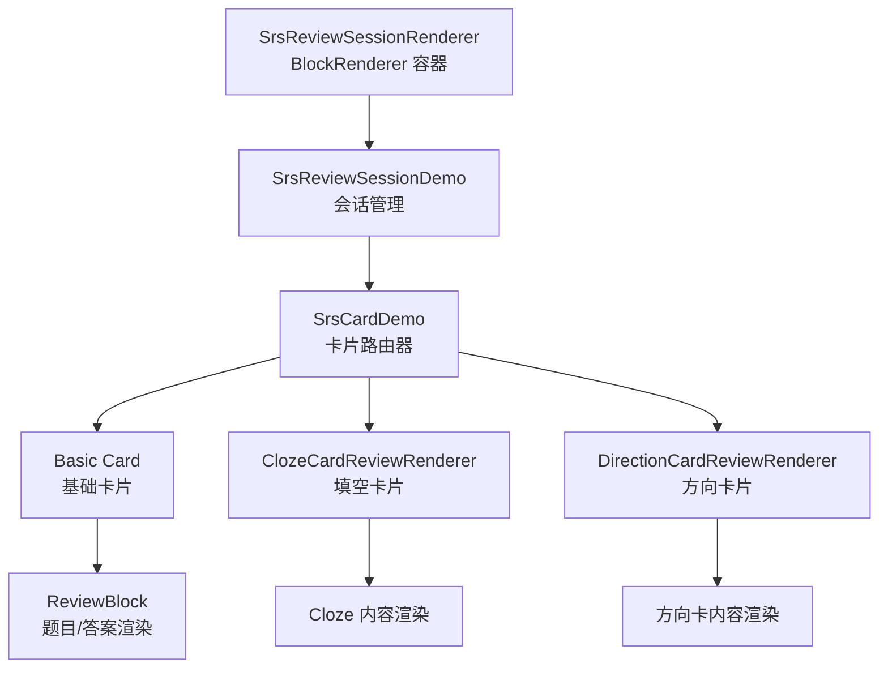
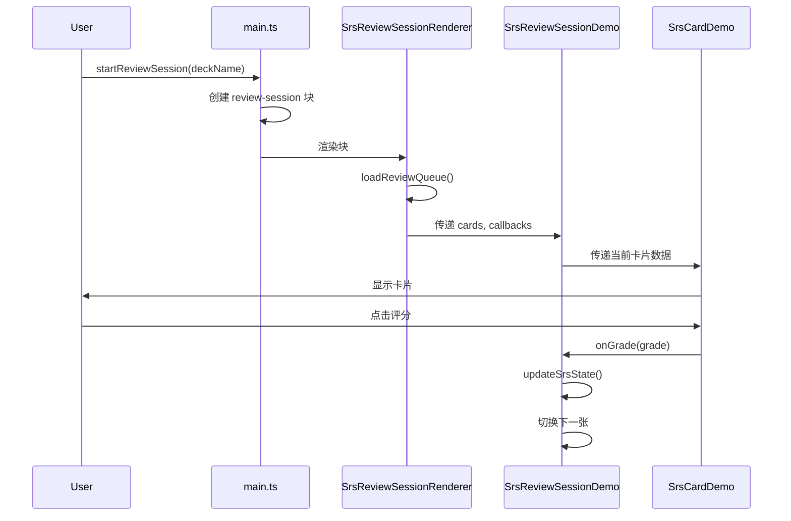
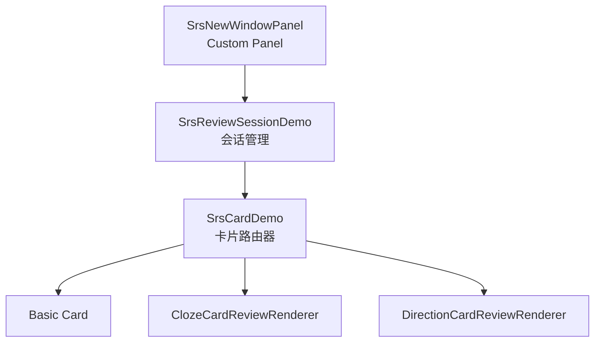

# SRS 复习界面 Custom Panel 迁移计划

## 一、概述

本文档描述将 SRS 复习会话界面从 **BlockRenderer 架构** 迁移到 **Custom Panel 架构** 的详细计划。

### 背景

当前复习界面使用 `SrsReviewSessionRenderer.tsx`（BlockRenderer）实现，存在以下问题：

1. **需要创建虚拟块**：占用数据库空间，管理复杂
2. **BlockShell 渲染开销**：额外的包装层影响性能
3. **参数传递困难**：需要通过全局状态传递 `deckFilter`、`hostPanelId`
4. **与现代架构不一致**：`FlashcardHome` 已迁移到 Custom Panel

### 目标

- 使用 Orca 的 `orca.panels.registerPanel` API 注册自定义面板
- 通过 `viewArgs` 传递参数
- 保持所有现有功能正常工作
- 便于后续扩展和维护

---

## 二、当前架构分析

### 组件层次



### 核心文件

| 文件                              | 职责                      | 迁移策略          |
| --------------------------------- | ------------------------- | ----------------- |
| `SrsReviewSessionRenderer.tsx`    | BlockShell 包装、队列加载 | **替换** 为新面板 |
| `SrsReviewSessionDemo.tsx`        | 会话管理、进度、评分回调  | **复用**          |
| `SrsCardDemo.tsx`                 | 卡片类型路由、基础卡渲染  | **复用**          |
| `ClozeCardReviewRenderer.tsx`     | 填空卡片渲染              | **复用**          |
| `DirectionCardReviewRenderer.tsx` | 方向卡片渲染              | **复用**          |
| `useReviewShortcuts.ts`           | 快捷键处理                | **复用**          |

### 关键数据流



---

## 三、目标架构设计

### 新组件层次



### 目录结构

```
src/panels/
├── SrsFlashcardHomePanel.tsx  (现有)
└── srs_new_window/
    └── SrsNewWindowPanel.tsx  (新建：复习会话面板)
```

### 参数传递

```typescript
// 启动复习会话
orca.nav.goTo(
  "srs.new-window", // 面板类型
  {
    deckFilter: "English", // 可选：Deck 过滤
    hostPanelId: "panel-1", // 可选：宿主面板 ID
  },
  panelId // 目标面板 ID
);

// 在面板中获取参数
const viewPanel = orca.nav.findViewPanel(panelId, panels);
const deckFilter = viewPanel?.viewArgs?.deckFilter;
```

---

## 四、分阶段迁移计划

### 阶段 1：创建空白面板骨架 ✅

**目标**：验证 Custom Panel API 可用性

**任务**：

- [x] 创建 `src/panels/srs_new_window/SrsNewWindowPanel.tsx`
- [x] 注册面板 `srs.new-window`
- [x] 渲染空白容器 + 测试文本

**验证**：

- [x] 通过 `orca.nav.goTo("srs.new-window", {})` 可以打开面板
- [x] 面板正确显示测试内容

---

### 阶段 2：迁移界面框架 ✅

**目标**：实现基本的会话容器 UI

**任务**：

- [x] 复制进度条组件
- [x] 复制状态栏（卡片计数、最近日志）
- [x] 实现队列加载逻辑（从 `main.ts` 导入 `collectReviewCards`、`buildReviewQueue`）
- [x] 读取 `viewArgs` 中的 `deckFilter`

**代码示例**：

```typescript
// 从 viewArgs 获取参数
useEffect(() => {
  const viewPanel = orca.nav.findViewPanel(panelId, panels);
  if (viewPanel) {
    setDeckFilter(viewPanel.viewArgs?.deckFilter ?? null);
    setHostPanelId(viewPanel.viewArgs?.hostPanelId ?? null);
  }
}, [panelId, panels]);

// 加载队列
useEffect(() => {
  void loadReviewQueue();
}, [deckFilter]);
```

**验证**：

- [x] 进度条正确显示
- [x] 卡片计数正确
- [x] Deck 过滤正常工作

---

### 阶段 3：迁移 Basic Card ✅

**目标**：支持基础卡片复习

**任务**：

- [x] 使用纯文本渲染卡片内容（`front`/`back` 字段）
- [x] 实现评分回调（调用 `updateSrsState`）
- [x] 实现关闭按钮
- [x] 实现跳转到卡片功能
- [x] 显示评分预览间隔
- [x] 面板激活时自动刷新队列
- [x] 添加刷新按钮
- [x] 埋藏功能（Bury）+ 快捷键 B
- [x] 暂停功能（Suspend）+ 快捷键 S
- [x] 键盘快捷键（空格、1234、B、S）

**验证**：

- [x] 题目区域正确渲染（纯文本）
- [x] 点击"显示答案"显示答案区域
- [x] 评分按钮工作正常
- [x] 评分后自动切换下一张
- [x] 新创建的卡片可通过刷新显示

---

## 九、迁移经验总结（阶段 3 教训）

> [!IMPORTANT]
> 以下是 Basic Card 迁移过程中遇到的关键问题和解决方案，对后续阶段（Cloze/Direction）具有重要参考价值。

### 9.1 Custom Panel 与 BlockRenderer 的数据流差异

| 方面           | BlockRenderer                                     | Custom Panel                                                 |
| -------------- | ------------------------------------------------- | ------------------------------------------------------------ |
| **参数获取**   | `props.panelId`, `props.blockId` 等直接传入       | 通过 `orca.nav.findViewPanel(panelId, panels).viewArgs` 获取 |
| **状态订阅**   | 可以使用 `useSnapshot(orca.state)` 订阅响应式更新 | **⚠️ 不能使用 `useSnapshot`**，会导致无限循环                |
| **Block 组件** | 可以正常使用 `orca.components.Block` 渲染块内容   | **⚠️ Block 组件可能触发无限更新**，需要使用替代方案          |
| **生命周期**   | 随块创建/销毁                                     | 独立于块，通过 `active` prop 感知激活状态                    |

### 9.2 关键教训：避免 React Error #185

**问题描述**：
使用 `useSnapshot(orca.state)` 和 `orca.components.Block` 会导致 "Maximum update depth exceeded" 错误。

**原因**：

- `useSnapshot` 在每次渲染时可能触发新的状态更新
- `Block` 组件内部可能有与 Custom Panel 不兼容的渲染逻辑

**解决方案**：

```typescript
// ❌ 错误做法：使用 useSnapshot 订阅整个 state
const { panels, blocks } = useSnapshot(orca.state);

// ✅ 正确做法：直接访问 orca.state，仅在需要时读取
useEffect(() => {
  if (viewArgsLoaded) return;
  const panels = orca.state.panels; // 直接访问
  const viewPanel = orca.nav.findViewPanel(panelId, panels);
  // ...
  setViewArgsLoaded(true);
}, [panelId, viewArgsLoaded]);
```

```typescript
// ❌ 错误做法：使用 Block 组件渲染
<Block panelId={panelId} blockId={currentCard.id} ... />

// ✅ 正确做法：使用纯文本渲染
<div>{currentCard.front}</div>
<div>{currentCard.back}</div>
```

### 9.3 面板激活时刷新队列

**问题**：用户切换到其他面板创建新卡片后，复习面板不会自动显示新卡片。

**解决方案**：监听 `active` prop 变化，从非激活变为激活时重新加载队列：

```typescript
const wasActiveRef = useRef(false);

useEffect(() => {
  // 当面板从非激活变为激活时，重新加载队列
  if (active && !wasActiveRef.current && viewArgsLoaded) {
    console.log(`[SrsNewWindowPanel] 面板激活，重新加载队列`);
    void loadReviewQueue();
  }
  wasActiveRef.current = active;
}, [active, viewArgsLoaded]);
```

### 9.4 viewArgs 一次性加载

**问题**：多次读取 `viewArgs` 可能触发不必要的重渲染。

**解决方案**：使用 `viewArgsLoaded` 标志确保只加载一次：

```typescript
const [viewArgsLoaded, setViewArgsLoaded] = useState(false);

useEffect(() => {
  if (viewArgsLoaded) return;

  const panels = orca.state.panels;
  const viewPanel = orca.nav.findViewPanel(panelId, panels);
  if (viewPanel) {
    setDeckFilter(viewPanel.viewArgs?.deckFilter ?? null);
    setHostPanelId(viewPanel.viewArgs?.hostPanelId ?? null);
  }

  setViewArgsLoaded(true);
}, [panelId, viewArgsLoaded]);
```

### 9.5 后续阶段建议

对于 Cloze 和 Direction 卡片的迁移，建议：

1. **不要复用 `SrsCardDemo` 或 `ClozeCardReviewRenderer`**：这些组件可能依赖 `useSnapshot` 或其他与 Custom Panel 不兼容的 API

2. **直接在 `SrsNewWindowPanel` 中实现渲染逻辑**：

   - Cloze：使用 `currentCard.front` + 处理 `{c1::text}` 语法的正则表达式
   - Direction：使用 `currentCard.front` 和 `currentCard.back`（已由 `collectReviewCards` 正确设置）

3. **保持简单**：Custom Panel 的优势在于简洁，不要引入复杂的组件依赖

---

### 阶段 4：迁移 Cloze Card ✅

**目标**：支持填空卡片复习

**任务**：

- [x] 在 `ReviewCard` 类型中添加 `content` 字段用于存储块内容
- [x] 在 `cardCollector.ts` 中收集 cloze 卡片时保存 `content`
- [x] 在 `SrsNewWindowPanel` 中实现 `renderFragments` 函数（纯函数，不依赖 useSnapshot）
- [x] 在 `SrsNewWindowPanel` 中实现 `renderClozeCard` 函数
- [x] 修改 `handleGrade` 支持 cloze 卡片评分（使用 `updateClozeSrsState`）
- [x] 修改 `renderMainContent` 根据卡片类型路由到对应渲染器

**实现细节**：

- **不复用旧的 `ClozeCardReviewRenderer`**：该组件依赖 `useSnapshot(orca.state)`，与 Custom Panel 不兼容
- **直接在面板中实现 `renderFragments`**：从 `ClozeCardReviewRenderer` 移植并简化，移除对 Valtio 的依赖
- **通过 `ReviewCard.content` 获取块内容**：在 `collectReviewCards` 时预加载，避免运行时查询

**验证**：

- [x] 填空位置正确显示 `[...]`
- [x] 答案揭示后高亮填空内容
- [x] 评分后正确更新对应的 cloze SRS 状态（srs.cN.xxx）

---

### 阶段 5：迁移 Direction Card

**目标**：支持方向卡片复习

**任务**：

- [ ] 确保 `DirectionCardReviewRenderer` 正确渲染
- [ ] 验证正向（forward）复习：左 → 右
- [ ] 验证反向（backward）复习：右 → 左

**验证**：

- [ ] 正向复习时问题在左、答案在右
- [ ] 反向复习时问题在右、答案在左
- [ ] 评分后正确更新对应方向的 SRS 状态

---

### 阶段 6：迁移高级功能

**目标**：完善用户体验

**任务**：

- [ ] 集成 `useReviewShortcuts` Hook（空格、1234、b、s）
- [ ] 实现 Bury 功能（埋藏到明天）
- [ ] 实现 Suspend 功能（暂停卡片）
- [ ] 实现"跳转到卡片"功能（面板分割逻辑）
- [ ] 实现最大化显示（隐藏编辑器 UI）

**验证**：

- [ ] 快捷键正常工作
- [ ] 埋藏后卡片不再出现在今天的队列
- [ ] 暂停后卡片标记为 suspend 状态
- [ ] 跳转时正确管理左侧面板

---

### 阶段 7：清理和验证

**目标**：完成迁移、更新文档

**任务**：

- [ ] 修改 `main.ts` 中的 `startReviewSession` 使用新面板
- [ ] 更新 `renderers.ts` 注册逻辑
- [ ] 运行完整测试
- [ ] 更新 `模块文档/SRS_卡片复习窗口.md`
- [ ] （可选）删除旧的 `SrsReviewSessionRenderer.tsx`

**验证**：

- [ ] 从命令面板启动复习正常
- [ ] 从斜杠命令启动复习正常
- [ ] 从 FlashcardHome 启动复习正常
- [ ] 无控制台错误
- [ ] 面板导航历史正常

---

## 五、风险控制

### 回滚策略

1. **代码共存**：新旧面板可同时注册，通过开关切换
2. **渐进式迁移**：每个阶段独立验证，问题可单独修复
3. **保留旧代码**：完全验证通过后再删除旧文件

### 开关机制

```typescript
// renderers.ts
const USE_NEW_REVIEW_PANEL = true  // 切换开关

if (USE_NEW_REVIEW_PANEL) {
  orca.panels.registerPanel("srs.new-window", SrsNewWindowPanel)
} else {
  orca.renderers.registerBlock("srs.review-session", SrsReviewSessionRenderer, ...)
}
```

---

## 六、预期收益

| 方面                    | 旧架构              | 新架构            |
| ----------------------- | ------------------- | ----------------- |
| 块管理                  | 需要创建/查找虚拟块 | 无需块管理        |
| 参数传递                | 全局状态变量        | viewArgs 直接传递 |
| 渲染层级                | BlockShell 包装     | 直接渲染          |
| 代码复杂度              | 高                  | 低                |
| 与 FlashcardHome 一致性 | 不一致              | 一致              |

---

## 七、时间估算

| 阶段     | 预计时间        | 备注           |
| -------- | --------------- | -------------- |
| 阶段 1   | 30 分钟         | 已完成         |
| 阶段 2   | 1 小时          | 界面框架       |
| 阶段 3   | 1.5 小时        | Basic Card     |
| 阶段 4   | 1 小时          | Cloze Card     |
| 阶段 5   | 1 小时          | Direction Card |
| 阶段 6   | 1.5 小时        | 高级功能       |
| 阶段 7   | 1 小时          | 清理验证       |
| **总计** | **约 7.5 小时** |                |

---

## 八、相关文件

| 文件                                                                                                             | 说明                 |
| ---------------------------------------------------------------------------------------------------------------- | -------------------- |
| [SrsNewWindowPanel.tsx](file:///d:/orca插件/虎鲸标记%20内置闪卡/src/panels/srs_new_window/SrsNewWindowPanel.tsx) | 新复习面板（待创建） |
| [SrsReviewSessionDemo.tsx](file:///d:/orca插件/虎鲸标记%20内置闪卡/src/components/SrsReviewSessionDemo.tsx)      | 会话管理组件（复用） |
| [SrsCardDemo.tsx](file:///d:/orca插件/虎鲸标记%20内置闪卡/src/components/SrsCardDemo.tsx)                        | 卡片渲染器（复用）   |
| [panel_plan.md](file:///d:/orca插件/虎鲸标记%20内置闪卡/panel_plan.md)                                           | 早期迁移计划参考     |
| [SRS\_卡片复习窗口.md](file:///d:/orca插件/虎鲸标记%20内置闪卡/模块文档/SRS_卡片复习窗口.md)                     | 功能文档             |
