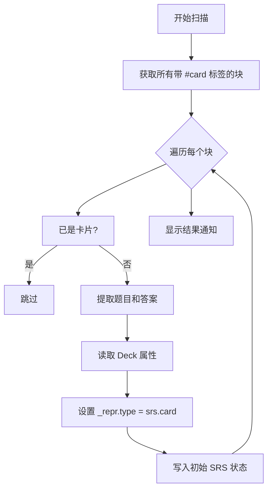

# SRS 卡片创建与管理模块

## 概述

本模块负责卡片的创建、标签识别和 Deck 分组管理，是将 Orca 块转换为 SRS 卡片的核心逻辑。

### 核心价值

- 通过 `#card` 标签自动识别卡片
- 支持 Deck 分组管理
- 提供手动和批量转换功能

## 技术实现

### 核心文件

- [main.ts](file:///d:/orca插件/虎鲸标记%20内置闪卡/src/main.ts)（卡片创建与识别函数）

### 卡片结构

```
父块（#card 标签）→ 题目
└── 第一个子块 → 答案
```

### 卡片识别规则

1. 块必须带有 `#card` 标签
2. 父块文本作为题目（front）
3. 第一个子块文本作为答案（back）
4. 从 `#card` 标签的属性中读取 Deck 名称

### 核心函数

#### `scanCardsFromTags()`

批量扫描所有带 `#card` 标签的块并转换为卡片：



#### `makeCardFromBlock(cursor)`

将当前光标所在块转换为卡片：

- 支持撤销操作
- 作为编辑器命令注册

#### `extractDeckName(block): string`

从块的标签属性中提取 Deck 名称：

```typescript
// 标签属性结构
block.refs[].data[].name === "deck"
block.refs[].data[].value // Deck 名称
```

### Deck 管理

#### 用户操作流程

1. 在 Orca 标签页面为 `#card` 标签定义 `deck` 属性
2. 添加可选值（如 "English"、"物理"、"数学"）
3. 给块打 `#card` 标签后，从下拉菜单选择 Deck

#### 默认行为

- 未设置 Deck 属性时，归入 "Default" 分组
- 支持多选类型（取第一个值）和单选类型

### 块渲染表示（\_repr）

转换后的块 `_repr` 结构：

```typescript
{
  type: "srs.card",
  front: string,  // 题目
  back: string,   // 答案
  deck: string    // Deck 名称
}
```

## 使用场景

### 1. 手动创建卡片

1. 在块中输入题目
2. 创建子块输入答案
3. 使用斜杠命令 `/srs-card` 转换

### 2. 批量扫描

1. 为多个块添加 `#card` 标签
2. 使用命令 "SRS: 扫描带标签的卡片"
3. 自动转换所有带标签的块

## 扩展点

1. **多答案支持**：可扩展支持多个子块作为答案
2. **富文本题目**：可扩展支持图片等富媒体内容
3. **模板系统**：可扩展卡片模板功能

## 相关文件

| 文件                                                                     | 说明                |
| ------------------------------------------------------------------------ | ------------------- |
| [main.ts](file:///d:/orca插件/虎鲸标记%20内置闪卡/src/main.ts)           | 卡片创建核心函数    |
| [storage.ts](file:///d:/orca插件/虎鲸标记%20内置闪卡/src/srs/storage.ts) | 状态初始化          |
| [types.ts](file:///d:/orca插件/虎鲸标记%20内置闪卡/src/srs/types.ts)     | ReviewCard 类型定义 |
