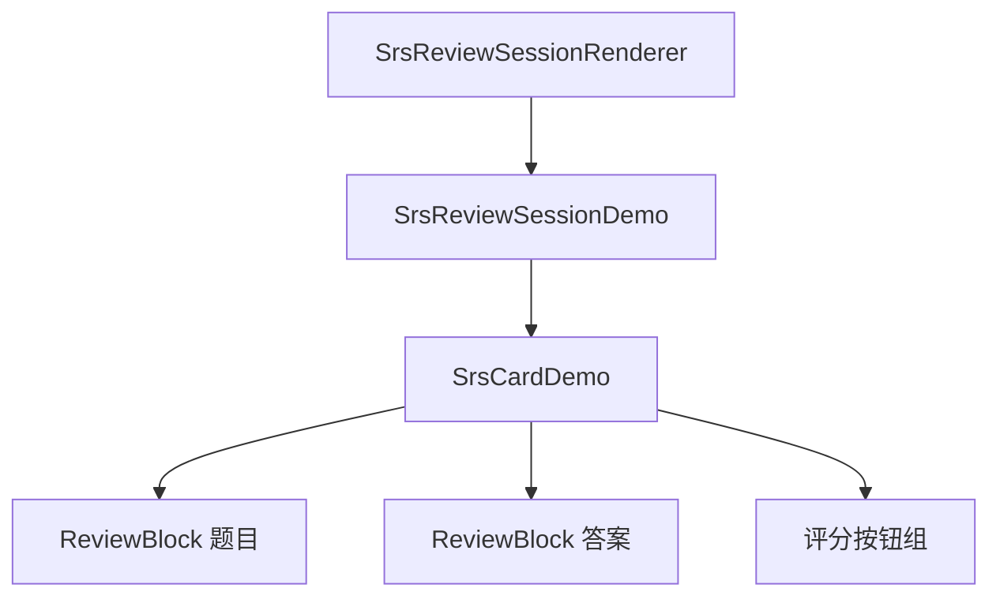
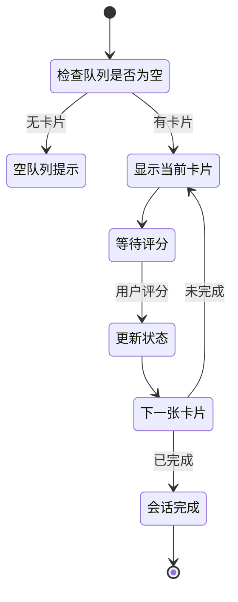

# SRS 卡片复习窗口模块

## 概述

本模块实现复习会话的用户界面，包括卡片展示、答案揭示、评分交互和会话进度管理。

### 核心价值

- 沉浸式复习体验
- 支持侧边面板和模态框两种模式
- 实时显示复习进度和 SRS 状态

## 技术实现

### 核心文件

- [SrsReviewSessionDemo.tsx](file:///d:/orca插件/虎鲸标记%20内置闪卡/src/components/SrsReviewSessionDemo.tsx)（会话主组件）
- [SrsReviewSessionRenderer.tsx](file:///d:/orca插件/虎鲸标记%20内置闪卡/src/components/SrsReviewSessionRenderer.tsx)（块渲染器包装）
- [SrsCardDemo.tsx](file:///d:/orca插件/虎鲸标记%20内置闪卡/src/components/SrsCardDemo.tsx)（单卡片组件）

### 组件层次

### SrsReviewSessionDemo 组件

#### Props

| 属性         | 类型              | 说明           |
| ------------ | ----------------- | -------------- |
| cards        | ReviewCard[]      | 复习队列       |
| onClose      | () => void        | 关闭回调       |
| onJumpToCard | (blockId) => void | 跳转回调       |
| inSidePanel  | boolean           | 是否在侧边面板 |
| panelId      | string            | 面板 ID        |

#### 状态管理

- `queue`：复习队列
- `currentIndex`：当前卡片索引
- `reviewedCount`：已复习数量
- `isGrading`：正在评分标志
- `lastLog`：最近评分日志

#### 会话流程

### SrsCardDemo 组件

#### 功能

- 显示题目区域（支持嵌入 Orca Block）
- 答案揭示交互
- 四个评分按钮
- SRS 状态信息显示

#### 题目区域

- 使用 `renderingMode="simple"` 渲染
- MutationObserver 隐藏子块（防止答案泄露）
- 支持在复习中直接编辑

#### 评分按钮

| 按钮  | 样式     | 说明       |
| ----- | -------- | ---------- |
| Again | 危险红   | 完全忘记   |
| Hard  | 柔和灰   | 记得但困难 |
| Good  | 主色实心 | 正常回忆   |
| Easy  | 主色高亮 | 轻松回忆   |

### 会话渲染器

`SrsReviewSessionRenderer` 作为块渲染器：

- 类型：`srs.review-session`
- 负责加载复习队列
- 提供面板 ID 给子组件
- 处理跳转卡片逻辑

## 用户交互

### 复习流程

1. 查看题目
2. 点击"显示答案"
3. 查看答案
4. 点击评分按钮
5. 自动进入下一张

### 侧边面板模式

- 在主编辑区右侧显示
- 可跳转到卡片原始位置
- 支持编辑卡片内容

## 扩展点

1. **快捷键支持**：可扩展键盘评分
2. **音效反馈**：可扩展评分音效
3. **统计图表**：可扩展显示复习统计

## 相关文件

| 文件                                                                                                                | 说明         |
| ------------------------------------------------------------------------------------------------------------------- | ------------ |
| [SrsReviewSessionDemo.tsx](file:///d:/orca插件/虎鲸标记%20内置闪卡/src/components/SrsReviewSessionDemo.tsx)         | 会话主组件   |
| [SrsCardDemo.tsx](file:///d:/orca插件/虎鲸标记%20内置闪卡/src/components/SrsCardDemo.tsx)                           | 卡片展示组件 |
| [SrsReviewSessionRenderer.tsx](file:///d:/orca插件/虎鲸标记%20内置闪卡/src/components/SrsReviewSessionRenderer.tsx) | 块渲染器     |
| [storage.ts](file:///d:/orca插件/虎鲸标记%20内置闪卡/src/srs/storage.ts)                                            | 评分更新     |
