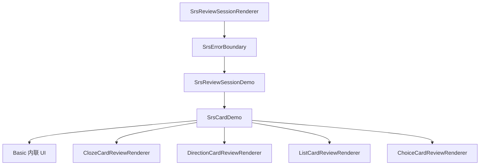
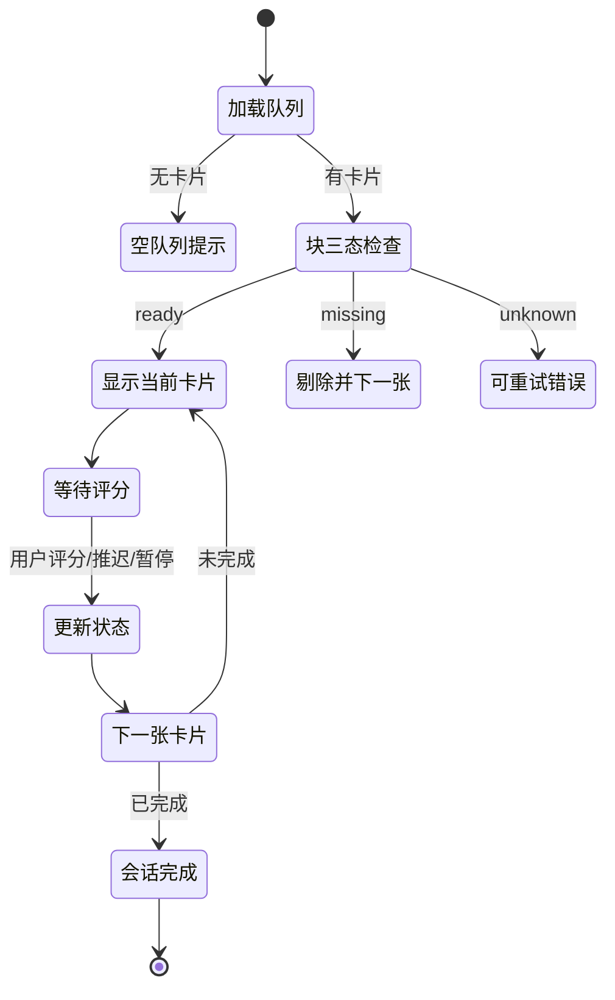

# SRS 卡片复习窗口模块

> 文档同步日期：2026-07-20  
> 变更说明：复习嵌入块默认展开（`initiallyCollapsed={false}`），原笔记折叠时题目仍可见；对齐当前会话 UI 流程、块加载三态、评分门控与进度。

## 概述

本模块实现复习会话的用户界面：卡片展示、答案揭示、评分交互、会话历史（只读回看）、进度统计与关闭时日志 flush。

### 核心价值

- 沉浸式复习体验（侧边面板主视图可最大化宿主 chrome）
- 按会话块上的 `ReviewSessionDescriptor` 加载队列（F2-01）
- 同步动作门闩防并发持久化；块存在性三态，避免把后端异常当「已删除」

### 不存在的组件

- **`SrsCardBrowser` 不存在**。卡片浏览/主页见 `SrsFlashcardHome` / `SrsFlashcardHomeRenderer`（`模块文档/SRS_卡片浏览器.md`）。

## 技术实现

### 核心文件

| 路径 | 说明 |
| ---- | ---- |
| `src/components/SrsReviewSessionRenderer.tsx` | 块类型 `srs.review-session`：读 descriptor、建队、额度、progress key、close flush |
| `src/components/SrsReviewSessionDemo.tsx` | 会话主 UI（默认 export 名 `SrsReviewSession`） |
| `src/components/SrsCardDemo.tsx` | 单卡路由：Basic / Cloze / Direction / List / Choice |
| `src/components/ClozeCardReviewRenderer.tsx` | 填空卡复习 |
| `src/components/DirectionCardReviewRenderer.tsx` | 方向卡复习 |
| `src/components/ListCardReviewRenderer.tsx` | 列表卡复习 |
| `src/components/ChoiceCardReviewRenderer.tsx` | 选择题复习 |
| `src/srs/reviewSessionDescriptor.ts` | 版本化会话描述 |
| `src/srs/reviewSessionActionGate.ts` | F2-05 会话动作 gate |
| `src/srs/reviewSessionBlockLoad.ts` | F2-06 当前卡 required 块决策 |
| `src/srs/blockExistence.ts` | 块存在三态 exists / missing / unknown |
| `src/srs/reviewSessionHistory.ts` | FC-06 会话历史与只读 |
| `src/srs/reviewSessionClose.ts` | 守卫关闭 + 日志 flush |
| `src/srs/reviewCardGrading.ts` | 正式评分 + 同源 timing |
| `src/srs/sessionProgressTracker.ts` | 进度状态与有效时长归一化 |
| `src/srs/sessionProgressStorage.ts` | scoped sessionStorage |
| `src/srs/sessionProgressFinalize.ts` | 完成态一次性 finalize |
| `src/hooks/useSessionProgressTracker.ts` | 进度 Hook |
| `src/srs/pendingDueRequeue.ts` | F2-04 again/hard 短期重入队 |

### 组件层次

```mermaid
flowchart TD
    A[SrsReviewSessionRenderer] --> B[SrsErrorBoundary]
    B --> C[SrsReviewSessionDemo]
    C --> D[SrsCardDemo]
    D --> E[Basic 内联 UI]
    D --> F[ClozeCardReviewRenderer]
    D --> G[DirectionCardReviewRenderer]
    D --> H[ListCardReviewRenderer]
    D --> I[ChoiceCardReviewRenderer]
```

注册：`src/srs/registry/renderers.ts` 注册 `srs.review-session` → `SrsReviewSessionRenderer`。

### SrsReviewSessionDemo Props

| 属性 | 类型 | 说明 |
| ---- | ---- | ---- |
| `cards` | `ReviewCard[]` | 初始复习队列 |
| `progressStorageKey` | `string` | **FC-09 必填**：Renderer 冻结的 sessionStorage 键 |
| `sessionScope` | `ReviewSessionScope` | 启动时冻结的会话范围（默认 all） |
| `sessionDailyLimits` | `ReviewQueueLimits \| null` | 普通会话：今日剩余正式根卡额度；fixed 为 `null` |
| `sessionFormalRootCards` | `readonly ReviewCard[]` | 额度 seed 用正式根卡 |
| `childExpandWarning` | `string \| null` | 子卡展开截断提示（仅展示） |
| `onClose` | `() => void \| Promise<void>` | 统一关闭（Renderer：flush 日志后关面板） |
| `onJumpToCard` | `(blockId, shiftKey?) => void` | 跳转原块 |
| `inSidePanel` | `boolean` | 是否侧边面板布局 |
| `panelId` | `string` | 面板 ID |
| `pluginName` | `string` | 插件名（评分 / 日志） |
| `isRepeatMode` / `currentRound` / `onRepeatRound` | — | 重复复习轮次 |
| `manageHostEditorChrome` | `boolean` | 是否允许 maximize / 隐藏宿主编辑器 chrome；默认 `false` |

### 主要状态

- `queue` / `currentIndex` / `reviewedCount`
- `isGrading`：**仅 UI/快捷键禁用展示**；并发正确性见 F2-05
- `sessionHistory`：FC-06 只读回看
- `sessionStats`：完成摘要（effect 一次性 finalize）
- `isMaximized`：默认 `true`
- `cardStartTime`：当前卡墙钟起点（计时）
- action gate / advance timer / pending due（refs）

---

### 会话动作同步门闩（F2-05）

`setIsGrading(true)` 是异步 React state，**不能**挡住同 tick 双击、键盘自动重复，或 grade 与 postpone/suspend 交叉。并发正确性由同步 ref 门闩保证。

| 门闩 | 模块 | 职责 |
| ---- | ---- | ---- |
| **会话动作 gate** | `src/srs/reviewSessionActionGate.ts` | 正式 `grade`、`repeat_grade`、`auxiliary_grade`、`postpone`、`suspend`，以及成功后 250ms 切卡 timer |
| **选择题提交 gate** | `src/srs/choiceSubmitGate.ts` | 仅 Choice 答案提交（单选 150ms / 多选 Enter）与选项统计；**不**写 FSRS、**不**推进会话 index |

二者**不得互相替代**。

**语义要点**：

1. `acquire(cardKey, actionKind)` **同步**获取；一次只允许一个会话持久化/推进动作；成功返回单调 `SessionActionToken`。
2. 同 tick 二次 acquire 失败（双击、键盘重复、grade↔postpone/suspend 交叉）。
3. 失败路径 `release(token)` 可重试；成功路径在**卡片身份真正切换前**保持锁定（250ms 动画窗口内不得二次持久化）。
4. 切卡 timer 仅当 `decideAdvanceAfterDelay(gate, token) === "advance"` 才 `setCurrentIndex`；随后 `bindCard(新 key)` 作废旧 token。
5. 返回上一张、跳过、只读继续、队列自动剔除、卸载：`invalidate` + 清 timer；旧 Promise 完成时 `canCommitSessionAction` 为 false → **安静停止**，不得写 `lastLog` / history / progress / index 到新卡。
6. List 正式评分成功后后续处理部分失败：保留「评分已保存但后续处理失败」语义（`orca.notify`），不经 gate 吞错回滚。
7. repeat / List 辅助预览虽不写正式 SRS，仍走同一 gate，只能推进一次。

**Demo 接入**：`handleGrade` / `handlePostpone` / `handleSuspend` / `scheduleAdvance`；导航 `handleSkip` / `handleContinue` / `handlePrevious` 与自动剔除路径作废 token。

---

### 当前卡块三态加载（F2-06）

进入某张卡时须确认渲染所需块可用。**不得**把后端异常与「块已删除」混成同一种 `false` 后自动跳卡。

| 状态 | 判定 | 行为 |
| ---- | ---- | ---- |
| **exists** | `orca.state.blocks` 命中，或 `get-block` 在超时内返回可验证块（非数组 object + 有限 number `id === 请求 id`） | 必要时写入 `orca.state.blocks`，正常继续 |
| **missing** | 后端**明确** `null` / `undefined` | 安全剔除：写 `autoDroppedCardKeysRef`、移出队列、F2-05 `invalidate` |
| **unknown** | throw、timeout（默认 `DEFAULT_GET_BLOCK_TIMEOUT_MS=10000`）、或身份不可判定 | **保留**当前卡；不写 auto-dropped；展示可重试错误 |

**List**：

- 同时验证父块 `card.id` 与条目块 `card.listItemId`。
- 必须检查完所有 required 后再决策。
- 任一 **unknown** → 整卡 `retain_unknown`；无 unknown 且任一 **missing** → `drop_missing`；全部 **exists** → `ready`。

**重试**：unknown 时错误条 +「重试」；递增 `blockLoadRetryNonce` 强制 effect 重请求。旧请求在 `cancelled` 或 `currentCardKey` 已切换时不得写状态。

**下一张预缓存**：仅优化（成功可写 `orca.state.blocks`）；null/throw 只打日志，不改队列/auto-dropped。现设计预缓存 `nextCard.id`（父块）。

**纯模块**：

- `src/srs/blockExistence.ts`：`resolveBlockExistence` / 超时 / 身份校验
- `src/srs/reviewSessionBlockLoad.ts`：`decideRequiredBlocksOutcome` / `shouldApplyBlockLoadResult` / `decidePrefetchBlockOutcome` / `requiredBlocksForCard`

---

### Again/Hard 短期重新入队（F2-04）

正式评分成功且 action token 仍有效后，若 `grade` 为 again/hard 且 FSRS `due` 在 5 分钟内，调用 `upsertPendingDueCard`（`src/srs/pendingDueRequeue.ts`）。

| 要点 | 行为 |
| ---- | ---- |
| 与 action gate | 须 `canCommitSessionAction` 通过后才 track |
| 入队位置 | 到期后**追加队尾**；去重看未处理尾部 |
| Timer | 唯一 scheduled token；完成/关闭/卸载/新轮次 deactivate |
| 完成摘要 | 实际追加后可 `reopenSessionFinalizeIfNeeded`；notify 以真实 appended 数为准 |
| 额度 | 已接纳 `cardKey` 重入不二次消耗 |
| 非正式路径 | `repeat_grade` / `auxiliary_grade` 不创建正式 pending |
| 持久化 | pending **仅内存**；非跨重启断点 |

详见 `模块文档/SRS 动态复习队列.md`。

---

### 返回上一张与只读回看（FC-06）

第一阶段**只读回看**，不做真正撤销。

| 动作 | 是否锁定只读 | 说明 |
| ---- | ------------ | ---- |
| 正式评分 | 是 | 写 SRS / 日志 / 会话统计 |
| 重复复习评分 | 是 | 不写 SRS，计会话进度 |
| 列表辅助预览评分 | 是 | 不写 SRS / 日志 |
| 推迟 / 暂停 | 是 | 改变 due / suspend |
| 跳过 | **否** | 返回后仍可正常评分 |

- 纯模块 `reviewSessionHistory.ts`：`cardKey` + `actionKind` + `outcomesByKey`；身份用 `getReviewCardKey` / `cardKeyFromReviewCard`。
- 返回按 card key 定位队列；找不到则 warn + 用户提示，**绝不跳到错误卡**。
- 副作用入口最终 `guardSideEffectAction`；只读时子组件误调用只 notify。
- UI：只读隐藏评分/推迟/暂停；跳过变「继续」，不得把继续记成 skip 覆盖 outcome。
- 快捷键：`useReviewShortcuts({ readOnly })` + `reviewShortcutRules.resolveReviewShortcut`。
- Choice 只读：揭晓正确答案；不传 / 不调用 `onAnswer`。正式答题统计见 `createChoiceAnswerHandler` → `srs.choice.statistics`；提交防重复用 `choiceSubmitGate`，FSRS 评分用 `reviewSessionActionGate`。

---

### FSRS 预览与正式评分同参（F2-08）

- 各卡种预览传入同一 `pluginName` → `getFsrsInstance(pluginName)`。
- 正式评分 `nextReviewState` / `gradeReviewCard` 与预览共用 validated 配置。
- 非法设置：`orca.notify("warn")`（按配置指纹去重）+ 算法侧安全默认。

---

### 会话描述加载（F2-01）

`SrsReviewSessionRenderer` **只**依赖当前 `blockId` 上的 `ReviewSessionDescriptor`：

1. `resolveReviewSessionBlock` → `readReviewSessionDescriptorFromBlock`。
2. 描述缺失/损坏/未知版本/未知 kind → **错误 UI**，不回退 all、不用 `getReviewDeckFilter()`。
3. `kind=custom`：显示「自定义学习尚未实现」。`scheduled` 固定 `updatesSrs/consumesDailyQuota=true`，`practice` 固定两者 `false`。
4. `kind=normal`：descriptor → deckFilter/scope → `collectReviewCards` + 额度 + 建队。
5. `kind=fixed` + `mode=repeat`：`getRepeatReviewSessionById` 后 **retain**；无载荷或 source 不一致 → 明确错误。

##### 异步 load latest-wins

- `src/srs/asyncLoadGeneration.ts`：`createLoadGenerationGate`。
- 每次 effect /「重试」`begin()`；cleanup `invalidate()`。
- 任意 `await` 后仅 `isCurrent(generation)` 可 `setState`。

##### 同 sessionId 多 Renderer 引用

- `createRepeatReviewSession` **不**增加引用计数；每个成功绑定 fixed/repeat 的 Renderer **retain 一次**，cleanup **release 一次**。
- 关面板不在 `beforeFlush` 再 release。
- **normal 不参与** retain/release。

详见 `模块文档/SRS_复习队列管理.md`。

#### 普通会话每日额度（FC-01）

`loadReviewQueue` 在 `kind=normal` 时：

1. `resolveDailyQueueLimits` 校验设置（无效则 warn + notify，回退默认）。
2. `getLocalTodayBounds` + `getReviewLogs`（内部先 flush）。
3. `remainingDailyLimitsFromLogs(configured, logs, { deckName })`：按 `cardKey` 去重今日 used；deck 会话只计同名 `deckName`，all 计全部；`remaining = max(0, configured − used)`。
4. **remaining** 冻结后传入 `buildSessionReviewQueue` 与 Demo budget，**不得**会话中重读全局设置绕过。
5. 读/flush 日志失败 → 加载失败，**禁止** used=0 兜底。
6. fixed / 重复：`sessionDailyLimits = null`。

#### 关闭与日志 flush（FC-03）

- **唯一 flush 入口**：`SrsReviewSessionRenderer.handleClose`（`createGuardedSessionCloser`）→ `flushReviewLogs` → 失败时 notify「复习已保存，但统计日志仍待重试」→ `orca.nav.close`。
- Demo 所有关闭先 `abandonSession`（进度清理）再 `onClose`；Demo **不再**自行 flush。
- 评分：`gradeReviewCard` → `saveAndFlushReviewLog`；`warning` 须展示/notify。

---

### 会话进度（FC-09 / FC-10）

**产品规则（第一阶段）**：**不支持断点恢复**。每次新会话从零开始。`sessionStorage` 仅当前挂载会话的 scoped 自动保存/诊断。

#### Scope / storage key

| 场景 | Scope | Key 形态 |
| ---- | ----- | -------- |
| 普通全部 | `normal/all` | `srs-session-progress:v2:normal/all` |
| 指定牌组 | `normal/deck/<deckName>` | `…:v2:normal/deck/<encodeURIComponent(deckName)>` |
| 困难卡（Home：`sourceBlockId=0` + children） | `fixed/difficult` | `…:v2:fixed/difficult` |
| 其他专项/重复 | `fixed/<sourceType>/<sourceBlockId>` | `…:v2:fixed/<enc type>/<enc id>` |

- 纯模块：`sessionProgressStorage.ts`。
- Renderer 按本块 descriptor 冻结 `progressStorageKey` 传入 Demo；Demo **不得**重读全局 filter 拼 key。
- 重复复习「再复习一轮」同 scope key，但 `resetSession` 归零本轮统计。

#### Hook（`useSessionProgressTracker`）

- `storageKey` **必填**，禁止默认共享键 `srs-session-progress`。
- 首次挂载：全新 state + `removeItem(scoped key)`；**不**自动 `getItem` 恢复。
- `autoSave` 写 scoped key；`finishSession` / `abandonSession` 清理并 `unregister`。
- 显式 `restore(json)` 存在但本阶段 UI 不调用。
- storage 抛错 `console.warn`，不阻断复习。

#### 完成结算

- `sessionProgressFinalize.ts`：`ensureSessionFinalized` / `resetSessionFinalizeController`。
- 从未完成→完成：在 **effect** 中一次 `finishProgressSession`；**render 禁止** `sessionStats \|\| finish…`。
- 完成界面 `sessionStats == null` 时显示「正在汇总...」。
- 「完成」按钮用缓存 stats；极端早于 effect 仍走 `ensureSessionFinalized` 保证只 finish 一次。

#### 关闭与卸载清理

| 路径 | 进度 storage | 日志 flush |
| ---- | ------------ | ---------- |
| 正常完成 | 清理 scoped key | `onClose` → Renderer flush |
| 主动关闭 / 放弃 | `handleRequestClose` → `abandonSession` → `onClose` | 同上 |
| 插件卸载 | `clearRegisteredSessionProgressKeys`（仅 registry 登记键） | unload 序列中日志 flush 在先 |

#### 复习时长（FC-10）

- 墙钟耗时（隐藏/失焦/编辑**暂不暂停**）；**每张卡有效时长最多 60s**（`MAX_EFFECTIVE_CARD_DURATION_MS`）。
- 异常（负、NaN、Infinity、回拨）→ 有效 **0**。
- 唯一实现：`sessionProgressTracker.ts` 的 `calculateEffectiveDuration` / `computeReviewTiming` / `effectiveDurationFromReviewLog`。

| 字段 | 含义 |
| ---- | ---- |
| `duration` | 有效时长（0..60000） |
| `rawDuration?` | 安全非负原始墙钟（不做 60s 截断） |

评分路径：`gradeReviewCard` 只读一次 `now` → `timing`；Demo 把 `effectiveDuration` 传给 `recordEffectiveGrade`，**禁止**无参二次 `Date.now`。repeat 用同一 `computeReviewTiming`；列表辅助预览不计进度。

---

### 会话流程（概要）

```mermaid
stateDiagram-v2
    [*] --> 加载队列
    加载队列 --> 空队列提示: 无卡片
    加载队列 --> 块三态检查: 有卡片
    块三态检查 --> 显示当前卡片: ready
    块三态检查 --> 剔除并下一张: missing
    块三态检查 --> 可重试错误: unknown
    显示当前卡片 --> 等待评分
    等待评分 --> 更新状态: 用户评分/推迟/暂停
    更新状态 --> 下一张卡片
    下一张卡片 --> 显示当前卡片: 未完成
    下一张卡片 --> 会话完成: 已完成
    会话完成 --> [*]
```

### SrsCardDemo 路由

| 条件 | 渲染器 |
| ---- | ------ |
| `srs.cloze-card` + blockId | `ClozeCardReviewRenderer` |
| `srs.direction-card` + blockId + directionType | `DirectionCardReviewRenderer` |
| `srs.list-card` + listItem 字段齐全 | `ListCardReviewRenderer` |
| `inferredCardType === "choice"` | `ChoiceCardReviewRenderer` |
| 其它 Basic / 摘录 | Demo 内联 UI |

- Basic 题目区：`EmbeddedQuestionBlock` 渲染宿主 `Block`，MutationObserver **移除**子块容器（避免答案泄漏）；答案区：`EmbeddedAnswerBlock` 隐藏父块正文、强制展示子块。
- **默认展开（局部语义）**：复习内所有嵌入 `Block` 传 `initiallyCollapsed={false}`（题目 / 答案 / 摘录 / Cloze / 选择题 SafeBlockPreview / 选项）。仅影响复习面板渲染实例，**不写**块属性、不改原笔记折叠态。否则原笔记折叠时 `BlockShell` 隐藏内容 → 「看不到题目」。CSS `.srs-question-block .orca-repr-main { display: block !important }` 作兜底。
- 复习中可直接编辑块内容（依赖编辑器能力，非 `contentEditable: false` 锁死）。
- 评分按钮：Again / Hard / Good / Easy；间隔/到期预览走 F2-08。
- 界面默认**不展示**完整 SRS 技术字段（稳定度、完整时间戳等）；评分后日志可用简化日期 `M-D`。

### 宿主 chrome 最大化

仅当 `shouldManageHostEditorChrome(panel, panelId, blockId)` 为 true（面板主视图 `view === "block"` 且 `viewArgs.blockId === 会话块`）时，Demo 可设置 `.orca-block-editor[maximize="1"]` 并隐藏 query tabs / go buttons / sidetools 等。嵌入 Journal、引用、查询结果时 `manageHostEditorChrome=false`，**不得**改外层宿主 DOM。实现：`src/srs/registry/panelTreeUtils.ts`。

### 复习相关设置（现行 Schema）

以 `src/srs/settings/reviewSettingsSchema.ts` 的 `REVIEW_SETTINGS_KEYS` 为准，当前仅有：

| 设置键 | 说明 |
| ------ | ---- |
| `review.disableNotifications` | 关闭通知提醒 |
| `review.newCardsPerDay` | 每日新卡上限 |
| `review.reviewCardsPerDay` | 每日复习卡上限 |
| `review.fsrsWeights` | FSRS 权重（21 个） |
| `review.fsrsRequestRetention` | 目标保留率 |
| `review.fsrsMaximumInterval` | 最大间隔（天） |

> **不存在** `review.showSiblingBlocks` / `review.maxSiblingBlocks`（旧文档或设想；全库 `src/` 无此键）。Basic 答案区同级子块展示不由上述设置控制。

### 埋藏 / 暂停

| 操作 | 行为 | 快捷键 |
| ---- | ---- | ------ |
| Bury（推迟） | `due` → 明天零点；不改 interval/stability 等 | `b` |
| Suspend | 标签 `status=suspend`；队列过滤 | `s` |

实现：`src/srs/cardStatusUtils.ts`；收集过滤：`cardCollector.ts`。

### 快捷键（复习）

详见 `模块文档/SRS 搜索快捷键.md` 复习专节。要点：

| 按键 | 条件 | 操作 |
| ---- | ---- | ---- |
| `空格` | 答案未显示 | 显示答案（多选 Choice 未揭晓时为空格提交，见规则模块） |
| `空格` | 答案已显示 | 评 Good |
| `1`–`4` | 答案已显示 | again / hard / good / easy |
| `b` / `s` | — | 推迟 / 暂停 |
| Choice `1`–`9` | 未揭晓 | 选选项 |
| Choice `Enter` | 多选未揭晓 | 提交 |

- `isGrading` / `readOnly` 禁用评分类键；输入框 / contenteditable 内不触发。
- 各专用 ReviewRenderer 各自挂 `useReviewShortcuts`；Basic 仅在 `shouldRenderBasicCard` 时启用。

## 用户交互

1. 查看题目 → 显示答案 → 评分 → 250ms 动画后下一张。
2. 可跳过、返回上一张（已操作卡只读）、跳转原块、埋藏/暂停。
3. 完成后看统计摘要与评分分布（`GradeDistributionBar`），再关闭触发 flush。

## 扩展点

1. 真正撤销（相对当前只读回看）
2. 断点恢复（相对当前 scoped 仅会话内 autosave）
3. 音效 / 更丰富完成图表

## 测试

| 范围 | 文件 |
| ---- | ---- |
| 动作 gate | `src/srs/reviewSessionActionGate.test.ts` |
| 块加载决策 | `src/srs/reviewSessionBlockLoad.test.ts` |
| 历史 | `src/srs/reviewSessionHistory.test.ts` |
| 关闭 | `src/srs/reviewSessionClose.test.ts` |
| 进度 / 时长 | `sessionProgressTracker.test.ts`、`sessionProgressStorage.test.ts`、`sessionProgressFinalize.test.ts` |
| 评分 | `src/srs/reviewCardGrading.test.ts` |
| 描述 / scope | `reviewSessionDescriptor.test.ts`、`reviewSessionScope.test.ts` |
| pending | `src/srs/pendingDueRequeue.test.ts` |

## 相关文件

| 文件 | 说明 |
| ---- | ---- |
| `src/components/SrsReviewSessionRenderer.tsx` | 会话块渲染与加载 |
| `src/components/SrsReviewSessionDemo.tsx` | 会话主 UI |
| `src/components/SrsCardDemo.tsx` | 单卡路由与 Basic UI |
| `src/components/ClozeCardReviewRenderer.tsx` | 填空复习 |
| `src/components/DirectionCardReviewRenderer.tsx` | 方向复习 |
| `src/components/ListCardReviewRenderer.tsx` | 列表复习 |
| `src/components/ChoiceCardReviewRenderer.tsx` | 选择题复习 |
| `src/components/GradeDistributionBar.tsx` | 评分分布 |
| `src/components/SrsErrorBoundary.tsx` | 错误边界 |
| `src/hooks/useReviewShortcuts.ts` | 复习快捷键 |
| `src/hooks/reviewShortcutRules.ts` | 快捷键纯解析 |
| `src/hooks/useSessionProgressTracker.ts` | 进度 Hook |
| `src/srs/reviewSessionActionGate.ts` | F2-05 |
| `src/srs/reviewSessionBlockLoad.ts` / `blockExistence.ts` | F2-06 |
| `src/srs/reviewSessionHistory.ts` | FC-06 |
| `src/srs/reviewSessionClose.ts` | 关闭 flush |
| `src/srs/reviewCardGrading.ts` | 正式评分 |
| `src/srs/sessionProgress*.ts` | 进度 / 存储 / finalize |
| `src/srs/pendingDueRequeue.ts` | F2-04 |
| `src/srs/reviewSessionDescriptor.ts` / `reviewSessionManager.ts` | 描述与块解析 |
| `src/srs/reviewSessionBudget.ts` / `reviewSessionScope.ts` | 额度与 scope |
| `src/srs/cardStatusUtils.ts` | 埋藏/暂停 |
| `src/srs/registry/panelTreeUtils.ts` | 宿主 chrome 闸门 |
| `src/srs/registry/renderers.ts` | 渲染器注册 |
| `src/srs/choiceSubmitGate.ts` | 选择题提交 gate |
