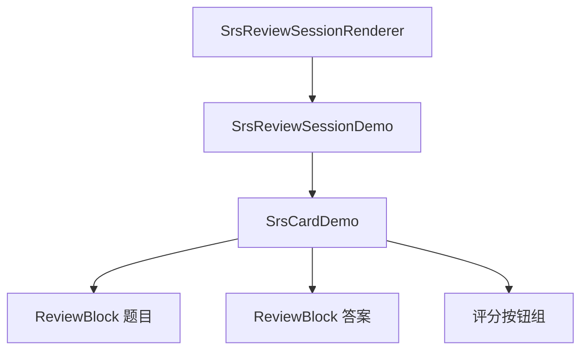
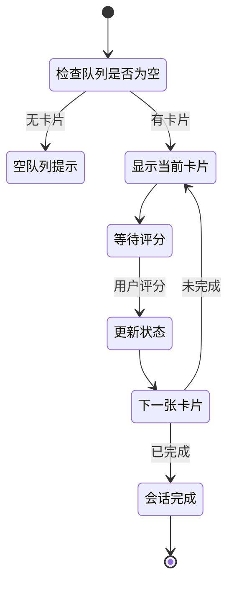

# SRS 卡片复习窗口模块

## 概述

本模块实现复习会话的用户界面，包括卡片展示、答案揭示、评分交互和会话进度管理。

### 核心价值

- 沉浸式复习体验
- 支持侧边面板和模态框两种模式
- 实时显示复习进度和 SRS 状态

## 技术实现

### 核心文件

- [SrsReviewSessionDemo.tsx](file:///d:/orca插件/虎鲸标记%20内置闪卡/src/components/SrsReviewSessionDemo.tsx)（会话主组件）
- [SrsReviewSessionRenderer.tsx](file:///d:/orca插件/虎鲸标记%20内置闪卡/src/components/SrsReviewSessionRenderer.tsx)（块渲染器包装；**F2-01** 按 block 描述加载）
- [reviewSessionDescriptor.ts](file:///d:/orca插件/虎鲸标记%20内置闪卡/src/srs/reviewSessionDescriptor.ts)（版本化会话描述）
- [SrsCardDemo.tsx](file:///d:/orca插件/虎鲸标记%20内置闪卡/src/components/SrsCardDemo.tsx)（单卡片组件）

### 组件层次


```mermaid
flowchart TD
    A[SrsReviewSessionRenderer] --> B[SrsReviewSessionDemo]
    B --> C[SrsCardDemo]
    C --> D[ReviewBlock 题目]
    C --> E[ReviewBlock 答案]
    C --> F[评分按钮组]
```

### SrsReviewSessionDemo 组件

#### Props

| 属性         | 类型                         | 说明 |
| ------------ | ---------------------------- | ---- |
| cards        | ReviewCard[]                 | 复习队列 |
| progressStorageKey | string | **FC-09 必填**：会话进度 sessionStorage 键（Renderer 加载队列时冻结并传入） |
| sessionScope | ReviewSessionScope | 会话范围（启动时冻结） |
| sessionDailyLimits | ReviewQueueLimits \| null | 普通会话：启动时按「今日日志 used」扣除后的 **剩余** 正式根卡额度（configured − used）；fixed 为 null（不限额） |
| onClose      | () => void \| Promise\<void\> | **统一关闭入口**（由 Renderer 提供：flush 日志后再关面板） |
| onJumpToCard | (blockId) => void            | 跳转回调 |
| inSidePanel  | boolean                      | 是否在侧边面板 |
| panelId      | string                       | 面板 ID |
| pluginName   | string                       | 插件名（评分写日志用） |

#### 状态管理

- `queue`：复习队列
- `currentIndex`：当前卡片索引
- `reviewedCount`：已复习数量
- `isGrading`：正在评分标志（**仅 UI/快捷键禁用展示**；并发正确性见 F2-05 action gate）
- `lastLog`：最近评分日志（若有 `gradeResult.warning` 会一并显示，并 `orca.notify`）
- `isMaximized`：是否最大化显示
- `sessionHistory`：会话历史（FC-06，见下）

#### 会话动作同步门闩（F2-05）

`setIsGrading(true)` 是异步 React state，**不能**挡住同 tick 双击、键盘自动重复，或 grade 与 postpone/suspend 交叉触发。并发正确性由同步 ref 门闩保证。

| 门闩 | 模块 | 职责 |
| ---- | ---- | ---- |
| **会话动作 gate** | `src/srs/reviewSessionActionGate.ts` | 正式 `grade`、`repeat_grade`、`auxiliary_grade`、`postpone`、`suspend`，以及成功后 250ms 切卡 timer |
| **选择题提交 gate** | `src/srs/choiceSubmitGate.ts` | 仅 Choice 答案提交（单选 150ms / 多选 Enter）与选项统计；**不**写 FSRS、**不**推进会话 index |

二者**不得互相替代**。`choiceSubmitGate` 不能充当评分/推迟/暂停锁。

**语义**：

1. `acquire(cardKey, actionKind)` **同步**获取；一次只允许一个会话持久化/推进动作；成功返回单调唯一 `SessionActionToken`。
2. 第二次同 tick acquire 必须失败（同动作双击、键盘重复、grade↔postpone/suspend 交叉）。
3. 失败路径 `release(token)`，用户可重试；成功路径在**卡片身份真正切换前**保持锁定（250ms 动画窗口内不得二次持久化）。
4. 切卡 timer 仅当 `decideAdvanceAfterDelay(gate, token) === "advance"` 才 `setCurrentIndex`；随后 `bindCard(新 key)` 作废旧 token。
5. 返回上一张、跳过、只读继续、队列自动剔除、组件卸载：`invalidate` + 清理 timer；旧 Promise 完成时 `canCommitSessionAction` 为 false → **安静停止**，不得写 `lastLog` / history / reviewedCount / progress / queue / index 到新卡。
6. List 在正式评分成功后的后续处理若部分失败：保留「评分已保存但后续处理失败」语义（`orca.notify`），**不**通过 gate 吞错或回滚已成功写入。
7. repeat / List 辅助预览虽不写正式 SRS，仍走同一 gate，只能推进一次。

**Demo 接入点**：`SrsReviewSessionDemo` 的 `handleGrade` / `handlePostpone` / `handleSuspend` / `scheduleAdvance`；导航类 `handleSkip` / `handleContinue` / `handlePrevious` 与自动剔除路径作废 token。

#### 当前卡块三态加载（F2-06）

复习会话进入某张卡时，必须确认其渲染所需块可用。**不得**把后端异常与「块已删除」混成同一种 `false` 后自动跳卡。

| 状态 | 判定 | 行为 |
| ---- | ---- | ---- |
| **exists** | `orca.state.blocks` 命中，或 `get-block` 在超时内返回**可验证**块（非数组 object + 有限 number `id === 请求 id`） | 必要时写入 `orca.state.blocks`，正常继续 |
| **missing** | 后端**明确**返回 `null` / `undefined` | 安全剔除当前卡：写入 `autoDroppedCardKeysRef`、从队列移除、F2-05 `invalidate` |
| **unknown** | `get-block` **throw**、**timeout**（默认 `DEFAULT_GET_BLOCK_TIMEOUT_MS=10000`，可注入更短测试值）、或非 null 但身份不可判定（false/string/array/`{}`/wrong id 等） | **保留**当前卡与队列；**不**写 auto-dropped；展示可重试错误 |

**List 规则**：

- 同时验证父块 `card.id` 与条目块 `card.listItemId`。
- 必须检查完所有 required 块后再决策；不得在尚有 unknown / 未检查项时因 partial missing 提前剔除。
- 任一 **unknown** → 整卡 `retain_unknown`（不剔除）。
- 无 unknown 且任一 **missing** → `drop_missing`。
- 全部 **exists** → `ready`。

**重试**：

- unknown 时 UI 显示错误条（含 blockId / cardKey 上下文）与「重试」按钮。
- 重试递增 `blockLoadRetryNonce`，强制 effect 重新请求；不依赖「卡片 props 变化」才能再次拉块。
- 旧异步请求：`cancelled` 或 `currentCardKey` 已切换时，不得写错误、删队列或覆盖新卡状态。

**下一张预缓存**：

- 仅优化：成功可将块写入 `orca.state.blocks`。
- 明确 null 或 throw → 只打可诊断日志；**不**改当前卡、队列、auto-dropped 或主流程。
- 现有设计预缓存 `nextCard.id`（父块）；不因 F2-06 扩张为强制双块预取。

**get-block 超时与身份校验**（`blockExistence.ts`）：

- 超时归 **unknown**（不得当 missing）；错误信息含 `blockId` 与超时毫秒；UI 走既有重试入口。
- 超时后 backend 晚到：不写 `orca.state.blocks`、不改已缓存结论。
- 非 null 返回值仅做最小身份校验（非数组 object + 有限 number id 且等于请求 id）；失败 → unknown 且不写 state。不做完整 Block schema。

**纯模块**：

- `src/srs/blockExistence.ts`：通用三态 `resolveBlockExistence` / `BlockExistenceCache` / timeout / 身份校验（cleanup 复用，复习 UI 不耦合 cleanup 业务）。
- `src/srs/reviewSessionBlockLoad.ts`：`decideRequiredBlocksOutcome` / `shouldApplyBlockLoadResult` / `decidePrefetchBlockOutcome`（全检后：任一 unknown 优先保留；无 unknown 且任一 missing 才剔除）。

#### Again/Hard 短期重新入队（F2-04）

正式评分成功且 action token 仍有效后，若 `grade` 为 again/hard 且 FSRS `due` 在 5 分钟内，调用 `trackPendingDueCard`（纯模块 `src/srs/pendingDueRequeue.ts`）。

| 要点 | 行为 |
| ---- | ---- |
| 与 action gate | 旧 token 不得 track/覆盖 pending；须 `canCommitSessionAction` 通过后才 upsert |
| 入队位置 | 到期后**追加队尾**；去重只看未处理尾部，历史副本不挡重入 |
| Timer | 唯一 `scheduledToken`；更新 due 必重排；完成按钮 / 关闭 / 卸载 / 新轮次 deactivate（**到达队尾不清**） |
| 完成摘要 | 完成态下实际追加后 `reopenSessionFinalizeIfNeeded` + 清 `sessionStats`；progress 累计；notify 以真实 appended 数为准 |
| 额度 | 已接纳 `cardKey` 重入不二次消耗；拒绝时 notify 并保留 pending |
| 非正式路径 | `repeat_grade` / `auxiliary_grade` early-return，不创建正式 pending |
| 持久化 | F2-04 pending 仅内存。过早 `finishSession` 后重入会 `resumeSessionPersistence` 恢复**当前挂载** sessionStorage autosave，**不是** F2-09 跨重启断点 |

详见 `模块文档/SRS 动态复习队列.md`「短期重学 pending」一节。

#### 返回上一张与只读回看（FC-06）

第一阶段实现**只读回看**，不做真正撤销。

| 动作 | 是否锁定只读 | 说明 |
| ---- | ------------ | ---- |
| 正式评分 | 是 | 会写 SRS / 日志 / 会话统计；List 可能推进 |
| 重复复习模式评分 | 是 | 不写 SRS，但已计会话进度 |
| 列表辅助预览评分 | 是 | 不写 SRS / 日志，但已走过该卡 |
| 推迟 / 暂停 | 是 | 改变 due / suspend 状态 |
| 跳过 | **否** | 不改变状态；返回被跳过卡片后允许正常评分 |

**实现要点**：

- 纯模块 `src/srs/reviewSessionHistory.ts`：记录 `cardKey`、`actionKind`、可选 `grade`、展示摘要与原索引；`outcomesByKey` 永久保留锁定结果；导航栈可 pop/push。
- 身份使用 `getReviewCardKey` / `cardKeyFromReviewCard`；Cloze/Direction/List 变体独立；Basic/Choice 同 `blockId` 也按 cardType 区分。
- 返回时**按 card key 定位**队列；找不到则 `console.warn` + 用户可见提示，并安全跳过该历史项，**绝不跳到错误卡**。
- `handleGrade` / `handlePostpone` / `handleSuspend`（及任何会推进 List/统计/日志的入口）有最终 `guardSideEffectAction`；即使子组件误调用也只 notify，不落盘。
- UI：只读时隐藏评分/推迟/暂停；跳过按钮切换为「继续」语义，**不得**把继续记成 skip 覆盖原 outcome。
- 快捷键：`useReviewShortcuts({ readOnly })` + `reviewShortcutRules.resolveReviewShortcut`；数字键/Enter/B/S/空格（评分）不得绕过。
- Choice 只读：揭晓正确答案，单选 150ms timer、重复点击与快捷键不能提交/评分；只读时 **不** 传 / 不调用 `onAnswer`，不写统计。
- Choice 正式答题统计（FC-08）：`SrsCardDemo` 在非只读时通过 `createChoiceAnswerHandler` 向 `ChoiceCardReviewRenderer` 传 `onAnswer`；提交时写入 `srs.choice.statistics`（见 `模块文档/SRS_数据存储.md`）。答案提交防重复依赖 `choiceSubmitGate`；**正式 FSRS 评分防重复依赖 `reviewSessionActionGate`（F2-05）**，二者分工见上表。保存失败 `orca.notify("warn")` 且不阻断 FSRS 评分。

#### FSRS 预览与正式评分同参（F2-08）

- `SrsCardDemo` 的 basic 预览：`previewIntervals` / `previewDueDates` 传入 `pluginName`，`useMemo` 依赖含 `pluginName`。
- Cloze / Direction：已有 `pluginName` prop，预览调用同样传入。
- List / Choice：新增 `pluginName` prop，由 `SrsCardDemo` 传入；预览调用传入。
- `IRMixedReviewPane` 已向 `SrsCardDemo` 传入正确 `pluginName`（不得依赖硬编码 `orca-srs` 假设）。
- 正式评分路径（`nextReviewState(..., pluginName)` / `reviewCardGrading`）与预览共用 `getFsrsInstance(pluginName)` → 同一 validated 配置。
- 非法设置：用户可见 `orca.notify("warn")`（按配置指纹去重）；算法侧回退安全默认。恢复默认见命令 `SRS: 恢复 FSRS 默认设置`。

#### 会话描述加载（F2-01）

`SrsReviewSessionRenderer` **只**依赖当前 `blockId` 上的 `ReviewSessionDescriptor`：

1. `resolveReviewSessionBlock(blockId)` → `readReviewSessionDescriptorFromBlock`。
2. 描述缺失、损坏、未知版本、未知 kind → **错误 UI**，不回退 all、不用 `getReviewDeckFilter()`。
3. `kind=custom`：类型可解析，但显示「自定义学习尚未实现」，无成功加载路径。`scheduled` 固定 `updatesSrs/consumesDailyQuota=true`，`practice` 固定两者 `false`；不一致 parse 失败。
4. `kind=normal`：由 descriptor 得到 deckFilter/scope，再 `collectReviewCards` + 额度 + 建队。
5. `kind=fixed` + `mode=repeat`：`getRepeatReviewSessionById(sessionId)` 后 **retain**；无载荷或 source 不一致 → 明确错误。

##### 异步 load latest-wins（generation gate）

- 纯模块：`src/srs/asyncLoadGeneration.ts`（`createLoadGenerationGate`）。
- 每次 `blockId` effect 启动或「重试」调用 `begin()` 得到单调 generation；effect cleanup 调用 `invalidate()`。
- 任意 `await` 之后仅当 `isCurrent(generation)` 才可 `setState` / 写 `boundSessionId` / `setIsLoading(false)` / `setError`。
- **场景**：Deck A 先 load、同一 panel 导航到 Deck B：B 后 start；无论 A/B 谁先完成，最终只允许 B commit。旧 A 失败也不得覆盖 B 成功态。

##### 同 sessionId 多 Renderer 引用（retain/release）

- `createRepeatReviewSession` **不**增加引用计数。
- 每个成功绑定 fixed/repeat 的 Renderer **retain 一次**；effect cleanup（换 block / 卸载）**release 一次**。
- 关面板 **不**在 `beforeFlush` 再 release，避免与 cleanup 双重 release。
- 同一会话块在两面板打开：retain=2；关一个 panel → release 后仍 1，另一面板载荷仍在；两面板都关后才删 payload。
- **normal 会话不参与** retain/release。

**同一块重复打开**：再次挂载同一 `blockId` 复用块上描述（同 sessionId）并各 retain。**新启动**总是新建块。详见 `模块文档/SRS_复习队列管理.md`。

#### 普通会话每日额度（FC-01，跨会话）

`SrsReviewSessionRenderer.loadReviewQueue` 在**非** fixed/重复模式下（descriptor.kind=normal）：

1. `resolveDailyQueueLimits` 校验设置（无效则 warn + notify，告警展示 **configured** 回退默认 30/200）。
2. `getLocalTodayBounds()` + `getReviewLogs(plugin, todayStart, now)` 读取本地时区「今天 00:00 → 当前」日志（内部先 flush）。
3. `remainingDailyLimitsFromLogs(configured, logs, { deckName })`：按 `cardKey` 去重统计今日 used；deck 会话只计同名 `deckName`，all 计全部；`remaining = max(0, configured − used)`。（F2-02 将改为全局额度统计，不按 deck 过滤 used。）
4. **remaining** 同时 `setSessionDailyLimits` 并传入 `buildSessionReviewQueue`；Demo 会话 budget 与动态追加共用该冻结值，**不得**再读全局设置或绕过剩余额度。
5. 读取/flush 日志失败 → 加载失败（错误 UI + notify），**禁止** used=0 兜底。
6. fixed / 重复 / 专项：`sessionDailyLimits = null`，不读今日日志做限额。

#### 关闭与日志 flush（FC-03）

- **唯一 flush 入口在 `SrsReviewSessionRenderer.handleClose`**（`createGuardedSessionCloser`）：`flushReviewLogs` → 失败时 notify「复习已保存，但统计日志仍待重试」→ `orca.nav.close`。
- Demo 内所有关闭入口先清理会话进度（`abandonSession`），再走 `onClose`：正常完成（`handleFinishSession`）、空队列关闭、Modal overlay 关闭、卡片 UI 关闭按钮。Demo **不再**自行 flush，避免与 Renderer 双重 flush。
- 守卫防止重复点击并发 close。
- 评分使用 `gradeReviewCard` → `saveAndFlushReviewLog`；若返回 `warning`（如日志落盘失败），Demo 必须显示/notify，不能只写 `logMessage`。

#### 会话进度存储隔离（FC-09）

**产品规则（第一阶段）**：**不支持断点恢复**。每次真正启动新复习会话都从零开始；不能只恢复统计而不恢复队列/索引。`sessionStorage` 仅用于当前挂载会话的 scoped 自动保存/诊断。

##### Scope / storage key

| 场景 | Scope | Key 形态 |
| ---- | ----- | -------- |
| 普通全部 | `normal/all` | `srs-session-progress:v2:normal/all` |
| 指定牌组 | `normal/deck/<deckName>` | `…:v2:normal/deck/<encodeURIComponent(deckName)>` |
| 困难卡（Home：`sourceBlockId=0` + `children`） | `fixed/difficult` | `…:v2:fixed/difficult` |
| 其他专项/重复 | `fixed/<sourceType>/<sourceBlockId>` | `…:v2:fixed/<enc type>/<enc id>` |

- 纯模块：`src/srs/sessionProgressStorage.ts`（key 编码、StorageLike 安全读写、严格 parse、进程内 key registry）。
- Renderer 在 `loadReviewQueue` 时根据**本块 descriptor** 冻结 `progressDescriptor` / `progressStorageKey` 并传入 Demo；**Demo 不得**重读 `getReviewDeckFilter` 或无 id 的 `getRepeatReviewSession` 自行拼 key。
- 重复复习的「再复习一轮」属于**同一**专项 scope（key 不变），但 `resetSession` 仍把本轮统计归零。

##### Hook 行为（`useSessionProgressTracker`）

- `storageKey` **必填**，禁止固定默认共享键 `srs-session-progress`。
- 首次挂载：创建全新 state，并 `removeItem(scoped key)`；**不** `getItem` 自动恢复。
- 仅在 `storageKey` 真正变化 / 新挂载时初始化；progress 更新不会清空 storage。
- `autoSave` 写 scoped key；`finishSession` / `abandonSession` 清理并 `unregister`。
- 显式 `restore(json)`：严格校验 version/结构，失败返回 `false` 并 `console.warn`（本阶段 UI 不调用）。
- `sessionStorage` get/set/remove 抛错时 `console.warn`，不阻断主复习流程。

##### 完成结算（纯 render + 一次性 finalize）

- 纯 helper：`src/srs/sessionProgressFinalize.ts`（`ensureSessionFinalized` / `resetSessionFinalizeController`）。
- 从未完成 → 完成：在 **effect** 中调用一次 `finishProgressSession` 并 `setSessionStats`；**render 禁止** `sessionStats || finish…` fallback。
- 完成界面在 `sessionStats == null` 的极短窗口显示「正在汇总...」。
- 「完成」按钮使用已缓存 `sessionStats`；若极端早于 effect 点击，仍走 `ensureSessionFinalized`，保证总计只 finish 一次，再 notify / abandon（幂等）/ onClose flush。
- 轮次 reset / 新会话：`resetSessionFinalizeController` + `setSessionStats(null)`，下一轮可再独立 finish 一次。

##### 关闭与卸载清理

| 路径 | 进度 storage | 日志 flush |
| ---- | ------------ | ---------- |
| 正常完成 `finishSession` | 清理 scoped key | 再 `onClose` → Renderer flush |
| 主动关闭 / 放弃 | Demo `handleRequestClose` → `abandonSession` 再 `onClose` | 同上 |
| 插件卸载 | 因不支持恢复，**不依赖** progress 恢复；清理本进程 **registry 已登记** keys（`clearRegisteredSessionProgressKeys`），单项失败 warn 且继续 | unload 序列中 flush 日志在先（FC-03） |

- 不扫全 `sessionStorage`、不删除其他插件或旧无关 key。

##### 复习时长统一口径（FC-10）

**产品规则：**

- 使用**墙钟耗时**（页面隐藏 / 失焦 / 编辑内容**暂不暂停**），但**每张卡有效时长最多 60 秒**（`MAX_EFFECTIVE_CARD_DURATION_MS = 60000`）。
- 负数、NaN、Infinity、系统时间回拨 → 有效时长 **0**。
- **唯一实现**：`src/srs/sessionProgressTracker.ts` 中的 `calculateEffectiveDuration` / `safeRawDuration` / `computeReviewTiming` / `effectiveDurationFromReviewLog`；永久日志、Hook、`statisticsManager` 均 import 同一函数与常量，禁止复制规则。

**写入与读取：**

| 字段 | 含义 |
| ---- | ---- |
| `duration` | **有效时长**（0..60000）；新日志写入有效值 |
| `rawDuration?` | 可选；安全非负原始墙钟（异常为 0，**不**做 60s 截断） |
| 旧日志仅有 `duration` | 统计时再经 `effectiveDurationFromReviewLog` 归一化（幂等；历史异常大值截断） |

**评分路径：**

1. `gradeReviewCard` **只读一次** `now`（可用 `options.now` 注入测试），生成同源 `timestamp` / `rawDuration` / `effectiveDuration`，经 `ReviewGradeSuccess.timing` 返回。
2. 日志：`duration = effective`，`rawDuration = safe raw`；日志失败仍 `ok: true` + warning（FC-03），**timing 仍返回**。
3. Demo 正式评分：把 `gradeResult.timing.effectiveDuration` 传给 `recordEffectiveGrade`，**禁止**无参让 Hook 二次 `Date.now`。
4. 卡切换：Demo 的 `cardStartTime`（`currentIndex` effect）仍维护，供 grading / repeat 计时。
5. **repeat 专项模式**：不经 `gradeReviewCard`，但用同一 `computeReviewTiming(cardStartTime, now)` 算有效时长后写入会话进度。
6. **列表辅助预览**：仍不计会话进度（FC-06 只读规则不变）。

##### 关联文件

- `src/srs/sessionProgressStorage.ts` / `sessionProgressStorage.test.ts`
- `src/hooks/useSessionProgressTracker.ts`（`recordEffectiveGrade(grade, effectiveDuration)`）
- `src/srs/sessionProgressTracker.ts`（时长归一化唯一源 + 序列化）
- `src/srs/reviewCardGrading.ts` / `statisticsManager.ts`
- `src/components/SrsReviewSessionRenderer.tsx`、`SrsReviewSessionDemo.tsx`
- `src/main.ts` unload 步骤 `clearSessionProgressStorage`

#### 会话流程


```mermaid
stateDiagram-v2
    [*] --> 检查队列是否为空
    检查队列是否为空 --> 空队列提示: 无卡片
    检查队列是否为空 --> 显示当前卡片: 有卡片
    显示当前卡片 --> 等待评分
    等待评分 --> 更新状态: 用户评分
    更新状态 --> 下一张卡片
    下一张卡片 --> 显示当前卡片: 未完成
    下一张卡片 --> 会话完成: 已完成
    会话完成 --> [*]
```

### SrsCardDemo 组件

#### 功能

- 显示题目区域（支持嵌入 Orca Block）
- 答案揭示交互
- 四个评分按钮
- ~~SRS 状态信息显示~~（已隐藏，2025-12-10）

#### 题目与答案区域

- 使用 `renderingMode="simple"` 渲染（题目区域）
- MutationObserver 隐藏子块（防止答案泄露）
- **支持在复习中直接编辑**（2025-12-15 更新）
  - 移除了 `SrsReviewSessionRenderer` 中的 `contentEditable: false` 配置
  - 题目和答案区域现在都可以直接编辑
  - 编辑内容会立即保存到 Orca 数据库
  - 用户可以在复习过程中修正或补充卡片内容
- ~~动态注入 CSS 隐藏块手柄和 bullet~~（已删除，2025-12-15）
  - 之前通过 `useEffect` 动态注入全局 CSS 样式来隐藏 `.srs-block-container` 内的编辑器 UI 元素
  - 现在仅依赖 `MutationObserver` 的 JavaScript 逻辑来隐藏这些元素
  - 简化了代码，避免了全局 CSS 污染

#### 评分按钮

| 按钮  | 样式     | 说明       |
| ----- | -------- | ---------- |
| Again | 危险红   | 完全忘记   |
| Hard  | 柔和灰   | 记得但困难 |
| Good  | 主色实心 | 正常回忆   |
| Easy  | 主色高亮 | 轻松回忆   |

### 会话渲染器

`SrsReviewSessionRenderer` 作为块渲染器：

- 类型：`srs.review-session`
- 负责加载复习队列
- 提供面板 ID 给子组件
- 处理跳转卡片逻辑

## 用户交互

### 复习流程

1. 查看题目
2. 点击"显示答案"
3. 查看答案
4. 点击评分按钮
5. 自动进入下一张

### 侧边面板模式

- 在主编辑区右侧显示
- 可跳转到卡片原始位置
- 支持编辑卡片内容
- **支持最大化显示**：点击工具栏最大化按钮，通过设置父级 `.orca-block-editor[maximize="1"]` 属性隐藏 query tabs 并铺满面板

### 同级子块显示设置（2025-12-11 新增）

默认情况下，Basic 卡片的答案区域只显示第一个子块。用户可以通过插件设置启用显示所有同级子块。

#### 设置项

| 设置项                     | 类型    | 默认值 | 说明                               |
| -------------------------- | ------- | ------ | ---------------------------------- |
| `review.showSiblingBlocks` | boolean | false  | 是否在答案区域显示所有同级子块     |
| `review.maxSiblingBlocks`  | number  | 10     | 最多显示的子块数量（防止性能问题） |

#### 行为说明

**默认行为（`showSiblingBlocks = false`）**：

```
- 中国的首都是？ #card  【题目区域】
  - 北京 【答案区域：显示】
     - 北京是一个很大的城市 【显示，作为第一个子块的孙子块】
  - 北京以前叫北平 【❌ 不显示，第二个同级子块】
```

**启用后（`showSiblingBlocks = true`）**：

```
- 中国的首都是？ #card  【题目区域】
  - 北京 【答案区域：显示】
     - 北京是一个很大的城市 【显示】
  - 北京以前叫北平 【✅ 显示，第二个同级子块】
  - 北京有很多名胜古迹 【✅ 显示，第三个同级子块】
```

**超过最大数量限制时**：

- 只显示前 N 个子块（N = `maxSiblingBlocks`）
- 在答案区域底部显示提示："还有 X 个子块未显示"

#### 实现文件

- [reviewSettingsSchema.ts](file:///d:/orca插件/虎鲸标记%20内置闪卡/src/srs/settings/reviewSettingsSchema.ts) - 设置 Schema 定义
- [SrsCardDemo.tsx](file:///d:/orca插件/虎鲸标记%20内置闪卡/src/components/SrsCardDemo.tsx) - Basic 卡片渲染逻辑

> **注意**：此功能仅适用于 Basic 卡片。Cloze 填空卡和 Direction 方向卡不涉及子块结构，不受影响。

### 视觉层次与交互反馈优化（2025-12-13 更新）

#### 视觉层次增强

**卡片容器优化**：

| 属性     | 旧值                         | 新值                          |
| -------- | ---------------------------- | ----------------------------- |
| 圆角     | `12px`                       | `16px`                        |
| 内边距   | `24px`                       | `28px`                        |
| 最大宽度 | `700px`                      | `720px`                       |
| 阴影     | `0 4px 20px rgba(0,0,0,0.1)` | `0 6px 32px rgba(0,0,0,0.12)` |

**内容区域优化**：

| 属性          | 旧值   | 新值        |
| ------------- | ------ | ----------- |
| 题目/答案字号 | `18px` | `22px`      |
| 行高          | `1.6`  | `1.8`       |
| 内边距        | `16px` | `20px 24px` |
| 圆角          | `8px`  | `10px`      |

**工具栏按钮增强**：

- 添加图标：埋藏（ti-clock-pause）、暂停（ti-player-pause）、跳转（ti-external-link）
- 添加过渡动画：`transition: transform 0.1s ease`

#### 交互反馈增强

**CSS 动画注入**：

```css
/* 答案渐显动画 */
@keyframes srsAnswerFadeIn {
  from {
    opacity: 0;
    transform: translateY(12px);
  }
  to {
    opacity: 1;
    transform: translateY(0);
  }
}

/* 卡片滑出动画 */
@keyframes srsCardSlideOut {
  from {
    opacity: 1;
    transform: translateX(0) scale(1);
  }
  to {
    opacity: 0;
    transform: translateX(-60px) scale(0.95);
  }
}

/* 卡片滑入动画 */
@keyframes srsCardSlideIn {
  from {
    opacity: 0;
    transform: translateX(40px) scale(0.98);
  }
  to {
    opacity: 1;
    transform: translateX(0) scale(1);
  }
}
```

**卡片过渡动画**：

- 评分后卡片向左滑出（250ms）
- 新卡片从右侧滑入（300ms）
- 状态管理：`isCardExiting` 控制动画类名

**按钮点击反馈**：

- 点击时缩放：`transform: scale(0.95)`
- 悬浮时阴影：`box-shadow: 0 2px 8px rgba(0,0,0,0.1)`

**影响的组件**：

- `SrsReviewSessionDemo.tsx` - CSS 动画注入和状态管理
- `SrsCardDemo.tsx` - Basic 卡片复习界面
- `ClozeCardReviewRenderer.tsx` - Cloze 卡片复习界面
- `DirectionCardReviewRenderer.tsx` - Direction 卡片复习界面

### UI 显示优化（2025-12-10 更新）

#### 日期格式简化

- **旧格式**：`2025/12/10 13:26:11` 或 `2025-12-10T16:00:00.000Z`
- **新格式**：`12-10`（只显示月-日）
- **实现**：添加 `formatSimpleDate()` 函数
  ```typescript
  function formatSimpleDate(date: Date): string {
    const month = date.getMonth() + 1;
    const day = date.getDate();
    return `${month}-${day}`;
  }
  ```
- **使用场景**：
  - 评分后的提示信息：`评分 GOOD [c1] -> 下次 12-15，间隔 5 天`
  - 复习面板顶部的日志显示

#### 隐藏 SRS 详细信息

已隐藏以下技术细节（不在复习界面显示）：

- ❌ 下次复习的完整时间戳
- ❌ 间隔天数 / 稳定度 / 难度
- ❌ 已复习次数 / 遗忘次数

**影响的组件**：

- `SrsCardDemo.tsx` - Basic 卡片复习界面
- `ClozeCardReviewRenderer.tsx` - Cloze 卡片复习界面
- `SrsCardBlockRenderer.tsx` - 编辑器内卡片块显示

### 快捷键支持（2025-12-11 更新）

在复习界面支持键盘快捷键，与 Anki 保持一致：

| 按键   | 操作     | 说明                 |
| ------ | -------- | -------------------- |
| `空格` | 显示答案 | 仅在答案未显示时有效 |
| `1`    | Again    | 忘记                 |
| `2`    | Hard     | 困难                 |
| `3`    | Good     | 良好                 |
| `4`    | Easy     | 简单                 |
| `b`    | Bury     | 埋藏到明天           |
| `s`    | Suspend  | 暂停卡片             |

**实现**：通过 `useReviewShortcuts` Hook 实现，同时支持 Basic、Cloze 和 Direction 三种卡片类型。

**注意事项**：

- 快捷键仅在复习界面激活时生效
- 在输入框、文本区域中不会触发快捷键
- 评分中（isGrading=true）快捷键被禁用（UI 层）；**真正防重复持久化**依赖 `reviewSessionActionGate` 同步 acquire（F2-05）
- **只读回看（readOnly=true）**：禁用评分、推迟、暂停、选择题选择/提交；仍可空格显示答案以便回看

### 卡片管理功能（2025-12-11 新增）

#### Bury（埋藏）

将卡片从今天的复习队列移除，明天重新进入调度：

- **行为**：设置卡片的 `due` 时间为明天零点
- **SRS 状态**：不改变 interval、stability、difficulty 等参数
- **UI 按钮**：顶部工具栏"埋藏"按钮（日历暂停图标）
- **快捷键**：`b`

#### Suspend（暂停）

将卡片标记为暂停状态，完全不会出现在复习队列：

- **行为**：在 `#card` 标签中写入 `status=suspend` 属性
- **恢复**：需要在卡片浏览器中手动取消暂停
- **UI 按钮**：顶部工具栏"暂停"按钮（播放暂停图标）
- **快捷键**：`s`

**实现文件**：

- [cardStatusUtils.ts](file:///d:/orca插件/虎鲸标记%20内置闪卡/src/srs/cardStatusUtils.ts) - 卡片状态管理工具
- [cardCollector.ts](file:///d:/orca插件/虎鲸标记%20内置闪卡/src/srs/cardCollector.ts) - 过滤 suspended 卡片

### 全屏沉浸式复习（2025-12-11 更新）

#### 默认最大化

- `isMaximized` 默认值改为 `true`，复习界面启动即为最大化状态
- 最大化按钮已隐藏（用户无需手动切换）

#### 全屏实现方式（2025-12-15 更新）

**已移除动态 CSS 注入**：

- ~~之前通过动态注入 CSS 样式来让复习界面撑满整个 `block-editor`~~（已删除）
- 现在仅通过 JavaScript 控制 DOM 元素的显示/隐藏来实现最大化效果

**当前实现方式**：

1. **设置 maximize 属性**：`blockEditor.setAttribute('maximize', '1')`
2. **隐藏编辑器 UI 元素**（通过 JavaScript 设置 `display: 'none'`）：
   - `.orca-block-editor-none-editable`（query tabs）
   - `.orca-block-editor-go-btns`（上下导航按钮）
   - `.orca-block-editor-sidetools`（侧边工具栏）
   - `.orca-repr-main-none-editable`（块手柄、折叠按钮）
   - `.orca-breadcrumb`（面包屑导航）
   - **注意**：不再隐藏 `.orca-panel-drag-handle`（面板拖拽手柄），保持其可见方便用户调整面板布局
3. **批量隐藏块手柄和 bullet**（通过 `querySelectorAll` 遍历设置）：
   - `.orca-block-children`、`.orca-repr-children`
   - `.orca-block-handle`、`.orca-repr-handle`
   - `.orca-block-bullet`、`[data-role="bullet"]`
   - `.orca-block-drag-handle`
   - `.orca-repr-collapse`、`.orca-block-collapse-btn`
   - **注意**：不使用 `[class*="collapse"]` 等模糊选择器，避免错误隐藏 `orca-repr-main-collapsed` 等原生内容区域

**优势**：

- 更简洁，无需维护复杂的 CSS 字符串
- 避免全局 CSS 污染
- 更容易调试和维护
- 精确匹配避免错误隐藏内容

#### 面板宽度 50/50 分割

`panelUtils.ts` 中调整面板默认宽度：

```typescript
const halfWidth = Math.floor(totalWidth * 0.5);
const leftWidth = Math.max(600, Math.min(1200, halfWidth));
const rightWidth = Math.max(600, totalWidth - leftWidth);
```

- 1920px 显示器：左右各约 960px
- 左侧最小 600px，最大 1200px

## 扩展点

1. **音效反馈**：可扩展评分音效
2. **统计图表**：可扩展显示复习统计

## 相关文件

| 文件                                                                                                                | 说明         |
| ------------------------------------------------------------------------------------------------------------------- | ------------ |
| [SrsReviewSessionDemo.tsx](file:///d:/orca插件/虎鲸标记%20内置闪卡/src/components/SrsReviewSessionDemo.tsx)         | 会话主组件   |
| [SrsCardDemo.tsx](file:///d:/orca插件/虎鲸标记%20内置闪卡/src/components/SrsCardDemo.tsx)                           | 卡片展示组件 |
| [ClozeCardReviewRenderer.tsx](file:///d:/orca插件/虎鲸标记%20内置闪卡/src/components/ClozeCardReviewRenderer.tsx)   | 填空卡片组件 |
| [ClozeReviewBlockContent.tsx](file:///d:/orca插件/虎鲸标记%20内置闪卡/src/components/ClozeReviewBlockContent.tsx)   | 填空卡原生块内容渲染 |
| [useReviewShortcuts.ts](file:///d:/orca插件/虎鲸标记%20内置闪卡/src/hooks/useReviewShortcuts.ts)                    | 快捷键 Hook  |
| [SrsReviewSessionRenderer.tsx](file:///d:/orca插件/虎鲸标记%20内置闪卡/src/components/SrsReviewSessionRenderer.tsx) | 块渲染器     |
| [storage.ts](file:///d:/orca插件/虎鲸标记%20内置闪卡/src/srs/storage.ts)                                            | 评分更新     |
