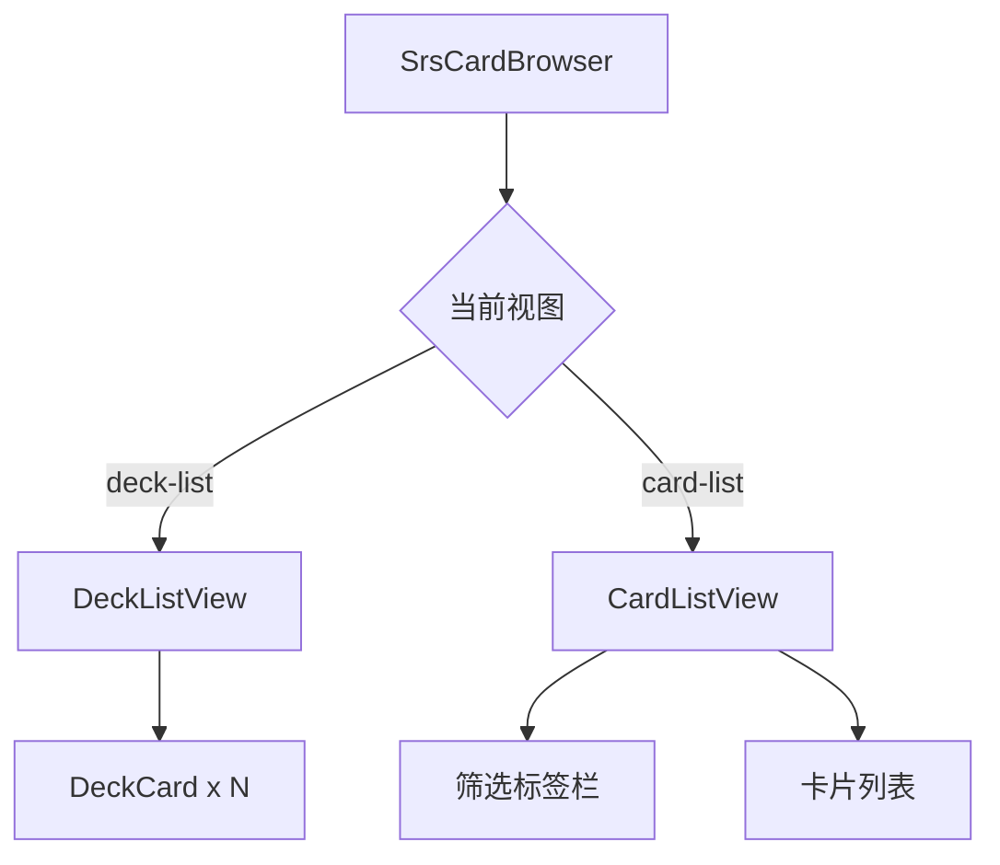
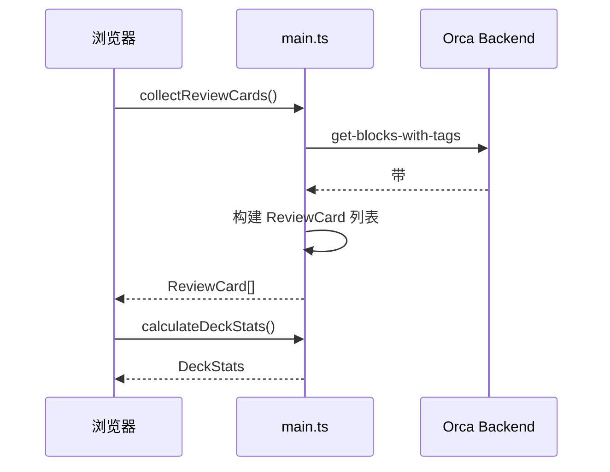

# SRS 卡片浏览器模块

## 概述

本模块提供卡片管理界面，支持按 Deck 浏览、筛选卡片和快速开始复习。

### 核心价值

- 两级导航：Deck 列表 → 卡片列表
- 支持按到期状态筛选
- 点击卡片跳转到原始块

## 技术实现

### 核心文件

- [SrsCardBrowser.tsx](file:///d:/orca插件/虎鲸标记%20内置闪卡/src/components/SrsCardBrowser.tsx)

### 组件结构



### DeckListView 组件

显示所有 Deck 的统计信息：

| 统计项 | 说明              |
| ------ | ----------------- |
| 新卡数 | 从未复习的卡片    |
| 到期数 | 已到期 + 今天到期 |
| 总计   | 该 Deck 所有卡片  |

#### 功能

- 点击 Deck 进入卡片列表
- 底部"开始复习所有 Deck"按钮
- 实时加载统计数据

### CardListView 组件

显示单个 Deck 内的卡片列表：

#### 筛选类型

| 类型   | 说明         | 颜色   |
| ------ | ------------ | ------ |
| 全部   | 所有卡片     | 默认   |
| 已到期 | 超过到期时间 | 危险红 |
| 今天   | 今日内到期   | 警告黄 |
| 未来   | 明天及以后   | 灰色   |
| 新卡   | 从未复习     | 主色   |

#### 卡片信息

- 题目预览
- 上次复习时间
- 下次复习时间（颜色编码）
- 复习次数

### 交互功能

#### 导航

- 面包屑返回按钮
- Deck 之间切换

#### 操作

- 点击卡片跳转到块
- 按 Deck 开始复习
- 复习所有 Deck

### 数据流



## 界面设计

### Deck 列表视图

```
┌─────────────────────────────────┐
│ 🃏 SRS 卡片浏览器               │
├─────────────────────────────────┤
│ ┌─────────────────────────────┐ │
│ │ 📚 Default                  │ │
│ │ 5 新卡 | 3 到期 | 总计 15   │ │
│ └─────────────────────────────┘ │
│ ┌─────────────────────────────┐ │
│ │ 📚 English                  │ │
│ │ 10 新卡 | 2 到期 | 总计 25  │ │
│ └─────────────────────────────┘ │
├─────────────────────────────────┤
│ 总计: 15 新卡 | 5 到期 | 40 张  │
│ [ 开始复习所有 Deck ]           │
└─────────────────────────────────┘
```

### 卡片列表视图

```
┌─────────────────────────────────┐
│ ← 返回  📚 English  [开始复习]  │
├─────────────────────────────────┤
│ 全部(25) 已到期(2) 今天(3) ...  │
├─────────────────────────────────┤
│ ┌─────────────────────────────┐ │
│ │ What is "hello"?            │ │
│ │ 上次: 2024-01-01 下次: 今天 │ │
│ └─────────────────────────────┘ │
│ ┌─────────────────────────────┐ │
│ │ What is "world"?            │ │
│ │ 上次: 从未  下次: -         │ │
│ └─────────────────────────────┘ │
├─────────────────────────────────┤
│ 当前筛选: 5 / 总计: 25          │
└─────────────────────────────────┘
```

## 扩展点

1. **搜索功能**：可扩展题目搜索
2. **批量操作**：可扩展批量删除/重置
3. **排序选项**：可扩展按到期时间/创建时间排序

## 相关文件

| 文件                                                                                            | 说明                    |
| ----------------------------------------------------------------------------------------------- | ----------------------- |
| [SrsCardBrowser.tsx](file:///d:/orca插件/虎鲸标记%20内置闪卡/src/components/SrsCardBrowser.tsx) | 浏览器主组件            |
| [main.ts](file:///d:/orca插件/虎鲸标记%20内置闪卡/src/main.ts)                                  | 数据收集函数            |
| [types.ts](file:///d:/orca插件/虎鲸标记%20内置闪卡/src/srs/types.ts)                            | DeckInfo/DeckStats 定义 |
