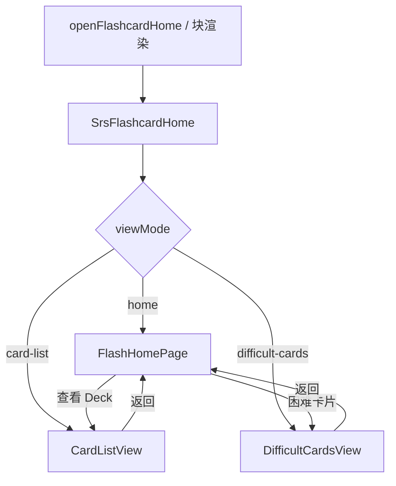

# SRS Flashcard Home（闪卡主页 / 卡片浏览器）

> **文档同步日期：2026-07-19**  
> 现状以代码为准。历史上称「卡片浏览器」；旧组件 `SrsCardBrowser.tsx` **已不存在**，统一为 Flashcard Home。  
> 已简化为 **单页主页**：去掉 Dashboard / 学习统计全页与顶层 主页/卡组/统计 Tab。

## 概述

Flashcard Home 是插件的闪卡管理主界面，以块类型 `srs.flashcard-home` 嵌入 Orca 面板，或通过 `SrsFlashcardHomePanel` 作为面板内容挂载。它聚合：

- **单页主页**（`FlashHomePage`：`HomeSummaryBar` 三统计 + 卡组列表）
- **卡片列表**（按 Deck 筛选、重置/删除/跳转）
- **困难卡片**（全页次级视图；`DifficultCardsView` + `difficultCardsManager`）

### 核心价值

- 与 Orca 面板系统一致：分屏、聚焦、块历史。
- 打开即见全局待办（新卡 / 今日到期 / 积压）与卡组表，一处完成 Deck 管理与专项复习入口。
- 复习/埋藏/暂停后通过 `orca.broadcasts` 静默刷新（见 `SRS_事件通信.md`）。
- 120s 低频全量兜底刷新（编辑/删除事件不完整时的补偿）。

---

## 代码组成

| 文件 | 职责 |
| ---- | ---- |
| `src/components/SrsFlashcardHome.tsx` | 主容器：视图路由、数据加载、事件订阅、业务动作 |
| `src/components/flashcard-home/FlashHomePage.tsx` | 单页主页：HomeSummaryBar + DeckListView |
| `src/components/flashcard-home/HomeSummaryBar.tsx` | 顶部三统计 + 开始今日复习 / 困难卡片 / 刷新 |
| `src/components/flashcard-home/DeckListView.tsx` | 卡组搜索与表格（新卡 / 今日到期 / 积压） |
| `src/components/flashcard-home/DeckRow.tsx` | 单卡组行 |
| `src/components/flashcard-home/CardListView.tsx` | 单 Deck 卡片列表 |
| `src/components/flashcard-home/CardListItem.tsx` | 卡片行 |
| `src/components/DifficultCardsView.tsx` | 困难卡片列表与一键复习 |
| `src/components/SrsFlashcardHomeRenderer.tsx` | `srs.flashcard-home` 块渲染器包装 |
| `src/panels/SrsFlashcardHomePanel.tsx` | 面板入口（ErrorBoundary + hideable 布局） |
| `src/srs/hideableDisplayManager.ts` | 隐藏视图占位与样式恢复 |
| `src/srs/flashcardHomeManager.ts` | 特殊块创建、复用、清理（`flashcardHomeBlockId`） |
| `src/srs/deckUtils.ts` | `calculateDeckStats` / `calculateHomeStats` |
| `src/srs/deckNoteManager.ts` | 卡组备注 CRUD |
| `src/srs/difficultCardsManager.ts` | 困难卡判定与列表 |
| `src/srs/cardFilterUtils.ts` | 卡片筛选（全部/已到期/今天/未来/新卡） |
| `src/srs/registry/renderers.ts` | 注册 `srs.flashcard-home` |
| `src/srs/registry/commands.ts` | `openFlashcardHome` 命令 |
| `src/srs/registry/uiComponents.tsx` | 工具栏入口按钮 |
| `src/srs/registry/converters.ts` | plain 转换器 |
| `src/main.ts` | `openFlashcardHome`、`startReviewSession` 等 |

> 旁路演示（非主路径）：`DeckNoteDemo.tsx`、`DeckSearchDemo.tsx`。  
> **已删除、勿再引用**：`FlashcardDashboard`、`StatisticsView`、`components/statistics/*`、`components/charts/*`、`HomeStatsDemo`、`statisticsManager` / `srs/statistics/*`。

---

## 视图模式

```text
ViewMode = "home" | "card-list" | "difficult-cards"
默认：home
```


```mermaid
flowchart TD
  A[openFlashcardHome / 块渲染] --> B[SrsFlashcardHome]
  B --> C{viewMode}
  C -->|home| D[FlashHomePage]
  C -->|card-list| F[CardListView]
  C -->|difficult-cards| H[DifficultCardsView]
  D -->|查看 Deck| F
  D -->|困难卡片| H
  F -->|返回| D
  H -->|返回| D
```

无顶层「主页 / 卡组 / 统计」Tab。困难卡片与单 Deck 列表为全页次级视图；`handleBack` 回到 **`home`** 并清空 `selectedDeck` / `currentFilter`。

---

## 渲染与面板

- **块类型**：`srs.flashcard-home`
- **存储键**：`flashcardHomeBlockId`（`orca.plugins.getData/setData`）
- **块属性**：`srs.isFlashcardHomeBlock`、`srs.pluginName`
- **打开逻辑**（`main.ts` → `openFlashcardHome`）：
  1. `getOrCreateFlashcardHomeBlock(pluginName)`
  2. 若某面板已打开该块 → `switchFocusTo`
  3. 否则右侧复用/新建面板，或 `openInCurrentPanel` 时在当前面板 `goTo`
- **面板组件** `SrsFlashcardHomePanel`：硬编码 `pluginName="srs-plugin"`，外层 `SrsErrorBoundary` + `attachHideableDisplayManager`
- **转换器**：plain 输出占位文本（见 `converters.ts`）

---

## 数据流

1. `loadData()`（仅下列三项）：
   - `collectReviewCards(pluginName)` → `allCards`
   - `calculateDeckStats(cards)` + `getAllDeckNotes` → 合并 `note` 到各 `DeckInfo`
   - `calculateHomeStats(cards)` → `todayStats`（`TodayStats`）
2. 事件：`CARD_GRADED` / `CARD_POSTPONED` / `CARD_SUSPENDED` → `loadData`（单处理器注册防护）
3. 定时：每 **120s** 静默刷新（卡片 + 卡组统计 + homeStats；不拉 statisticsManager）
4. 复习：`startReviewSession(deckName?)`；困难卡走 `createFixedRepeatSessionDescriptor` + `createRepeatReviewSession` + `createReviewSessionBlockWithDescriptor`

### TodayStats（主页三卡）

| 字段 | 含义（`calculateHomeStats`） |
| ---- | ---------------------------- |
| `newCount` | `isNew` 卡片数 |
| `pendingCount` | 非新卡且 `due <= now`（精确到时分秒） |
| `todayCount` | 上述待复习中，到期日落在今天的数量 |
| `totalCount` | 全部卡片 |

顶部展示（标签与卡组表头一致）：

| 标签 | 计算 |
| ---- | ---- |
| 新卡 | `newCount` |
| 今日到期 | `todayCount` |
| 积压 | `pendingCount - todayCount`（到期日早于今天，且已到期） |

详见 [SRS Flash Home 顶部统计卡片.md](SRS%20Flash%20Home%20顶部统计卡片.md)。

---

## FlashHomePage（单页主页）

- 上半：`HomeSummaryBar` — 三 `StatCard`、「共 N 张卡片」、开始今日复习 / 困难卡片 / 刷新
- 下半：`DeckListView` — 搜索 + 卡组表（无顶栏统计 CTA；CTA 在 HomeSummaryBar）
- 「开始今日复习」在 `pendingCount > 0 || newCount > 0` 时可点
- 卡组备注、搜索见权威文档

---

## CardListView（单 Deck 卡片）

1. 面包屑：返回、Deck 名、「复习此牌组」（有到期时）
2. 筛选：`全部 / 已到期 / 今天 / 未来 / 新卡`（`filterCards` + 数量统计）
3. 列表项：`SafeBlockPreview`、到期相对描述、间隔、Cloze/Direction 标记、重置次数
4. 操作：**删除**（清 SRS + 去 `#card`）、**重置**（变新卡）、**跳转**（`orca.nav.openInLastPanel("block", …)`）
5. 无限滚动：每页 20 张

筛选逻辑与 `cardFilterUtils.FilterType` 一致（按自然日边界，非 `pendingCount` 的「精确 now」）。

---

## 扩展点

1. 将 `DeckCard` 卡片模式重新挂入视图切换（代码内仍保留组件）。
2. 视图状态（`selectedDeck` / `currentFilter`）持久化到块属性。
3. 点击顶部三统计跳转到对应筛选。

---

## 相关文件

| 文件 | 说明 |
| ---- | ---- |
| `src/components/SrsFlashcardHome.tsx` | 主容器与视图路由 |
| `src/components/flashcard-home/FlashHomePage.tsx` | 单页主页 |
| `src/components/flashcard-home/HomeSummaryBar.tsx` | 顶部摘要区 |
| `src/components/flashcard-home/DeckListView.tsx` | 卡组列表 |
| `src/components/flashcard-home/DeckRow.tsx` | 卡组行 |
| `src/components/flashcard-home/StatCard.tsx` | 统计小卡 |
| `src/components/flashcard-home/CardListView.tsx` | 单 Deck 卡片列表 |
| `src/components/DifficultCardsView.tsx` | 困难卡片 UI |
| `src/components/SrsFlashcardHomeRenderer.tsx` | 块渲染器 |
| `src/panels/SrsFlashcardHomePanel.tsx` | 面板封装 |
| `src/srs/flashcardHomeManager.ts` | 块生命周期 |
| `src/srs/deckUtils.ts` | Deck/首页统计 |
| `src/srs/deckNoteManager.ts` | 卡组备注 |
| `src/srs/difficultCardsManager.ts` | 困难卡后端 |
| `src/srs/cardFilterUtils.ts` | 列表筛选 |
| `src/srs/srsEvents.ts` | 广播事件名 |
| `src/main.ts` | 打开与复习入口 |
| `src/srs/registry/{commands,renderers,uiComponents,converters}.ts` | 注册 |

### 相关模块文档

- [SRS Flash Home 顶部统计卡片.md](SRS%20Flash%20Home%20顶部统计卡片.md)
- [SRS_困难卡片.md](SRS_困难卡片.md)
- [SRS_卡组备注.md](SRS_卡组备注.md)
- [SRS_卡组搜索.md](SRS_卡组搜索.md)
- [SRS_事件通信.md](SRS_事件通信.md)
