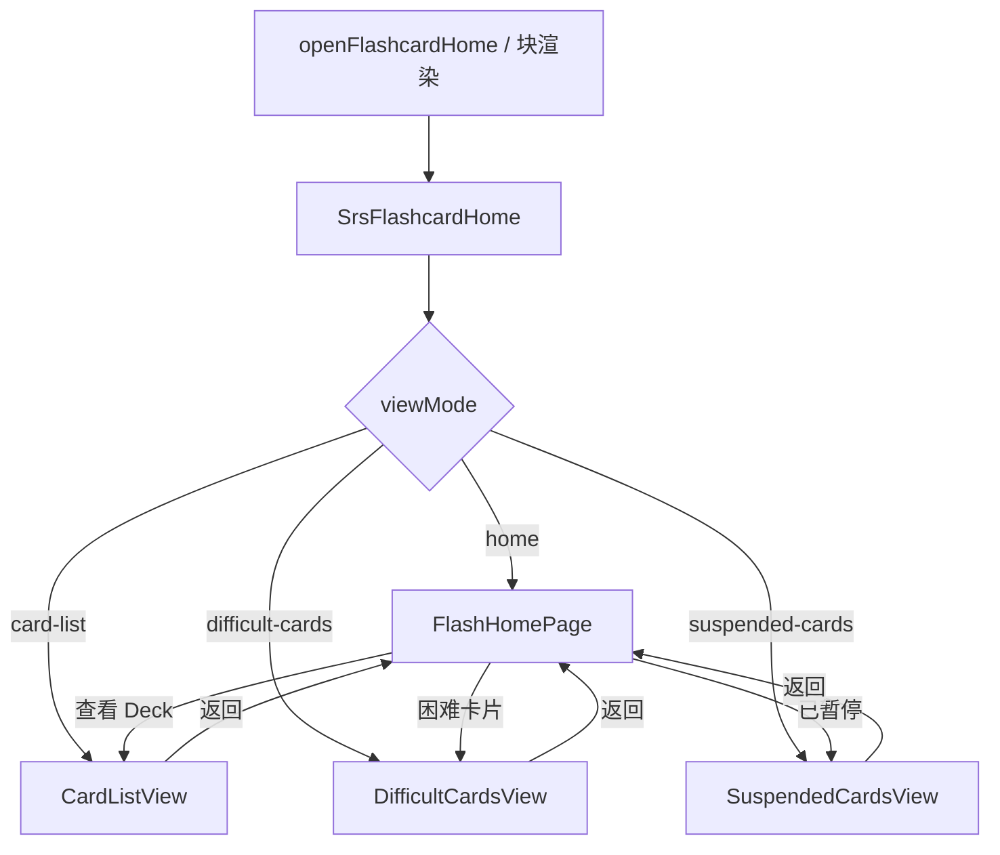

# SRS Flashcard Home（闪卡主页 / 卡片浏览器）

> **文档同步日期：2026-08-03**
> 现状以代码为准。产品主入口称为 **「今日学习」**（块类型 / 命令 ID 仍为 `srs.flashcard-home` / `openFlashcardHome` 以兼容）。
> 历史上称「卡片浏览器 / Flash Home」；旧组件 `SrsCardBrowser.tsx` **已不存在**。

## 概述

「今日学习」主页是插件的统一学习入口，以块类型 `srs.flashcard-home` 嵌入 Orca 面板。它聚合：

- **今日学习摘要**（统一 remaining：复习 + 阅读、预计分钟、建议动作、开始/继续；**无** 10/20/30 时间盒）
- **卡库次级区**（新卡 / 今日到期 / 积压三卡 + 卡组列表）
- **卡片列表**（按 Deck 筛选、重置/删除/跳转）
- **困难卡**（全页次级视图；fixed 会话，**不**写今日 resume）
- **已暂停**（全页次级视图；逐变体恢复，失败保留行并显示错误）

### 核心价值

- 打开即见「今天还剩多少 / 约几分钟 / 现在做什么」，一键开始或继续。
- 所有入口共享同一份今日 resume marker（见 `todayLearningResumeStorage`）。
- 评分后通过 `orca.broadcasts` 刷新并失效 Flash Home / 今日摘要缓存（见 `SRS_事件通信.md`）。
- 120s 低频全量兜底刷新。

---

## 代码组成

| 文件 | 职责 |
| ---- | ---- |
| `src/components/SrsFlashcardHome.tsx` | 主容器：今日摘要、resume、启动/继续、视图路由 |
| `src/components/flashcard-home/FlashHomePage.tsx` | 单页主页：HomeSummaryBar + DeckListView |
| `src/components/flashcard-home/HomeSummaryBar.tsx` | 今日学习区 + 卡库次级三统计 + 困难卡 / 刷新 |
| `src/srs/todayLearning/todayLearningSummary.ts` | 统一今日 remaining / 估时 / 完成数（防双算） |
| `src/srs/todayLearning/todayLearningResumeStorage.ts` | 版本化 resume marker（srs block / 统一 ir 入口；不存时间盒时长） |
| `src/srs/todayLearning/todayLearningLaunch.ts` | 受信任 remaining → mixed / 独立 SRS / 只读 IR 路由 |
| `src/components/flashcard-home/DeckListView.tsx` | 卡组搜索与表格（新卡 / 今日到期 / 积压） |
| `src/components/flashcard-home/DeckRow.tsx` | 单卡组行 |
| `src/components/flashcard-home/CardListView.tsx` | 卡片浏览器状态 / query / 批量 orchestration / 分页列表 |
| `src/components/flashcard-home/CardBrowserControls.tsx` | 顶栏/到期 tabs 与搜索筛选工具栏（无业务状态） |
| `src/components/flashcard-home/CardBrowserBatchControls.tsx` | 管理批量条、确认文案、选择提示与独立 batch alert |
| `src/components/flashcard-home/CardListItem.tsx` | 卡片行内容（预览 / 操作状态徽标 / 管理多选） |
| `src/components/flashcard-home/cardBrowserQuery.ts` | 浏览器纯函数：搜索 / 状态·标签·卡型·来源牌组筛选 / 稳定排序 / 选择裁剪 / 批量后选择 |
| `src/components/flashcard-home/cardBrowserBatchActions.ts` | 批量暂停·激活·重置·改牌组（partial success、块级去重） |
| `src/components/flashcard-home/CardFrame.tsx` | 卡片外壳：左侧状态色条 + 状态徽标 |
| `src/components/SuspendedCardsView.tsx` | 已暂停卡片列表、行级恢复状态与错误展示 |
| `src/components/flashcard-home/cardStatus.ts` | 到期状态（new/today/backlog/future）与日期文案 |
| `src/styles/flashcard-home.css` | Flash Home 列表框与卡片帧样式（`main.ts` 引入） |
| `src/components/DifficultCardsView.tsx` | 困难卡片列表与一键复习 |
| `src/components/SrsFlashcardHomeRenderer.tsx` | `srs.flashcard-home` 块渲染器包装 |
| `src/panels/SrsFlashcardHomePanel.tsx` | 面板入口（ErrorBoundary + hideable 布局） |
| `src/srs/hideableDisplayManager.ts` | 隐藏视图占位与样式恢复 |
| `src/srs/flashcardHomeManager.ts` | 特殊块创建、复用、清理（`flashcardHomeBlockId`） |
| `src/srs/deckUtils.ts` | `calculateDeckStats` / `calculateHomeStats` |
| `src/srs/deckNoteManager.ts` | 卡组备注 CRUD |
| `src/srs/difficultCardsManager.ts` | 困难卡判定与列表 |
| `src/srs/cardFilterUtils.ts` | 卡片筛选（全部/已到期/今天/未来/新卡） |
| `src/srs/registry/renderers.ts` | 注册 `srs.flashcard-home` |
| `src/srs/registry/commands.ts` | `openFlashcardHome` 命令 |
| `src/srs/registry/uiComponents.tsx` | 工具栏入口按钮 |
| `src/srs/registry/converters.ts` | plain 转换器 |
| `src/main.ts` | `openFlashcardHome`、`startReviewSession` 等；引入 `styles/flashcard-home.css` |

> **已删除、勿再引用**：`FlashcardDashboard`、`StatisticsView`、`components/statistics/*`、`components/charts/*`、`HomeStatsDemo`、`DeckNoteDemo`、`DeckSearchDemo`、`statisticsManager` / `srs/statistics/*`。

---

## 视图模式

```text
ViewMode = "home" | "card-list" | "difficult-cards" | "suspended-cards"
默认：home
```


```mermaid
flowchart TD
  A[openFlashcardHome / 块渲染] --> B[SrsFlashcardHome]
  B --> C{viewMode}
  C -->|home| D[FlashHomePage]
  C -->|card-list| F[CardListView]
  C -->|difficult-cards| H[DifficultCardsView]
  C -->|suspended-cards| I[SuspendedCardsView]
  D -->|查看 Deck| F
  D -->|困难卡片| H
  D -->|已暂停| I
  F -->|返回| D
  H -->|返回| D
  I -->|返回| D
```

无顶层「主页 / 卡组 / 统计」Tab。困难卡片、已暂停与单 Deck 列表为全页次级视图；`handleBack` 回到 **`home`** 并清空 `selectedDeck` / `currentFilter`。

---

## 渲染与面板

- **块类型**：`srs.flashcard-home`
- **存储键**：`flashcardHomeBlockId`（`orca.plugins.getData/setData`）
- **块属性**：`srs.isFlashcardHomeBlock`、`srs.pluginName`
- **块生命周期**（`flashcardHomeManager.ts`）：
  - **resolveBlock 三态**：state 命中或后端返回块 → 存在；后端**明确 null/undefined** → 不存在（允许新建）；后端 **throw → 读取失败向上抛**，瞬时故障绝不能新建或覆盖 `flashcardHomeBlockId`（与 IR 会话块 / 复习会话块对齐）。回归：`flashcardHomeManager.test.ts`
  - **insertBlock ID 校验**：创建时要求有限正数；坏值（undefined/null/NaN/Infinity/对象/字符串/0/负数）抛带上下文错误，零 `setProperties`、零 `setData`、不污染内存指针
- **打开逻辑**（`main.ts` → `openFlashcardHome`）：
  1. `getOrCreateFlashcardHomeBlock(pluginName)`
  2. 若某面板已打开该块 → `switchFocusTo`
  3. 否则右侧复用/新建面板，或 `openInCurrentPanel` 时在当前面板 `goTo`
- **实际渲染路径是块渲染器** `SrsFlashcardHomeRenderer`（注册于 `registry/renderers.ts`）：`openFlashcardHome` 走 `orca.nav.goTo("block", …)`，宿主用块编辑器渲染该块。`src/panels/SrsFlashcardHomePanel.tsx` 为**历史遗留、未被引用**，勿当作现行入口。
- **宿主 chrome 清理 + Wide View（2026-07-27 落地）**：渲染器 mount 时经 `shouldManageHostEditorChrome(panel, panelId, blockId)` **fail-closed** 判定「本面板主视图确为该块」，成立才给最近 `.orca-block-editor` 加类 `srs-flash-home-host-chrome-managed`，CSS 隐藏左侧 bullet / handle / `orca-repr-scope-line` / 查询 Tab（引用·同标签·候选引用，`orca-block-editor-query-tabs(-container)`）/ `orca-block-editor-query-views` / `orca-memoizedviews`；并按 `shouldInvokePanelWideViewToggle`（`panel.wide` 非 true 时一次性）切 Wide View。卸载移除该类。内嵌（Journal / 查询 / 引用预览）永不命中裸选择器。镜像 IR 的 `srs-ir-host-panel-chrome-managed`，但用独立类名解耦。
- **转换器**：plain 输出占位文本（见 `converters.ts`）

---

## 数据流

1. `loadFlashHomeData`（`src/srs/flashHomeDataLoader.ts`）：
   - 短 TTL（45s）缓存 + 并发 inflight 去重，减少重复全量 `collectReviewCards`
   - Home 用 `includeSuspended: true` 做一次有界收集，按 `isSuspended` 分成 `cards` / `suspendedCards`；统计只基于 active `cards`
   - inflight 按 include key 分槽，同 key 去重、不同 key 并发互不清理
   - 用户刷新 / 评分事件：`invalidate` + `force` 重载
2. 今日摘要：同一轮 `applyLoaded` 中 `loadTodayLearning(true, data.cards)` —— 经 `loadTodayLearningSummaryCached` 的 **`deps.collectReviewCards` 注入复用本轮 cards**，一次刷新只做一遍 SRS 全量收集（IR 收集链不受影响；回归：`src/srs/todayLearning/todayLearningSummary.depsReuse.test.ts`）；随后 `loadResume()` 读恢复点
3. 事件：`CARD_GRADED` / `CARD_POSTPONED` / `CARD_SUSPENDED` → 失效缓存并重载
4. 定时：每 **120s** `force` 刷新（`document.hidden` 时跳过本轮，避免后台反复全量收集）
5. 复习：`startReviewSession(deckName?)`；困难卡走 `createFixedRepeatSessionDescriptor` + `createRepeatReviewSession` + `createReviewSessionBlockWithDescriptor`

### TodayStats（主页三卡）

| 字段 | 含义（`calculateHomeStats`） |
| ---- | ---------------------------- |
| `newCount` | `isNew` 卡片数 |
| `pendingCount` | 非新卡且 `due <= now`（精确到时分秒） |
| `todayCount` | 上述待复习中，到期日落在今天的数量 |
| `totalCount` | 全部卡片 |

顶部展示（标签与卡组表头一致）：

| 标签 | 计算 |
| ---- | ---- |
| 新卡 | `newCount` |
| 今日到期 | `todayCount` |
| 积压 | `pendingCount - todayCount`（到期日早于今天，且已到期） |

详见 [SRS Flash Home 顶部统计卡片.md](SRS%20Flash%20Home%20顶部统计卡片.md)。

---

## FlashHomePage（单页主页）

- 上半：`HomeSummaryBar` — **今日学习**（统一 remaining、预计分钟、建议、开始/继续）+ 次级卡库统计细带（`StatChip`）
- 下半：`DeckListView` — 搜索 + 卡组表

### 动作层级与入口（2026-07-27 调整）

`HomeSummaryBar` 动作区分两行，语义层级清晰（Apple 风）：

1. `.srs-home-summary__actions`（主 CTA 行）：主按钮「开始今日学习 / 继续上次学习」（`srs-home-primary-btn`）+ 可选「重新开始」（`srs-home-linkbtn`，仅 `canContinue && canStart`）。
2. `.srs-home-summary__nav`（次级入口行）：**「阅读资料库」**（`srs-home-nav-btn--library` 强调色调，`onOpenReadingLibrary` → `openIRWorkspace({ mode: "library" })`，经 `FlashHomePage` 由 `SrsFlashcardHome.handleOpenReadingLibrary` 透传，失败可见 notify）· 「困难卡」· 「已暂停」· 刷新图标。

### 已暂停视图与恢复

- 正常 `collectReviewCards()` 仍排除暂停卡；仅 Home 的 include 路径返回暂停行并标记 `isSuspended`，因此今日 remaining、牌组统计与复习队列不包含暂停卡。
- Cloze / IO 用 `srs.cN.suspended`，Direction 用 `srs.forward|backward.suspended`；取消暂停按 `cardKeyFromReviewCard` 精确移除一行，不影响同块其它变体。
- 旧 `#card.status=suspend` 多变体块会在视图中展开。恢复目标前以后端最新块确认存活变体，把其它变体显式保持暂停后再清旧整块状态；后端读取、masks 或写入失败时保留行并显示错误。
- 成功后当前行立即消失，并失效 Flash Home / 今日摘要缓存后重载；重载失败显示 warning，不回滚已经成功的恢复写入。

回归：`src/srs/cardStatusUtils.test.ts`、`src/srs/reviewCardFactory.test.ts`、`src/srs/flashHomeDataLoader.test.ts`、`src/components/SuspendedCardsView.test.ts`。

### 启动路由（受信任 remaining 降级）

由 `decideTodayLearningLaunch`（`todayLearningLaunch.ts`）纯函数决策；首页警告/错误保留，降级 = 只用可信侧，不假装失败侧成功：

| 条件 | 行为 |
| ---- | ---- |
| IR、SRS **均为精确 number**（0 合法），且至少一侧 > 0 | 打开统一 IR 工作区，`sessionLaunchMode: "mixed"`（日额度队列，可纯复习） |
| 仅 SRS 精确且 > 0，IR 为 `null` | 独立 `startReviewSession()`；不碰 IR 收集/日统计 |
| 仅 IR 精确且 > 0，SRS 为 `null` | IR 工作区 `sessionLaunchMode: "read-only"`；不读 SRS 日志/额度 |
| 无受信任正任务 | 不启动；沿用完成/错误展示 |

- **从 Home 进入 IR（开始/继续 → mixed / ir-read-only）**：`openIrLearningFromHome` → `openIRWorkspace({ openInCurrentPanel: true, autoStart: true, … })`，在 **当前 Home 面板** 内 `goTo` IR 会话块（Home 内容被替换，不再残留并排的 Flash Home 面板块）。若已有 IR 面板被聚焦（`activePanel !== panelId`），再 `onClose` / `orca.nav.close(panelId)` 关闭 Home 面板。导航失败不关 Home；成功离开后不再刷新 Home 摘要（组件可能已卸载）。
- **resume 写入时机**：不在队列装配前写 IR marker。仅当非空队列装配成功后写 `kind: "ir"`（失败可见，不撤销可用队列）；失败/空队列不得覆盖先前有效的 SRS marker。
- **继续**：`kind: "srs"` → 验证会话块 + 导航；`kind: "ir"` → 按**当前** remaining 再走上表路由（不信任过期 launchMode）。`resumeMarkerHasTrustedTasks`：srs 仅看 SRS remaining；ir 统一 marker 在精确正 IR **或** 精确正 SRS 时均可继续。
- 主按钮：有有效当日 resume 且仍有任务 →「继续上次学习」；否则「开始今日学习」

### 视觉（2026-07-27）

- 内容居中于最大宽度列（`.srs-flash-home-page/…-view/…-difficult-cards-view` `max-width: 720px`），`.srs-flash-home-root` flex 居中 + 大留白。
- 「今日学习」升级为主卡片：大圆角 + 分层柔和阴影；剩余数 44px tabular-nums。
- 全部用 Orca CSS tokens，深浅色自适应。样式集中在 `src/styles/flashcard-home.css`。
- **恢复语义不是**字节级队列快照：SRS 用冻结 descriptor + 当前状态/日志重建；IR 用当日调度 + breakpoint 重建
- loading 不显示临时 0；完整失败「暂时无法读取今日学习」+ 重试；partial 明示「部分内容暂时无法读取」
- 卡组备注、搜索见权威文档

---

## CardListView（卡片浏览器）

父容器 `SrsFlashcardHome` 在 `card-list` 视图传入：

| prop | 内容 |
| ---- | ---- |
| `activeCards` / `suspendedCards` | **同 scope**（牌组下钻或全局 `__all__`），供列表与筛选 |
| `deckResolutionCards` | **全库** `allCards + suspendedCards`（已加载数据，不新扫库），仅供改牌组目标下拉与 `resolveDeckTargetBlockIdFromCards` |

到期 tabs 与搜索/状态等筛选在 `CardListView` 内通过 `queryBrowserCards` 完成；**默认操作状态 = 正常 (active)**，不会突然把暂停卡混进默认列表。

1. 面包屑：返回、Deck 名、「复习此牌组」（**仅 active 可复习到期**，与 statusFilter 无关）、「批量语音」
2. **到期 tabs**：数量基于当前操作状态子集
3. **工具栏**（`CardBrowserControls.CardBrowserToolbar`）：搜索 front/back/tag；状态/卡型/标签；**来源牌组筛选选项 = scope**；排序稳定
4. **多选**：`cardKeyFromReviewCard`；全选筛选结果；`pruneBrowserSelection`；与 TTS 选择互斥；`batchBusy` 时 checkbox/返回/单卡删重置禁用
5. **批量**（`CardManageBatchBar`）：
   - 暂停 / 激活 / 重置语义同前
   - **改牌组**目标列表与解析均用 `deckResolutionCards`（全库），故从牌组 A 可改到 B
   - partial：`nextSelectionAfterBatch` 只保留 failed keys；全成功清空；全失败保持选择
   - **`CardBatchAlert` 独立 `role=alert`**，不依赖 selectedCount；可显式关闭 / 下次操作 / 进 TTS 清理
   - 写成功后 cache invalidate + `applyLoaded(true, false)`；父级在 `showSpinner===false` 失败时 **rethrow**，子级提示「动作已写入但刷新失败」
6. 列表：`CardFrame` + `CardListItem`；已暂停/待激活徽标独立；无限滚动 20/页

回归（Vitest）：`cardBrowserQuery.test.ts`、`cardBrowserBatchActions.test.ts`。

### 手工 Orca 验证清单

1. 打开某牌组列表：默认仅 active；切状态「已暂停」可见暂停行与徽标
2. 搜索 front/back/标签；组合卡型 + 来源牌组 + 到期 tab
3. 全选筛选结果（多于一页时仍全选）；筛选后再选应无幽灵
4. 批量暂停 / 激活 / 重置 / 改牌组（同块两变体只应改一次牌组）；确认 partial 失败可见
5. TTS 批量语音与管理多选互不串扰

### 删除的变体感知语义（`deleteReviewCardBackendData`，`SrsFlashcardHome.tsx` 导出）

cloze / direction 变体行的删除**不得**直接摘整块 `#card`（否则同块其它变体被静默踢出复习系统）：

- 先以后端 `get-block` 读块内容（**不走本地块缓存**；读取失败**抛错**，不静默降级为整卡删除），用 `getAllClozeNumbers` / `extractDirectionInfo + getDirectionList` 判断同块是否还有**其它存活变体**。
- **仍有其它变体** → 仅删该变体前缀属性（`deleteClozeCardSrsData` 删 `srs.cN.*` / `deleteDirectionCardSrsData` 删 `srs.<dir>.*`），**保留 `#card`**；返回 `{ kind: "variant-only", remainingVariants }`，成功通知「已删除{填空 cN|正向卡|反向卡}，同块其它卡片保留 #card」。
- **无剩余变体**（或普通卡） → `deleteCardSrsData` 清全部 `srs.*` 属性 + `core.editor.removeTag("card")`；返回 `{ kind: "full" }`。
- 每次属性写入后 `invalidateBlockCache(card.id)`。

回归：`src/components/SrsFlashcardHome.delete.test.ts`（cloze/direction 变体保留、最后一个变体整卡删除、读块失败抛错）。

### 视觉帧结构（Deck 下钻）

```text
CardListView
└── .srs-card-list-frame          # 列表托盘：间距与抬升，卡片不贴成一片
    └── CardFrame × N            # 单卡外壳：左色条 = 状态
        └── CardListItem         # 预览 / 元数据徽标 / 删除·重置·跳转
```

| 状态键 | 含义（自然日） | UI |
| ------ | -------------- | -- |
| `new` | 新卡（`isNew`） | 左色条 + **新卡** 徽标 |
| `today` | 今日到期 | 左色条 + 今日相关徽标/文案 |
| `backlog` | 积压（到期日早于今天） | 左色条 + 积压/已到期文案 |
| `future` | 未来到期 | 左色条 + 未来文案 |

意图：用 **帧（frame）+ 色条 + 间距** 区分「列表容器」与「单卡」，状态一眼可读；业务筛选仍走 `cardFilterUtils.FilterType`（按自然日，非 `pendingCount` 的「精确 now」）。

相关实现：`CardListView.tsx`、`CardFrame.tsx`、`CardListItem.tsx`、`cardStatus.ts`、`src/styles/flashcard-home.css`（由 `src/main.ts` import）。

---

## 主页三数导航

点击 **新卡 / 今日到期 / 积压** → 全局卡片列表（`selectedDeck = __all__`）并设置筛选：

| 三数 | FilterType |
| ---- | ---------- |
| 新卡 | `new` |
| 今日到期 | `today` |
| 积压 | `overdue` |

实现：`homeStatNav.ts`、`HomeSummaryBar` → `handleStatClick`。

## 视觉规范

> **唯一验收标准**：[SRS_UI设计规范.md](SRS_UI设计规范.md)。令牌真源 `src/styles/srs-design-tokens.css`（由 `src/main.ts` **最先**导入）。

`src/styles/flashcard-home.css` 是该规范的**基准实现**，同时是令牌层的第一个消费者（2026-07-27 完成令牌化）：

- 圆角 / 间距 / 阴影 / 动效时长 / 字号 / 字重 / 内容测量一律取 `--srs-*` 令牌，**不再写裸数值**；仅少数无对应档的值保留字面量并就地注释说明（`18px`/`26px` 环形字号、`15px` 主 CTA 与次级按钮图标、`24px`/`48px` 空状态图标、`360px` 错误详情宽、`0.4s` 进度弧补间、`10px`/`14px`/`18px` 等非 4pt 栅格间距）。
- 颜色只能来自 `--orca-color-*` 或令牌层派生的 `--srs-accent-*` / `--srs-surface-*` / `--srs-hairline*`；唯一允许的十六进制是 `--orca-color-warning-6` 的 fallback。
- 状态语义统一：新卡 `--srs-accent-new`、今日到期 `--srs-accent-due`、积压 `--srs-accent-backlog`、未来 `--srs-accent-future`、阅读 `--srs-accent-reading`（左色条、徽章、卡组表计数列、`StatChip` 全部共用）。
- **React 内联样式不再承载视觉表现**。`FlashHomePage` / `HomeSummaryBar` / `DeckListView` / `DeckRow` / `CardListView` / `CardListItem` / `HighlightText` / `TodayProgressRing` / `DifficultCardsView` / `SrsFlashcardHomeRenderer` / `SrsFlashcardHomePanel` / `SafeBlockPreview` / `DeckCardCompact` 均走 CSS 类。仅两类例外：
  1. `TodayProgressRing` 的 `strokeDasharray` / `strokeDashoffset`（运行时几何量，必须留内联）；
  2. `StatChip` 通过 `style={{ "--srs-stat-chip-tone": … }}` 把**令牌名**交接给样式表（不是硬编码颜色）。
- 宿主 Button 无 `disabled` 属性，禁用态统一用 `.srs-btn-disabled`（`opacity/cursor`），替代原先的内联 `opacity`。
- 所有自定义可点击元素（`.srs-home-linkbtn`、`.srs-home-nav-btn`、`.srs-filter-chip`、`.srs-stat-chip--clickable`、`.srs-today-learning__timebox-btn`、`.srs-deck-row__main`、`.srs-difficult-card`）具备 `:hover` / `:active` / `:disabled` / `:focus-visible` 四态，焦点环 `2px solid var(--orca-color-primary-5)` + `outline-offset: 2px`。
- **禁止放宽**文件顶部的宿主 chrome 隐藏选择器（`.orca-block-editor.srs-flash-home-host-chrome-managed …`）与 `.srs-flash-home-host { display: contents }`；裸选择器会波及内嵌渲染。

困难卡片视图的类名表见 [SRS_困难卡片.md](SRS_困难卡片.md#视觉规范)。

## 危险操作确认

`CardListItem` 删除 / 重置经 `orca.components.ConfirmBox` 二次确认后再生效。删除确认文案按变体三分（`deleteConfirmText`，导出便于测试）：

| 行类型 | 文案要点 |
| ------ | -------- |
| cloze 变体 | 「确定删除此填空（cN）？…同块其它填空/卡片不受影响，仅当它是本块最后一个卡片变体时才移除 #card」 |
| direction 变体 | 「确定删除此方向（正向/反向）？…同块另一方向不受影响，仅当它是本块最后一个卡片变体时才移除 #card」 |
| 普通卡 | 「确定删除此卡片？将移除 #card 与 SRS 数据，不可撤销。」 |

## 扩展点

1. 将 `DeckCard` 卡片模式重新挂入视图切换（代码内仍保留组件）。
2. 视图状态（`selectedDeck` / `currentFilter`）持久化到块属性。

---

## 相关文件

| 文件 | 说明 |
| ---- | ---- |
| `src/components/SrsFlashcardHome.tsx` | 主容器与视图路由 |
| `src/components/flashcard-home/FlashHomePage.tsx` | 单页主页 |
| `src/components/flashcard-home/HomeSummaryBar.tsx` | 顶部摘要区 |
| `src/components/flashcard-home/DeckListView.tsx` | 卡组列表 |
| `src/components/flashcard-home/DeckRow.tsx` | 卡组行 |
| `src/components/flashcard-home/StatCard.tsx` | 统计小卡 |
| `src/components/flashcard-home/CardListView.tsx` | 卡片浏览器状态与编排 |
| `src/components/flashcard-home/CardBrowserControls.tsx` | 顶栏与筛选工具栏 UI |
| `src/components/flashcard-home/CardBrowserBatchControls.tsx` | 批量管理与 alert UI |
| `src/components/flashcard-home/CardListItem.tsx` | 卡片行内容 |
| `src/components/flashcard-home/cardBrowserQuery.ts` | 筛选 / 排序 / 选择纯函数 |
| `src/components/flashcard-home/cardBrowserBatchActions.ts` | 批量写入 |
| `src/components/flashcard-home/CardFrame.tsx` | 卡片外壳（左色条 / 状态帧） |
| `src/components/flashcard-home/cardStatus.ts` | 列表用到期状态与日期文案 |
| `src/components/flashcard-home/homeStatNav.ts` | 三数 → 全局筛选映射 |
| `src/srs/flashHomeDataLoader.ts` | 首屏 collect TTL 缓存 + 去重 |
| `src/styles/flashcard-home.css` | 列表托盘与卡片帧样式 |
| `src/components/DifficultCardsView.tsx` | 困难卡片 UI |
| `src/components/SrsFlashcardHomeRenderer.tsx` | 块渲染器 |
| `src/panels/SrsFlashcardHomePanel.tsx` | 面板封装 |
| `src/srs/flashcardHomeManager.ts` | 块生命周期 |
| `src/srs/deckUtils.ts` | Deck/首页统计 |
| `src/srs/deckNoteManager.ts` | 卡组备注 |
| `src/srs/difficultCardsManager.ts` | 困难卡后端 |
| `src/srs/cardFilterUtils.ts` | 到期 tabs 筛选 |
| `src/srs/srsEvents.ts` | 广播事件名 |
| `src/main.ts` | 打开与复习入口；引入 `flashcard-home.css` |
| `src/srs/registry/{commands,renderers,uiComponents,converters}.ts` | 注册 |

### 相关模块文档

- [SRS Flash Home 顶部统计卡片.md](SRS%20Flash%20Home%20顶部统计卡片.md)
- [SRS_困难卡片.md](SRS_困难卡片.md)
- [SRS_卡组备注.md](SRS_卡组备注.md)
- [SRS_卡组搜索.md](SRS_卡组搜索.md)
- [SRS_事件通信.md](SRS_事件通信.md)
