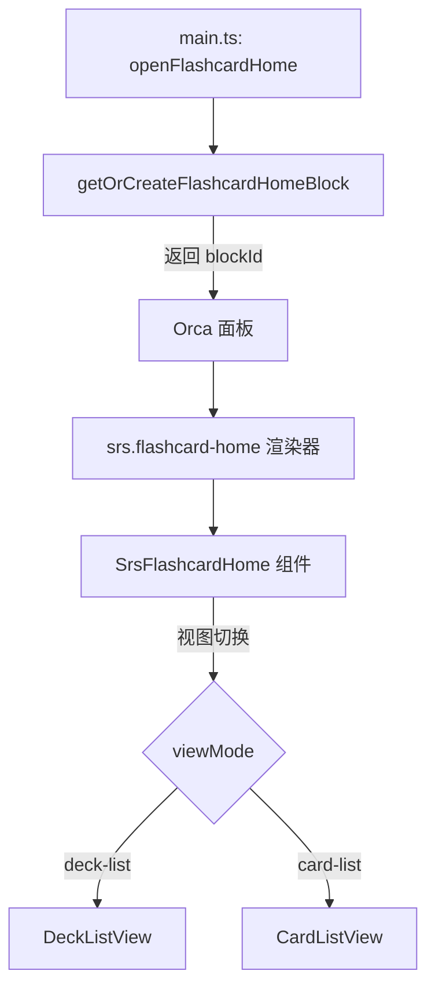

# SRS 卡片浏览器（Flashcard Home）

## 概述

Flashcard Home 是新版卡片浏览器，嵌入在 Orca 面板系统中，以块的形式呈现。它替换了早期的模态弹窗（`SrsCardBrowser.tsx`），提供更完整的仪表板体验，让 Deck 管理、卡片统计与卡片列表聚合在同一面板。

> [!NOTE]
> 2025‑12‑10 起，所有“打开卡片浏览器”的入口都会转向 Flashcard Home 块（`srs.flashcard-home`）。

### 核心价值

- **与面板系统一致**：支持分屏、面板历史、快捷键，不卡住编辑器。
- **数据聚合**：一屏展示统计、快速复习、Deck 卡片与卡片列表。
- **按 Deck 复习**：直接在列表中触发指定 Deck 的复习队列。
- **统一的卡片列表**：沿用旧浏览器的筛选逻辑（全部/已到期/今天/未来/新卡）。
- **可刷新**：随时重新计算统计与卡片状态。

---

## 代码组成

| 文件 | 职责 |
| ---- | ---- |
| `src/components/SrsFlashcardHome.tsx` | 主界面组件，包含 DeckListView 与 CardListView |
| `src/components/DeckCardCompact.tsx` | Deck 紧凑卡片组件 |
| `src/components/SrsFlashcardHomeRenderer.tsx` | Block 渲染器包装，供 Orca 渲染块 |
| `src/srs/flashcardHomeManager.ts` | 特殊块创建、复用、清理 |
| `src/srs/registry/renderers.ts` | 注册 `srs.flashcard-home` 渲染器 |
| `src/srs/registry/uiComponents.tsx` | 工具栏“Flashcard Home”按钮 |
| `src/srs/registry/commands.ts` | `openFlashcardHome` 命令 |
| `src/main.ts` | 面板打开逻辑、Block 管理、复习过滤 |

---

## 渲染架构

- **Block 类型**：`srs.flashcard-home`
- **存储键**：`flashcardHomeBlockId`（保存在插件数据里，避免重复创建）
- **转换器**：plain 格式输出 `[SRS Flashcard Home 面板块]`

---

## DeckListView

DeckListView 是默认视图，聚合仪表板、快速复习入口、Deck 列表三块内容。

### 1. 顶部信息

- 标题 + 当前插件名
- “刷新”按钮（有节流，刷新中禁用）
- 错误提醒（加载失败时展示）

### 2. 统计仪表板

| 指标 | 数据来源 | 说明 |
| ---- | -------- | ---- |
| 今日待复习 | `TodayStats.todayCount` | 今天到期的复习卡片（**不含新卡**） |
| 新卡待学 | `TodayStats.newCount` | 从未复习过的卡片（**单独统计**） |
| 总卡片数 | `DeckStats.totalCards` | 所有 Deck 的卡片总数（新卡 + 复习卡） |

`TodayStats` 由 `calculateHomeStats()` 基于 `ReviewCard[]` 计算：
- **新卡与复习卡分开统计**：新卡只计入 `newCount`，不计入 `todayCount` 或 `pendingCount`
- `pendingCount`：<= 今天结束时间的复习卡片（不含新卡）
- `todayCount`：今天到期的复习卡片（不含新卡）

### 3. 快速复习区

- “开始今日复习”：调用 `startReviewSession()`（无参，复习队列自动包括到期卡片）。
- “复习所有到期”：使用相同入口，但文案强调范围。
- 两个按钮在没有待复习卡片时通过 `opacity + pointerEvents` 禁用。

### 4. Deck 管理

每个 Deck 使用 `DeckCardCompact` 渲染：

- 统计：`新卡 / 今天到期 / 已到期 / 总数`
- 操作：`查看`（切换视图到 CardListView）、`复习`（`startReviewSession(deckName)`）
- 支持自动布局（`grid` + `minmax(280px, 1fr)`）

---

## CardListView

CardListView 在选择 Deck 后显示，沿用了旧浏览器的列表体验。

### 功能模块

1. **面包屑**：返回按钮、Deck 名称、刷新按钮、`复习此 Deck`。
2. **Deck 概览**：展示该 Deck 的新卡/今天/已到期/总数。
3. **筛选标签**：`全部/已到期/今天/未来/新卡`，每个标签显示数量。
4. **卡片列表**：按到期时间排序，支持点击跳转块。
5. **空状态**：无卡片或加载时给出提示。

### 筛选逻辑

- `overdue`: `card.srs.due < todayStart`
- `today`: `within today range`
- `future`: `> todayEnd`
- `new`: `card.isNew === true`
- 过滤使用 `useMemo`，避免重复计算。

### 卡片行内容

- Front 预览 + Cloze 编号（如 `#c2`）
- 上次复习时间、到期时间（状态颜色）、复习次数
- 额外标签徽章（排除 `#card`），点击可跳转到对应标签块
- 点击卡片行或标签徽章：默认在当前面板右侧打开目标块（优先复用右侧面板，否则使用 `orca.nav.addTo(panelId, "right", { view: "block", viewArgs: { blockId } })` 创建）

---

## 数据流

1. `loadData()` 使用 `collectReviewCards(pluginName)` 获取所有卡片。
2. `calculateDeckStats()` 生成各 Deck 统计以及总数。
3. `calculateHomeStats()` 生成仪表板数据。
4. React state 保存：`deckStats`、`todayStats`、`cards`、`viewMode`、`selectedDeck`、加载状态。
5. 复习入口调用 `startReviewSession(deckName?)`，`main.ts` 会记录 `reviewDeckFilter`，并在 `SrsReviewSessionRenderer` 里过滤队列。
6. **实时刷新**：复习面板评分/埋藏/暂停成功后通过 `orca.broadcasts` 广播事件，FlashcardHome 订阅后触发 `loadData(false)` 静默刷新，避免返回后仍显示旧统计（详见 `模块文档/SRS_事件通信.md`）。

---

## 面板管理

- `openFlashcardHome()`：确保右侧面板存在，如果没有则在当前活动面板右侧新建。
- `flashcardHomeManager`：负责创建/复用块，保存到插件数据，卸载时清理。
- 渲染器 `SrsFlashcardHomeRenderer` 将 React 组件包裹在 `BlockShell` 中，禁用编辑。

---

## 扩展点

1. **新增统计卡片**：在 `StatsSection` 中添加条目，数据可来自 `ReviewCard[]` 的更多指标。
2. **快速行动**：为 Deck 卡片扩展更多操作（如重置、导出）。
3. **卡片列表操作**：支持批量选择、快速跳转等。
4. **视图持久化**：可将 `selectedDeck`、`currentFilter` 写入 block 状态，面板关闭后恢复。
5. **趋势与图表**：在 DeckListView 上增加图表区，复用 `cards` 数据。

---

## 相关文件

| 文件 | 说明 |
| ---- | ---- |
| `src/components/SrsFlashcardHome.tsx` | 主界面逻辑 |
| `src/components/DeckCardCompact.tsx` | Deck 卡片组件 |
| `src/components/SrsFlashcardHomeRenderer.tsx` | Block 渲染器 |
| `src/srs/flashcardHomeManager.ts` | 特殊块管理 |
| `src/main.ts` | openFlashcardHome、reviewDeckFilter、复习入口 |
| `src/srs/registry/commands.ts` | `openFlashcardHome` 命令注册 |
| `src/srs/registry/uiComponents.tsx` | 工具栏按钮 |
| `src/srs/registry/renderers.ts` | `srs.flashcard-home` 注册 |
| `src/srs/registry/converters.ts` | plain 转换器 |
