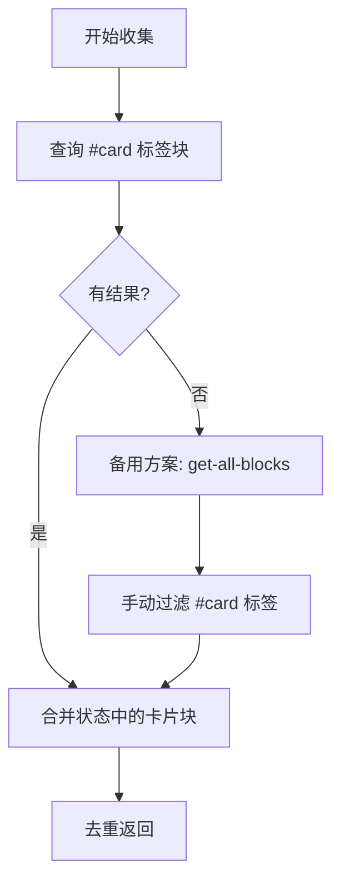
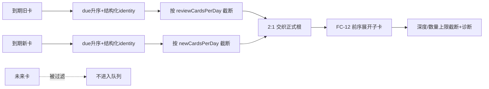
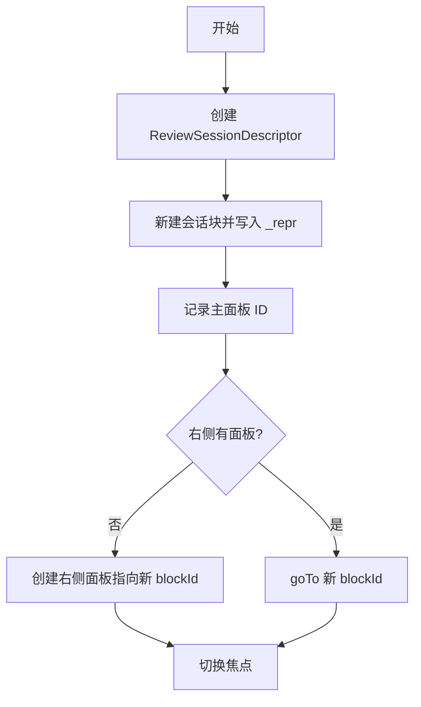

# SRS 复习队列管理模块

## 概述

本模块负责复习队列的构建和管理，包括收集待复习卡片、生成复习顺序、管理复习会话块。

### 核心价值

- 智能排序复习顺序
- 两旧一新的交织策略
- 管理复习会话的生命周期

## 技术实现

### 核心文件

- [main.ts](file:///d:/orca插件/虎鲸标记%20内置闪卡/src/main.ts)（队列管理函数、启动入口）
- [reviewSessionDescriptor.ts](file:///d:/orca插件/虎鲸标记%20内置闪卡/src/srs/reviewSessionDescriptor.ts)（**F2-01** 版本化会话描述）
- [reviewSessionManager.ts](file:///d:/orca插件/虎鲸标记%20内置闪卡/src/srs/reviewSessionManager.ts)（会话块创建与 descriptor 写入）
- [repeatReviewManager.ts](file:///d:/orca插件/虎鲸标记%20内置闪卡/src/srs/repeatReviewManager.ts)（fixed/repeat 按 sessionId 内存载荷）

### 核心函数

#### `collectSrsBlocks(): Promise<BlockWithRepr[]>`

收集所有 SRS 卡片块：


```mermaid
flowchart TD
    A[开始收集] --> B[查询 #card 标签块]
    B --> C{有结果?}
    C -->|是| D[合并状态中的卡片块]
    C -->|否| E[备用方案: get-all-blocks]
    E --> F[手动过滤 #card 标签]
    F --> D
    D --> G[去重返回]
```

#### `collectReviewCards(pluginName?, options?): Promise<ReviewCard[]>`

将块转换为 ReviewCard 对象：

```typescript
// 返回结构
{
  id: DbId,       // 块 ID
  front: string,  // 题目
  back: string,   // 答案
  srs: SrsState,  // SRS 状态
  isNew: boolean, // 是否新卡
  deck: string,   // Deck 名称
  tags?: {        // 额外标签（排除 #card）
    name: string
    blockId: DbId
  }[]
}
```

**FC-13 收集性能（默认开启，不改变卡片数量/顺序/card key/due/isNew/deck）：**

1. **块缓存预热**：`preheatBlockCache(collectSrsBlocks 返回的完整块)`，避免 `ensure*` 对同一卡块再 `get-block`。
2. **List 子块批量预取**：去重后 `get-blocks` 分批（默认 batch=50、并发≤4），再写入块缓存。
3. **牌组名批量预取**：`prefetchDeckNamesForBlocks` 先读 `orca.state.blocks`，缺失目标块用正式 `get-blocks` 去重分批读取；单卡 `extractDeckName` 命中本轮缓存。收集结束 `clearDeckNameCache`，**不做长期牌组索引**。
4. **metrics**：可选 `options.metricsOut` 写入 `CollectReviewCardsMetrics`（输入块数、输出卡数、总耗时、阶段耗时、最慢阶段、预热数、并发峰值、牌组/列表预取摘要）。`logMetrics: true` 时才 `console.info`；生产默认不刷屏。
5. **测试开关**：`disableOptimizations: true` 仅用于 A/B 与行为等价回归，生产不得关闭。
6. **失效**：评分/写入仍走既有 `invalidateBlockCache`；不引入依赖不完整删除/卡型/牌组事件的长期索引。
7. **轮询策略（评估结论）**：
   - 会话 60s 全库扫描：**保留**。F2-04 `pendingDueStateRef`（`pendingDueRequeue`）只覆盖正式 Again/Hard 后 5 分钟内重学卡；新到期卡/他处编辑无完整事件时，仅扫描短期候选无法证明可靠。调用成本已由本收集优化显著下降。fixed/repeat 仍禁止全库扫描。
   - 首页 120s 兜底刷新：**保留**。已有 graded/postponed/suspended 事件即时刷新；编辑/删除事件不完整，低频全量仍作兜底。

#### `buildReviewQueue(cards, limits?): ReviewCard[]`

构建复习队列：到期筛选 → **FC-11 稳定排序** → **FC-01 限额** → 两旧一新交织。

**关键特性：**

- **到期判断（精确时间）**：`card.srs.due.getTime() <= now`；新卡同样检查到期时间
- **FC-11 稳定排序**（旧卡、新卡各自独立排序，不依赖输入/后端顺序）：
  1. `due` 升序（逾期最久优先）
  2. 相同 due：`cardIdentity` 结构化比较（`compareReviewCardIdentity` / `orderTupleFromIdentity`）
     - Cloze：`clozeNumber` **数值**序（c2 先于 c10，避免 cardKey 字符串字典序）
     - Direction：`forward` 先于 `backward`
     - List：`listItemId` 数值自然序
     - **不改变** `buildCardKey` / 日志字符串格式
  3. 不随机；fixed 会话与动态候选共用同一 `buildReviewQueue`（均稳定排序）
- **FC-01 每日正式根卡限额**：可选显式 `limits: { newCardsPerDay, reviewCardsPerDay }`；**不得**在函数内隐式读全局 settings
  - 有 limits：在**已稳定排序**的序列上截断旧卡 `reviewCardsPerDay`、新卡 `newCardsPerDay`，再 2:1 交织
  - `limits` 省略/`null`：不限额（fixed 会话、动态扫描候选列表），仍做稳定排序
  - **辅助子卡不计入正式根卡额度**（先限额再展开；`formalRootCards` 仅含已选根）
  - **跨普通会话按当天日志累计**：Renderer 启动普通会话时读取本地时区「今天 00:00:00.000 → 当前」`getReviewLogs`，按 `cardKey` 去重统计已用新/旧卡额度，将 `remaining = max(0, configured - used)` 同时传给 `setSessionDailyLimits` 与 `buildSessionReviewQueue`；同一 remaining 冻结为动态追加 budget
- **特殊卡 due 分天**：List 解锁、Cloze/Direction 分天推送由各自 `due` 决定入队与先后；排序只按 due + identity，不打乱分天策略
- **FC-12 子卡展开**（`buildReviewQueueWithChildren` / `buildSessionReviewQueue` / `expandChildCardsForRoots`）：
  - 跟随已排序正式根卡做**确定性前序**展开；**不改变** FC-11 根卡排序与链内既有顺序
  - 正式根深度 = 0，始终保留；限制**只计辅助子卡**
  - 显式 `childExpandLimits: { maxDepth, maxAuxChildCards }`；默认 **maxDepth=10**、**maxAuxChildCards=200**（每会话）
  - 核心函数只收显式输入，**不读**全局 settings；无效值（负/NaN/小数/过大）`warn` 并回退默认
  - 达单链深度或会话辅助数量上限：截断该扩展，**继续**后续正式根卡；链内循环安全终止
  - 返回诊断（`truncated`、`reason`、`rootKey`、`depth`/`count`、`message`），不得静默；Renderer 生成简短 warning 交给 Demo 会话顶部展示，控制台打印具体诊断
  - fixed / normal / repeat 行为一致（fixed 正式根仍不限额，但子卡展开仍受 FC-12 约束）

```typescript
// 显式限额（普通 all/deck 会话）
buildReviewQueue(filteredCards, { newCardsPerDay: 30, reviewCardsPerDay: 200 })

// 不限额但稳定排序（fixed / 动态候选）
buildReviewQueue(allCards, null)

// 会话队列：正式根限额 + 子卡展开限制（默认 10/200）
await buildSessionReviewQueue(cards, pluginName, dailyLimits, {
  maxDepth: 10,
  maxAuxChildCards: 200
})
// → { queue, formalRootCards, childExpandDiagnostics, childExpandLimits, auxChildCount }
```


```mermaid
flowchart LR
    A[到期旧卡] --> S1[due升序+结构化identity]
    C[到期新卡] --> S2[due升序+结构化identity]
    S1 --> T[按 reviewCardsPerDay 截断]
    S2 --> U[按 newCardsPerDay 截断]
    T --> B[2:1 交织正式根]
    U --> B
    B --> E[FC-12 前序展开子卡]
    E --> F[深度/数量上限截断+诊断]
    D[未来卡] -.被过滤.-> G[不进入队列]
```

相关纯函数：`partitionDueAndNewCards`、`sortCardsForReviewQueue` / `compareReviewCardsForQueue`、`applyDailyRootLimits`、`interleaveDueAndNew`、`resolveChildExpandLimits`、`expandChildCardsForRoots`、`formatChildExpandWarning`。回归：`cardCollector.queueOrdering.test.ts`、`cardCollector.queueLimits.test.ts`、`cardCollector.children.test.ts`。
#### `calculateDeckStats(cards): DeckStats`

计算各 Deck 的统计信息：

```typescript
// 返回结构
{
  decks: DeckInfo[],   // 各 Deck 信息
  totalCards: number,  // 总卡片数
  totalNew: number,    // 总新卡数
  totalOverdue: number // 总到期数
}
```

### 会话描述与会话块管理（F2-01）

#### `ReviewSessionDescriptor`（`reviewSessionDescriptor.ts`）

版本化、可序列化的**会话启动描述**，至少包含：

| 字段 | 说明 |
|------|------|
| `version` | 当前为 `1`；未知版本严格失败 |
| `sessionId` | 稳定会话身份（供后续 F2-09 断点恢复关联；本阶段不实现恢复 UI） |
| `createdAt` | 创建时间 Unix 毫秒 |
| `kind` | 互斥：`normal` \| `fixed` \| `custom` |
| `updatesSrs` / `consumesDailyQuota` | 是否更新正式 SRS / 消耗全局每日额度 |

| kind | 子类型 | updatesSrs | consumesDailyQuota | 说明 |
|------|--------|------------|--------------------|------|
| `normal` | `scope.kind=all` | true | true | 全部牌组正式复习 |
| `normal` | `scope.kind=deck` + `deckName` | true | true | 单牌组正式复习 |
| `fixed` | `mode=repeat` + source + cardKeys | false | false | 重复复习 / 困难卡 / 查询块专项 |
| `custom` | `definition.mode=scheduled\|practice` | 视模式 | 视模式 | **仅类型可扩展**；无启动 UI，Renderer 加载时明确报错 |

校验规则：缺失、损坏、未知版本、未知 kind → 抛 `ReviewSessionDescriptorError`，**禁止**回退为 all scope。

#### 与会话块的稳定关联

- 每次「启动复习」调用 `createReviewSessionBlockWithDescriptor(pluginName, descriptor)` **新建** `srs.review-session` 块。
- 描述写入块 `_repr.sessionDescriptor`（与 `type: "srs.review-session"` 一并设置）；属性 `srs.sessionId` 便于诊断。
- **禁止**复用单一全局 `reviewSessionBlockId` 再覆盖描述（旧 `getOrCreateReviewSessionBlock` 已废弃并抛错）。
- Renderer 只按当前 `blockId` 读描述；异步收集期间其它启动创建的是**另一块**，不会改写本块描述。

#### 同一会话块重复打开的语义

| 动作 | 语义 |
|------|------|
| 再次导航到**同一** `blockId` | **复用**块上已冻结的 descriptor（同 `sessionId`、同 scope）；不新建会话 |
| 再次点击「开始复习 / 牌组复习 / 重复复习」 | **新建**块 + 新 `sessionId` + 新描述；不覆盖旧块 |
| fixed/repeat 内存载荷丢失（如进程重启） | 明确错误，请用户重新从入口启动；不回退 all |

#### `cleanupReviewSessionBlock(pluginName)`

仅清理进程内 last-created 指针；不删除笔记中的会话块，避免打开中的面板丢描述。

### 复习队列策略

#### 稳定排序 + 两旧一新交织

```
输入（任意顺序）：
- 到期旧卡 due 时间：C < A < B < D < E
- 新卡 due / identity 序：1, 2, 3

排序后：
- 旧卡：[C, A, B, D, E]
- 新卡：[1, 2, 3]

输出队列（2:1）：
[C, A, 1, B, D, 2, E, 3]
```
#### 到期判定（2025-12-10 更新）

- **新卡定义**：`lastReviewed === null` 或 `reps === 0`
- **到期判断（类似 ANKI）**：
  - 只比较日期，忽略时分秒
  - 计算今天范围：`[今天零点, 明天零点)`
  - 到期条件：`card.srs.due < 明天零点`
  - 即使卡片到期时间是今天 14:10，在今天 14:00 也能看到
- **新卡也要检查到期**：只有到期日期 <= 今天的新卡才会出现在队列中
- **未来卡片**：到期日期 > 今天的卡片不进入本次队列

### 面板管理

#### `startReviewSession(deckName?)`

启动普通复习会话（F2-01）：

1. `createNormalSessionDescriptor(deckName)` → 版本化描述（all 或 deck）
2. `createReviewSessionBlockWithDescriptor` 新建会话块并写入 `_repr.sessionDescriptor`
3. 记录当前面板为主面板
4. 在右侧（或当前）面板打开**该** `blockId`
5. Renderer 只读本块描述加载队列


```mermaid
flowchart TD
    A[开始] --> B[创建 ReviewSessionDescriptor]
    B --> C[新建会话块并写入 _repr]
    C --> D[记录主面板 ID]
    D --> E{右侧有面板?}
    E -->|否| F[创建右侧面板指向新 blockId]
    E -->|是| G[goTo 新 blockId]
    F --> H[切换焦点]
    G --> H
```

`getReviewDeckFilter()` 已废弃：可能被后续启动覆盖，**不得**作为 Renderer 加载来源。

### 会话范围冻结（FC-02 + F2-01）

核心文件：`src/srs/reviewSessionScope.ts`、`src/srs/reviewSessionDescriptor.ts`

启动入口把范围写入**块上**的 `ReviewSessionDescriptor`；Renderer 解析后得到不可变 `ReviewSessionScope`，经 Props 传给 `SrsReviewSessionDemo`。Demo **不得**再读取全局 deck filter 或模块级「当前会话」。

| kind | 含义 | 动态检查 |
|------|------|----------|
| `all` | 今日全部复习，无牌组限制 | 允许全库扫描，A/B 均可追加 |
| `deck` | 固定单牌组 `deckName` | 允许扫描，但只接纳 `card.deck === deckName` |
| `fixed` | 重复复习/困难卡/专项训练固定集合（`cardKeys` + List `fixedRootIds`） | **禁止**全库扫描；只允许集合内重新入队；List 同根后续条目/辅助预览允许 |

规则摘要：

1. 普通会话：`loadReviewQueue` 从 `blockId` 读 descriptor → `scopeFromReviewSessionDescriptor` / `prepareNormalSessionQueueInput` 筛选初始 cards。快速连续启动 Deck A 再 Deck B：各自新块、各自描述，异步收集互不影响。
2. 重复复习：`createFixedRepeatSessionDescriptor` + `createRepeatReviewSession(..., sessionId)`（创建 ≠ retain）；Renderer 用 `getRepeatReviewSessionById` + **retain**；effect cleanup **release**。引用归零才删内存载荷。多面板同 sessionId 互不影响。
3. 异步加载：`asyncLoadGeneration` generation gate，latest-wins；旧 in-flight 不得提交 state。
4. 定时 60s 刷新、手动「检查新到期卡片」、Again/Hard pending due 重入队，全部走同一 scope helper（`selectNewDueCardsForSession` / `selectPendingDueCardsForRequeue` / `isCardInSessionScope`）。
5. **F2-04 短期重入**：`pendingDueRequeue` 幂等 upsert + timer token；入队去重**只查未处理尾部**（历史副本不挡）；到期追加队尾；已接纳身份不二次消耗额度。详见 `模块文档/SRS 动态复习队列.md`。
6. card key 统一 `cardKeyFromReviewCard`；Cloze/Direction 按精确变体，不因同 `blockId` 串卡；List 用 `fixedRootIds` 允许同根下一条。

### 每日正式根卡额度（FC-01）

核心文件：`src/srs/reviewSessionBudget.ts`、`src/srs/cardCollector.ts`、`src/components/SrsReviewSessionRenderer.tsx`

| 概念 | 规则 |
|------|------|
| 作用对象 | **仅正式根卡**（`buildReviewQueue` / 动态追加的到期根卡） |
| 子卡 | `buildReviewQueueWithChildren` / `expandChildCardsForRoots` 随已选根卡展开的辅助子卡 **不消耗** 新/旧额度，也 **不能** 使额外根卡进入 |
| 计算范围 | 指定 deck 会话：先按牌组过滤，再在该范围内截断；全部会话：在全库候选上截断 |
| **跨会话累计** | 普通会话启动时读取本地时区「今天 00:00:00.000 → 当前」日志（`getReviewLogs`，内部先 flush）；按稳定 `cardKey` 去重统计 **今日已用**；`remaining = max(0, configured − used)` 构建初始队列并冻结给会话 budget |
| 新卡 used | 当天日志中 `previousState === "new"` 的不同 `cardKey` 数；同一身份多次评分只计 1 |
| 旧卡 used | 当天日志中 `previousState !== "new"` 的不同 `cardKey` 数；同一身份多次评分只计 1 |
| 新优先归类 | 同一身份当天同时出现在新卡与旧卡记录中，**只计新卡**，不得双占 |
| scope 过滤 | deck 会话只统计同名 `deckName` 日志；all 统计全部；限额在会话 scope 内计算 |
| 交织 | 先截断再 **2 旧 : 1 新**（根卡侧另经 FC-11 稳定排序） |
| fixed / 重复 / 专项 | **不受**每日限制；**不**读今日日志做额度扣除；**不**做全库动态扫描（保持 FC-02） |
| 会话冻结 | `resolveDailyQueueLimits` → 今日 used → **remaining** 冻结为 `sessionDailyLimits` + seed `sessionFormalRootCards`；会话中不重读全局 settings，也不在会话中重算「今日 used」 |
| 动态追加 | 候选用**不限额** `buildReviewQueue(..., null)` → 先 scope → 再**本会话剩余**额度；自动/手动共用 `selectNewDueCardsForSession(..., budget)`，**不得**绕过 remaining |
| 短期重学 | 已接纳 `cardKey` 重新入队 **不重复消耗**；新身份才占额度 |
| 额度生命周期 | 会话内：表示「本会话已接纳过的正式根卡」；`currentIndex` 前移或卡暂时离开待复习尾部 **不释放**。跨会话：由当天日志 used 决定下一会话 remaining |
| 失败可见 | 读取/flush 今日日志失败 → 加载失败（错误 UI + notify），**禁止**用 used=0 兜底（否则会突破每日限制） |
| 设置校验 | 仅接受有限、非负整数且 ≤ `MAX_DAILY_CARD_LIMIT`（10000）；拒绝负数 / NaN / Infinity / 小数 / 过大值；`console.warn`（及用户可见告警）后回退 schema 默认 **30 / 200**（告警展示 **configured** 回退值）；不可静默；合法 `0` 得到空队列 |

```typescript
// 启动（普通会话）
const resolved = resolveDailyQueueLimits(settings.newCardsPerDay, settings.reviewCardsPerDay)
const { start, end } = getLocalTodayBounds()
const todayLogs = await getReviewLogs(plugin, start, end) // 失败则加载失败
const remaining = remainingDailyLimitsFromLogs(resolved, todayLogs, {
  deckName: scope.kind === "deck" ? scope.deckName : null
})
// remaining 同时用于 sessionDailyLimits 与初始队列
const { queue, formalRootCards } = await buildSessionReviewQueue(
  filteredCards, plugin, remaining
)

// 动态追加（仍用会话冻结的 remaining budget）
const candidates = buildReviewQueue(await collectReviewCards(plugin), null)
const added = selectNewDueCardsForSession(candidates, prevQueue, sessionScope, budget)
```

## 辅助函数

| 函数                       | 说明                  |
| -------------------------- | --------------------- |
| `isSrsCardBlock(block)`    | 判断是否为 SRS 卡片块 |
| `getFirstChildText(block)` | 获取第一个子块文本    |
| `resolveFrontBack(block)`  | 解析题目和答案        |
| `removeHashTags(text)`     | 移除文本中的 # 标签   |
| `extractDeckName(block)`   | 提取 Deck 名称        |
| `resolveDailyQueueLimits`  | 校验并回退每日限额    |
| `countUsedDailyQuotasFromLogs` | 从今日日志统计已用新/旧额度（cardKey 去重） |
| `remainingDailyLimitsFromLogs` | configured − used → remaining |
| `getLocalTodayBounds`      | 本地时区今日 00:00 → now |
| `buildSessionReviewQueue`  | 正式根卡 + 子卡展开   |
| `createSessionRootCardBudget` | 会话额度状态 seed  |

## 扩展点

1. **筛选策略**：可扩展按 Deck、标签筛选
2. **优先级算法**：可扩展更复杂的排序算法（FC-11）
3. **学习限制**：每日新卡/复习卡上限已由 FC-01 接入

## 相关文件

| 文件                                                                                               | 说明            |
| -------------------------------------------------------------------------------------------------- | --------------- |
| [main.ts](file:///d:/orca插件/虎鲸标记%20内置闪卡/src/main.ts)                                     | 队列管理函数    |
| [reviewSessionManager.ts](file:///d:/orca插件/虎鲸标记%20内置闪卡/src/srs/reviewSessionManager.ts) | 会话块管理      |
| [types.ts](file:///d:/orca插件/虎鲸标记%20内置闪卡/src/srs/types.ts)                               | ReviewCard 类型 |
