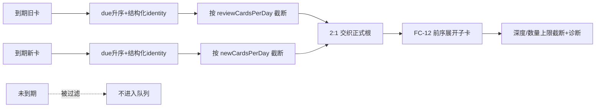

# SRS 复习队列管理模块

> **文档同步日期：2026-07-26**  
> 变更说明：P0 低压调度优化——`SHORT_RELEARN_WINDOW_MS` 5 分钟 → 15 分钟（详见 `SRS 动态复习队列.md`）。  
> 同日另一批次：新增「查询块收集」小节——`getQueryResults` 对后端 `query` 返回做 DbId[]/Block[] 双形状归一化，失败抛 `QueryExecutionError`（不再静默返回空数组）。低危批次：`collectSrsBlocks` 的 `get-all-blocks` 兜底改**仅标签查询失败时触发**；会话块创建补 `insertBlock` 返回值校验与 `reviewSessionManager.test.ts` 回归。  
> 2026-07-13：收集/建队入口改为 `cardCollector.ts`；到期判定统一为精确时间（删除过时的「仅比日期」段落）；补全 descriptor / scope / budget / pending / 子卡展开相关文件。

## 概述

本模块负责复习队列的构建和管理：收集待复习卡片、稳定排序与限额、子卡展开、版本化会话描述与会话块生命周期。

### 核心价值

- 到期筛选 + FC-11 稳定排序 + 两旧一新交织
- FC-01 每日正式根卡限额（跨普通会话按今日日志累计）
- FC-12 子卡展开深度/数量上限
- F2-01 版本化 `ReviewSessionDescriptor` 写入会话块，禁止复用单例块覆盖 scope

## 技术实现

### 核心文件

| 文件 | 职责 |
|------|------|
| `src/srs/cardCollector.ts` | `collectSrsBlocks` / `collectReviewCards` / `buildReviewQueue` / 子卡展开 |
| `src/srs/blockCardCollector.ts` / `childCardCollector.ts` | 块级收集与子卡 |
| `src/srs/reviewSessionDescriptor.ts` | 版本化会话描述 |
| `src/srs/reviewSessionManager.ts` | 新建会话块并写入 descriptor |
| `src/srs/reviewSessionScope.ts` | 会话范围冻结与动态过滤 |
| `src/srs/reviewSessionBudget.ts` | 每日正式根卡额度 |
| `src/srs/pendingDueRequeue.ts` | Again/Hard 短期重学 |
| `src/srs/repeatReviewManager.ts` | fixed/repeat 按 sessionId 内存载荷 |
| `src/srs/asyncLoadGeneration.ts` | 异步加载 latest-wins gate |
| `src/srs/deckUtils.ts` | `calculateDeckStats` 等 |
| `src/main.ts` | `startReviewSession` 启动入口 |
| `src/components/SrsReviewSessionRenderer.tsx` | 读块上 descriptor 加载队列 |
| `src/components/SrsReviewSessionDemo.tsx` | 会话 UI / 动态队列 / pending |

---

## 收集与建队

### `collectSrsBlocks(pluginName?): Promise<BlockWithRepr[]>`

收集 SRS 卡片块：

1. `get-blocks-with-tags` 查询 `card` / `Card`
2. **仅当标签查询全部失败（抛错）时**才走备用：`get-all-blocks` + 手动过滤 `#card`（`isCardTag` 大小写不敏感）。查询**成功且为空**直接跳过兜底（零卡片仓库不再每轮触发无界全库读取，低危#1）
3. 合并 `orca.state.blocks` 中 `_repr.type` 为 `srs.card` / `srs.cloze-card` / `srs.direction-card` 的块
4. 按 id 去重返回

> **有意取舍**：只打非常规大小写标签（如 `#CARD`）的块此前靠「无结果就全库扫描」被兜底捕获；门控后**查询成功场景不再被兜底捕获**（`get-blocks-with-tags` 只查 `card`/`Card` 两个变体）。审计确认此行为变化为预期——代价是极端大小写变体，收益是消除零卡库的每轮全库读取。回归：`cardCollector.fallback.test.ts`。

### `collectReviewCards(pluginName?, options?): Promise<ReviewCard[]>`

将块转换为 `ReviewCard`（Cloze/Direction 展开变体；List 选当前 due 条目等）：

```typescript
// 主要字段
{
  id: DbId,
  front: string,
  back: string,
  srs: SrsState,
  isNew: boolean,  // !lastReviewed || reps === 0
  deck: string,
  cardType?: CardType,
  clozeNumber? / directionType? / listItemId? / ...,
  tags?: TagInfo[]
}
```

**FC-13 收集性能（默认开启，不改变卡片数量/顺序/card key/due/isNew/deck）：**

1. **块缓存预热**：`preheatBlockCache(collectSrsBlocks 返回的完整块)`
2. **List 子块批量预取**：`get-blocks` 分批（默认 batch=50、并发≤4）
3. **牌组名批量预取**：`prefetchDeckNamesForBlocks`；收集结束 `clearDeckNameCache`，**不做长期牌组索引**
4. **metrics**：可选 `options.metricsOut`；`logMetrics: true` 才 `console.info`
5. **测试开关**：`disableOptimizations: true` 仅 A/B；生产不得关闭
6. **失效**：评分/写入仍走 `invalidateBlockCache`
7. **轮询策略（评估结论）**：
   - 会话 60s 全库扫描：**保留**（pending 只覆盖正式 Again/Hard 15 分钟窗口；新到期/他处编辑仍依赖扫描）
   - fixed/repeat：**禁止**全库扫描
   - 首页 120s 兜底刷新：**保留**

### `buildReviewQueue(cards, limits?): ReviewCard[]`

流水线：到期筛选 → **FC-11 稳定排序** → **FC-01 限额** → 两旧一新交织。

| 步骤 | 行为 |
|------|------|
| 到期判断 | **精确时间**：`card.srs.due.getTime() <= now`；新卡同样检查 due |
| 新卡定义 | `isNew`：`!lastReviewed \|\| reps === 0` |
| FC-11 排序 | 旧卡、新卡各自：`due` 升序 → `compareReviewCardIdentity`（Cloze 数值序、Direction forward 先、List listItemId 数值序；**不用** cardKey 字典序） |
| FC-01 限额 | 可选显式 `limits: { newCardsPerDay, reviewCardsPerDay }`；**不得**在函数内隐式读全局 settings。`null`/省略 = 不限额（fixed、动态候选） |
| 交织 | 2 旧 : 1 新 |
| 子卡 | 本函数只返回正式根卡；展开见 `buildSessionReviewQueue` |

```typescript
// 普通 all/deck：有 limits
buildReviewQueue(filteredCards, { newCardsPerDay: 30, reviewCardsPerDay: 200 })

// fixed / 动态候选：不限额但稳定排序
buildReviewQueue(allCards, null)

// 会话队列：正式根限额 + 子卡展开（默认 maxDepth=10, maxAuxChildCards=200）
await buildSessionReviewQueue(cards, pluginName, dailyLimits, {
  maxDepth: 10,
  maxAuxChildCards: 200
})
// → { queue, formalRootCards, childExpandDiagnostics, childExpandLimits, auxChildCount }
```


```mermaid
flowchart LR
    A[到期旧卡] --> S1[due升序+结构化identity]
    C[到期新卡] --> S2[due升序+结构化identity]
    S1 --> T[按 reviewCardsPerDay 截断]
    S2 --> U[按 newCardsPerDay 截断]
    T --> B[2:1 交织正式根]
    U --> B
    B --> E[FC-12 前序展开子卡]
    E --> F[深度/数量上限截断+诊断]
    D[未到期] -.被过滤.-> G[不进入队列]
```

相关纯函数：`partitionDueAndNewCards`、`sortCardsForReviewQueue` / `compareReviewCardsForQueue`、`applyDailyRootLimits`、`interleaveDueAndNew`、`resolveChildExpandLimits`、`expandChildCardsForRoots`、`formatChildExpandWarning`。

**FC-12 子卡展开：**

- 正式根深度 = 0，始终保留；限制**只计辅助子卡**
- 默认 **maxDepth=10**、**maxAuxChildCards=200**；安全 cap：`MAX_CHILD_DEPTH_CAP=100`、`MAX_AUX_CHILD_CARDS_CAP=10000`
- 核心函数只收显式输入，**不读**全局 settings；无效值 warn 并回退默认
- 达上限：截断该扩展，**继续**后续正式根；返回诊断，Renderer 展示 warning
- fixed / normal / repeat：fixed 正式根仍不限额，但子卡展开仍受 FC-12 约束

回归测试：`cardCollector.queueOrdering.test.ts`、`cardCollector.queueLimits.test.ts`、`cardCollector.children.test.ts`、`cardCollector.performance.test.ts`。

### `calculateDeckStats(cards): DeckStats`

实现位于 **`src/srs/deckUtils.ts`**（非 cardCollector）。返回各 Deck 与全局 total/new/overdue。

### 查询块收集（`blockCardCollector.ts`）

右键菜单「复习此查询结果 / 子树复习」的收集入口：

- **`getQueryResults(blockId)`**：后端 `get-block` 读查询块 `_repr.q` 后 `invokeBackend("query", repr.q)`。返回值做**双形状归一化**（`normalizeQueryResultIds`）：`Backend-API.md` 声明 query 返回块数组，但运行时也可能返回 DbId 数组——逐项按「number → 直接用 / 对象 → 取 `.id`」归一化，过滤非有限数字（与 `epubBookRepository` / `webImport` 的同 API 归一化一致）。**禁止** `as DbId[]` 纯断言。
- **失败语义**：查询执行抛错时 `console.error` 后抛 **`QueryExecutionError`**（导出类，携带 `cause`），沿 `collectCardsFromQueryBlock` / `estimateCardCount` 向上传播——**不得** `return []` 把失败伪装成空结果。调用方用 `instanceof` 区分：
  - `main.ts` 查询分支 / `contextMenuRegistry.handleReviewError`：notify `error`「查询执行失败，请重试」（title「SRS 复习」），与「查询结果中没有找到卡片」的 info 区分；
  - `QueryBlockMenuItem.fetchCount` 失败置 `hasError` → 菜单标题「复习此查询结果 (加载失败)」并禁用。
- 「查询结果为空 / 非查询块 / 无 `repr.q`」仍返回 `[]`（属正常空结果，console.log 可见）。

回归：`blockCardCollector.test.ts`（含块对象形状归一化与 `QueryExecutionError` 传播用例）。

---

## 会话描述与会话块（F2-01）

### `ReviewSessionDescriptor`（`reviewSessionDescriptor.ts`）

版本化、可序列化的**会话启动描述**：

| 字段 | 说明 |
|------|------|
| `version` | 当前为 `1`（`REVIEW_SESSION_DESCRIPTOR_VERSION`）；未知版本严格失败 |
| `sessionId` | 稳定会话身份（`generateReviewSessionId`；F2-09 断点恢复预留） |
| `createdAt` | Unix 毫秒 |
| `kind` | 互斥：`normal` \| `fixed` \| `custom` |
| `updatesSrs` / `consumesDailyQuota` | 是否更新正式 SRS / 消耗全局每日额度 |

| kind | 子类型 | updatesSrs | consumesDailyQuota | 说明 |
|------|--------|------------|--------------------|------|
| `normal` | `scope.kind=all` | true | true | 全部牌组正式复习 |
| `normal` | `scope.kind=deck` + `deckName` | true | true | 单牌组正式复习 |
| `fixed` | `mode=repeat` + source + cardKeys + fixedRootIds | false | false | 重复复习 / 困难卡 / 查询块专项 |
| `custom` | `definition.mode=scheduled\|practice` | 视模式 | 视模式 | **仅类型可扩展**；无启动 UI，Renderer 加载时明确报错 |

校验失败 → `ReviewSessionDescriptorError`，**禁止**回退为 all scope。

工厂：`createNormalSessionDescriptor` / `createFixedRepeatSessionDescriptor` 等。

### 与会话块的稳定关联（`reviewSessionManager.ts`）

- 每次「启动复习」调用 `createReviewSessionBlockWithDescriptor(pluginName, descriptor)` **新建** `srs.review-session` 块。
- **`insertBlock` 返回值校验（低危#24）**：`core.editor.insertBlock` 未承诺非空返回；返回值必须是**有限正数**，否则抛错（含 sessionId/kind/deck 上下文）——坏 ID **零落盘**，绝不继续写属性/持久化。
- 描述写入块 `_repr.sessionDescriptor`（`SESSION_DESCRIPTOR_REPR_KEY`）；属性 `srs.sessionId` / `srs.isReviewSessionBlock` / `srs.pluginName` 便于诊断。
- **禁止**复用单一全局 `reviewSessionBlockId` 再覆盖描述（`getOrCreateReviewSessionBlock` 已废弃并**抛错**）。该「必须抛错」契约与 insertBlock 校验现有回归保障：`reviewSessionManager.test.ts`（15 用例：锚点 / 废弃单例必抛 / 八种坏返回值）。
- Renderer 只按当前 `blockId` 读描述；异步收集期间其它启动创建的是**另一块**。

| 动作 | 语义 |
|------|------|
| 再次导航到**同一** `blockId` | **复用**块上已冻结的 descriptor |
| 再次点击「开始复习 / 牌组复习 / 重复复习」 | **新建**块 + 新 `sessionId` |
| fixed/repeat 内存载荷丢失 | 明确错误，请重新从入口启动；不回退 all |

`cleanupReviewSessionBlock`：仅清理进程内 last-created 指针；不删除笔记中的会话块。

### `startReviewSession(deckName?, openInCurrentPanel?)`（`main.ts`）

1. `createNormalSessionDescriptor(deckName)` 
2. `createReviewSessionBlockWithDescriptor` 新建会话块
3. 打开该 `blockId` 的复习面板
4. Renderer 只读本块描述加载队列

> 历史全局 `getReviewDeckFilter()` 不得作为 Renderer 加载来源（可能被后续启动覆盖）。

---

## 会话范围冻结（FC-02 + F2-01）

核心：`reviewSessionScope.ts` + 块上 descriptor。

| kind | 含义 | 动态检查 |
|------|------|----------|
| `all` | 今日全部复习 | 允许全库扫描 |
| `deck` | 固定 `deckName` | 扫描但只接纳该牌组 |
| `fixed` | cardKeys + List `fixedRootIds` | **禁止**全库扫描；集合内重入 / List 同根允许 |

规则摘要：

1. 普通会话：Renderer 从 `blockId` 读 descriptor → `prepareNormalSessionQueueInput` 等筛选初始 cards。
2. 重复复习：`createFixedRepeatSessionDescriptor` + `createRepeatReviewSession(..., sessionId)`（创建 ≠ retain）；Renderer `getRepeatReviewSessionById` + **retain**；cleanup **release**。
3. 异步加载：`asyncLoadGeneration` generation gate，latest-wins。
4. 定时 60s / 手动检查 / pending due 重入队：共用 `selectNewDueCardsForSession` / `selectPendingDueCardsForRequeue` / `isCardInSessionScope`。
5. F2-04 短期重入：见 `模块文档/SRS 动态复习队列.md`。

---

## 每日正式根卡额度（FC-01）

核心：`reviewSessionBudget.ts` + `cardCollector` + Renderer。

| 概念 | 规则 |
|------|------|
| 作用对象 | **仅正式根卡** |
| 子卡 | 不消耗新/旧额度，也不能使额外根卡进入 |
| 跨会话累计 | 本地时区「今天 00:00 → now」日志，`cardKey` 去重 used；`remaining = max(0, configured − used)` |
| 新卡 used | `previousState === "new"` 的不同 cardKey |
| 旧卡 used | `previousState !== "new"`；同一身份同时出现**只计新卡** |
| deck scope | 只统计同名 deck 日志 |
| fixed | **不**限额、**不**读今日日志扣额度、**不**全库动态扫描 |
| 动态追加 | `buildReviewQueue(..., null)` → scope → 会话 remaining budget |
| 短期重学 | 已接纳 cardKey **不重复消耗** |
| 失败 | 读/flush 今日日志失败 → 加载失败，**禁止** used=0 兜底 |
| 设置校验 | 有限非负整数 ≤ `MAX_DAILY_CARD_LIMIT`(10000)；非法 warn 回退 **30/200**；合法 `0` → 空队列 |

```typescript
const resolved = resolveDailyQueueLimits(settings.newCardsPerDay, settings.reviewCardsPerDay)
const { start, end } = getLocalTodayBounds()
const todayLogs = await getReviewLogs(plugin, start, end) // 失败则加载失败
const remaining = remainingDailyLimitsFromLogs(resolved, todayLogs, {
  deckName: scope.kind === "deck" ? scope.deckName : null
})
const { queue, formalRootCards } = await buildSessionReviewQueue(
  filteredCards, plugin, remaining
)
```

---

## 辅助函数索引

| 函数 | 位置 | 说明 |
|------|------|------|
| `isSrsCardBlock` 等 | `blockUtils` / `cardCollector` 周边 | 块判断与文本解析 |
| `resolveDailyQueueLimits` | `reviewSessionBudget` | 校验并回退每日限额 |
| `countUsedDailyQuotasFromLogs` / `remainingDailyLimitsFromLogs` | 同上 | 今日 used → remaining |
| `getLocalTodayBounds` | 同上 | 本地今日 00:00 → now |
| `createSessionRootCardBudget` | 同上 | 会话额度 seed |
| `buildSessionReviewQueue` | `cardCollector` | 正式根 + 子卡展开 |
| `createLoadGenerationGate` | `asyncLoadGeneration` | 异步 latest-wins |

## 扩展点

1. **筛选策略**：可按 Deck、标签扩展（custom study 类型已预留）
2. **优先级算法**：FC-11 已稳定；可再扩展但不破坏 identity 比较
3. **学习限制**：FC-01 已接入；断点恢复见 F2-09（未做）

## 相关文件

| 文件 | 说明 |
|------|------|
| `src/srs/cardCollector.ts` | 收集与建队核心 |
| `src/srs/blockCardCollector.ts` | 单块变体收集 |
| `src/srs/childCardCollector.ts` | 子卡收集 |
| `src/srs/reviewSessionDescriptor.ts` | 会话描述 |
| `src/srs/reviewSessionManager.ts` | 会话块创建 |
| `src/srs/reviewSessionScope.ts` | 会话范围 |
| `src/srs/reviewSessionBudget.ts` | 每日额度 |
| `src/srs/pendingDueRequeue.ts` | 短期重学 |
| `src/srs/repeatReviewManager.ts` | fixed/repeat 内存载荷 |
| `src/srs/asyncLoadGeneration.ts` | 异步 generation gate |
| `src/srs/deckUtils.ts` | Deck 统计 |
| `src/srs/cardIdentity.ts` | 队列 identity 比较 |
| `src/srs/types.ts` | `ReviewCard` 等 |
| `src/main.ts` | `startReviewSession` |
| `src/components/SrsReviewSessionRenderer.tsx` | 加载队列 |
| `src/components/SrsReviewSessionDemo.tsx` | 会话运行时 |
| `模块文档/SRS 动态复习队列.md` | 动态追加与 pending 细节 |

## 同批聚簇与待激活（2026-07-27）

`buildReviewQueue` 的流水线由「分区 → 排序 → 限额 → 2:1 交织」扩展为
「分区 → 排序 → 限额 → **同批聚簇** → 2:1 交织」。

- `clusterCardsByBatch(cards)`：把带相同 `ReviewCard.batchId` 的卡以**该批最早到期成员**为锚点就地展开。批次之间、以及无 batchId 的卡之间，原有 due 升序完全不变——聚簇只改变同批卡的相对聚合，不会把晚到期的卡提前到别的批次之前。只有一张的批次不构成簇，保持原位。
- **顺序很关键**：聚簇必须在 `applyDailyRootLimits` **之后**。放在之前会让整批卡一起挤进当日额度，把队列变成单一材料。
- `batchId` 来自块属性 `srs.batchId`（`src/srs/cardBatch.ts`），由 AI 批量制卡写入。它是**分组令牌不是实体身份**，不得用作卡片唯一标识（与 book-ir / ir-auto 的既有约定一致）。走 `srs.` 前缀因此会被 `deleteCardSrsData` 一并清除——重置卡片即丢分组，可接受。

`partitionDueAndNewCards` 现在排除 `card.isPending`：待激活卡既不进队列也**不占当日额度**（否则激活前队列会莫名变短）。pending 与 suspend 的区别见 [SRS_AI模块.md](SRS_AI模块.md)。

相关测试：`reviewQueueBatchCluster.test.ts`（聚簇不丢不重、批次独立锚定、pending 不进队列不占额度）、`cardBatch.test.ts`。
