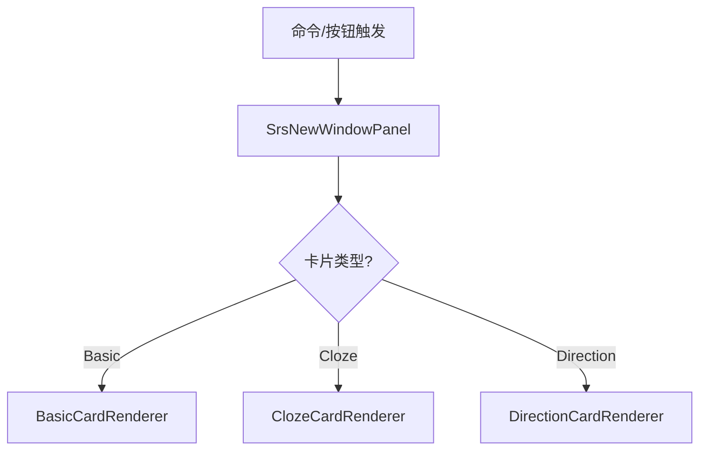

# SRS 复习面板（Custom Panel 架构）

## 概述

本模块基于 Orca 的 **Custom Panel API** 实现复习会话界面，作为原 BlockRenderer 架构（`SrsReviewSessionRenderer`）的替代方案。

### 设计目标

- **无需虚拟块**：直接使用 Custom Panel，不需要创建和管理复习会话块
- **参数直传**：通过 `viewArgs` 传递 `deckFilter`、`hostPanelId` 等参数
- **简洁架构**：移除 BlockShell 包装，减少渲染层级
- **与 FlashcardHome 一致**：采用相同的 Custom Panel 架构

## 技术实现

### 核心文件

| 文件                                                                                                                     | 说明                            |
| ------------------------------------------------------------------------------------------------------------------------ | ------------------------------- |
| [SrsNewWindowPanel.tsx](file:///d:/orca插件/虎鲸标记%20内置闪卡/src/panels/srs_new_window/SrsNewWindowPanel.tsx)         | 复习会话面板主组件（692 行）    |
| [BasicCardRenderer.tsx](file:///d:/orca插件/虎鲸标记%20内置闪卡/src/panels/srs_new_window/BasicCardRenderer.tsx)         | Basic 卡片渲染器组件            |
| [ClozeCardRenderer.tsx](file:///d:/orca插件/虎鲸标记%20内置闪卡/src/panels/srs_new_window/ClozeCardRenderer.tsx)         | Cloze（填空）卡片渲染器组件     |
| [DirectionCardRenderer.tsx](file:///d:/orca插件/虎鲸标记%20内置闪卡/src/panels/srs_new_window/DirectionCardRenderer.tsx) | Direction（方向）卡片渲染器组件 |
| [refactor_plan.md](file:///d:/orca插件/虎鲸标记%20内置闪卡/src/panels/srs_new_window/refactor_plan.md)                   | 迁移计划和经验总结              |

### 面板注册

```typescript
// renderers.ts
import SrsNewWindowPanel from "../panels/srs_new_window/SrsNewWindowPanel";
orca.panels.registerPanel("srs.new-window", SrsNewWindowPanel);
```

### 启动方式

```typescript
// 通过 goTo 导航
orca.nav.goTo(
  "srs.new-window",
  {
    deckFilter: "English", // 可选：按 Deck 过滤
    hostPanelId: "panel-123", // 可选：跳转卡片时使用的目标面板
  },
  targetPanelId
);
```

## 架构对比

### 旧架构（BlockRenderer）


**问题**：

- 需要创建虚拟块，占用数据库
- 通过全局状态传递参数
- BlockShell 增加渲染层级

### 新架构（Custom Panel）



**优势**：

- 无需虚拟块
- 参数通过 `viewArgs` 直传
- 组件拆分，职责清晰（主面板 692 行，各渲染器 260-400 行）
- 静态导入，无动态加载开销

### 组件拆分后架构


**优势**：

- 无需块管理
- `viewArgs` 直接传参
- 简洁的组件结构

## 组件状态

### Props

| 属性      | 类型    | 说明         |
| --------- | ------- | ------------ |
| `panelId` | string  | 当前面板 ID  |
| `active`  | boolean | 面板是否激活 |

### viewArgs

| 参数          | 类型           | 说明        |
| ------------- | -------------- | ----------- |
| `deckFilter`  | string \| null | Deck 过滤器 |
| `hostPanelId` | string \| null | 宿主面板 ID |

### 内部状态

| 状态            | 类型           | 说明         |
| --------------- | -------------- | ------------ |
| `queue`         | ReviewCard[]   | 复习队列     |
| `currentIndex`  | number         | 当前卡片索引 |
| `reviewedCount` | number         | 已复习数量   |
| `isGrading`     | boolean        | 正在评分标志 |
| `showAnswer`    | boolean        | 是否显示答案 |
| `lastLog`       | string \| null | 最近操作日志 |

## 功能特性

### 支持的卡片类型

| 卡片类型       | 状态      | 说明                                 |
| -------------- | --------- | ------------------------------------ |
| Basic Card     | ✅ 已完成 | 使用纯文本渲染 `front`/`back`        |
| Cloze Card     | ✅ 已完成 | 使用 `renderFragments` 渲染填空内容  |
| Direction Card | ✅ 已完成 | 阶段 5（使用 DirectionCardRenderer） |

### 复习功能

| 功能                         | 状态 | 实现方式                                     |
| ---------------------------- | ---- | -------------------------------------------- |
| 评分（again/hard/good/easy） | ✅   | `updateSrsState()` / `updateClozeSrsState()` |
| 评分预览间隔                 | ✅   | `previewIntervals()`                         |
| 埋藏（Bury）                 | ✅   | `buryCard()`                                 |
| 暂停（Suspend）              | ✅   | `suspendCard()`                              |
| 跳转到卡片（新交互）         | ✅   | 复习移右侧，主面板显示卡片                   |
| 刷新队列                     | ✅   | `loadReviewQueue()`                          |

### 面板交互模式

> [!IMPORTANT]
> 新增的全屏复习 + 跳转侧边栏交互模式。

#### 点击复习（从 FlashcardHome）

复习界面**替换 FlashcardHome 占满主面板**：

```typescript
// SrsFlashcardHome.tsx
const handleReviewAll = useCallback(() => {
  // openInCurrentPanel=true：在当前面板打开
  void startReviewSession(undefined, true);
}, []);
```

#### 点击跳转（复习中查看卡片源）

新交互：复习界面**移到右侧**，主面板**显示卡片内容**：

```typescript
// SrsNewWindowPanel.tsx - handleJumpToCard
// 1. 右侧创建复习面板
const rightPanelId = orca.nav.addTo(panelId, "right", {
  view: "srs.new-window",
  viewArgs: reviewViewArgs,
  viewState: {},
});

// 2. 主面板导航到卡片block
orca.nav.goTo("block", { blockId }, panelId);
```

#### 隐藏视图处理

Custom Panel 架构中需要处理同面板内的 hidden 视图，避免占用布局空间：

```typescript
// SrsNewWindowPanel.tsx
useEffect(() => {
  const panelEl = rootRef.current?.closest(".orca-panel");
  if (!panelEl) return;

  // 隐藏同面板内的其他 hidden 视图
  const hiddenViews = panelEl.querySelectorAll(
    ".orca-hideable.orca-hideable-hidden"
  );
  for (const hidden of hiddenViews) {
    hidden.style.display = "none";
  }
}, []);
```

### 键盘快捷键

| 按键   | 操作     | 说明                 |
| ------ | -------- | -------------------- |
| `空格` | 显示答案 | 仅在答案未显示时有效 |
| `1`    | Again    | 忘记                 |
| `2`    | Hard     | 困难                 |
| `3`    | Good     | 良好                 |
| `4`    | Easy     | 简单                 |
| `B`    | Bury     | 埋藏到明天           |
| `S`    | Suspend  | 暂停卡片             |

### 自动刷新

当面板从非激活状态变为激活状态时，自动重新加载复习队列：

```typescript
useEffect(() => {
  if (active && !wasActiveRef.current && viewArgsLoaded) {
    void loadReviewQueue();
  }
  wasActiveRef.current = active;
}, [active, viewArgsLoaded]);
```

## 关键教训

> [!IMPORTANT]
> 以下是从 BlockRenderer 迁移到 Custom Panel 时的重要经验。

### 避免使用 useSnapshot

在 Custom Panel 中使用 `useSnapshot(orca.state)` 会触发 React Error #185（Maximum update depth exceeded）。

```typescript
// ❌ 错误做法
const { panels, blocks } = useSnapshot(orca.state);

// ✅ 正确做法：直接访问，一次性读取
useEffect(() => {
  const panels = orca.state.panels;
  const viewPanel = orca.nav.findViewPanel(panelId, panels);
  // ...
}, [panelId]);
```

### 避免使用 Block 组件

`orca.components.Block` 在 Custom Panel 中可能导致无限更新循环。

```typescript
// ❌ 错误做法
<Block panelId={panelId} blockId={cardId} ... />

// ✅ 正确做法：使用纯文本渲染
<div>{currentCard.front}</div>
<div>{currentCard.back}</div>
```

### viewArgs 一次性加载

使用标志变量确保 viewArgs 只加载一次：

```typescript
const [viewArgsLoaded, setViewArgsLoaded] = useState(false);

useEffect(() => {
  if (viewArgsLoaded) return;
  // 加载 viewArgs...
  setViewArgsLoaded(true);
}, [panelId, viewArgsLoaded]);
```

### Cloze 卡片渲染方案

不复用旧的 `ClozeCardReviewRenderer` 组件（依赖 `useSnapshot`），而是直接在面板中实现渲染：

```typescript
// ❌ 错误做法：复用旧组件（内部使用 useSnapshot）
<ClozeCardReviewRenderer blockId={id} pluginName={pluginName} />;

// ✅ 正确做法：使用纯函数 renderFragments
function renderFragments(
  fragments: ContentFragment[] | undefined,
  showAnswers: boolean,
  pluginName: string,
  currentClozeNumber?: number
): React.ReactNode[] {
  // 遍历 fragments，判断 cloze 类型并渲染
  // 当前 clozeNumber 的填空显示 [...]，其他显示内容
}
```

**关键点**：

- 在 `ReviewCard` 类型中添加 `content?: ContentFragment[]` 字段
- 在 `cardCollector.ts` 收集 cloze 卡时保存 `block.content`
- 使用 `fragment.t.endsWith(".cloze")` 匹配任何插件名的 cloze fragment
- 评分时调用 `updateClozeSrsState(blockId, clozeNumber, grade)`

## UI 布局

### 整体结构

```
┌─────────────────────────────────────┐
│ 进度条                               │
├─────────────────────────────────────┤
│ 状态栏：卡片计数 | Deck | 刷新按钮    │
├─────────────────────────────────────┤
│                                     │
│  ┌─────────────────────────────┐   │
│  │ 工具栏：埋藏 | 暂停 | 跳转   │   │
│  ├─────────────────────────────┤   │
│  │ 题目区域                     │   │
│  │ currentCard.front            │   │
│  ├─────────────────────────────┤   │
│  │ [显示答案] 或                │   │
│  │ 答案区域                     │   │
│  │ currentCard.back             │   │
│  ├─────────────────────────────┤   │
│  │ 评分按钮：忘记|困难|良好|简单 │   │
│  └─────────────────────────────┘   │
│                                     │
└─────────────────────────────────────┘
```

### 答案排版策略（2025-12-14 更新）

在 Basic 卡片的答案区域中，当出现以下情况之一时，将自动从“居中排版”切换为“左对齐分块排版”，避免长内容/多块内容全部居中导致阅读负担：

- 启用同级子块显示且答案块数量 > 1
- 任意答案块包含多行内容
- 任意答案块内容较长（≥ 80 字符）

左对齐分块排版会为每个答案块提供独立承载（浅色背景 + 左侧强调线），并启用 `overflowWrap:anywhere` 防止超长字符串撑破布局；短答案仍保持居中以维持沉浸式视觉聚焦。

### 状态界面

- **加载中**：显示加载提示
- **空队列**：显示"今天没有待复习的卡片"
- **复习完成**：显示复习统计和完成按钮

## 迁移进度

### 已完成

- [x] 阶段 1：创建空白面板骨架
- [x] 阶段 2：迁移界面框架
- [x] 阶段 3：迁移 Basic Card
- [x] 阶段 4：迁移 Cloze Card
- [x] 阶段 5：迁移 Direction Card（使用独立渲染器）
- [x] 高级功能：Bury、Suspend、快捷键
- [x] 组件拆分：BasicCardRenderer、ClozeCardRenderer、DirectionCardRenderer
- [x] 性能优化：动态导入改为静态导入、加载锁防止竞态条件

### 待完成

- [ ] 阶段 7：清理旧代码（可选，保留作为参考）

## 相关文件

| 文件                                                                                                                     | 说明              |
| ------------------------------------------------------------------------------------------------------------------------ | ----------------- |
| [SrsNewWindowPanel.tsx](file:///d:/orca插件/虎鲸标记%20内置闪卡/src/panels/srs_new_window/SrsNewWindowPanel.tsx)         | 复习面板主组件    |
| [BasicCardRenderer.tsx](file:///d:/orca插件/虎鲸标记%20内置闪卡/src/panels/srs_new_window/BasicCardRenderer.tsx)         | Basic 卡片渲染器  |
| [ClozeCardRenderer.tsx](file:///d:/orca插件/虎鲸标记%20内置闪卡/src/panels/srs_new_window/ClozeCardRenderer.tsx)         | Cloze 卡片渲染器  |
| [DirectionCardRenderer.tsx](file:///d:/orca插件/虎鲸标记%20内置闪卡/src/panels/srs_new_window/DirectionCardRenderer.tsx) | Direction 渲染器  |
| [refactor_plan.md](file:///d:/orca插件/虎鲸标记%20内置闪卡/src/panels/srs_new_window/refactor_plan.md)                   | 迁移计划文档      |
| [useReviewShortcuts.ts](file:///d:/orca插件/虎鲸标记%20内置闪卡/src/hooks/useReviewShortcuts.ts)                         | 快捷键 Hook       |
| [cardStatusUtils.ts](file:///d:/orca插件/虎鲸标记%20内置闪卡/src/srs/cardStatusUtils.ts)                                 | Bury/Suspend 实现 |
| [renderers.ts](file:///d:/orca插件/虎鲸标记%20内置闪卡/src/srs/registry/renderers.ts)                                    | 面板注册          |
