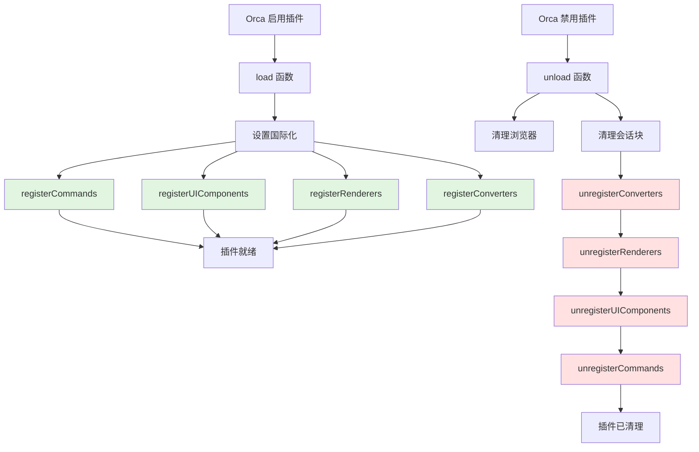

# SRS 插件入口与命令模块

## 概述

本模块是插件的入口点，负责管理插件生命周期并委托给专门的注册模块。

> [!NOTE] > **2025-12-10 重构**：`main.ts` 从 402 行精简至 145 行（**-64%**），注册逻辑拆分到 4 个独立模块。

### 核心价值

- **集中管理插件生命周期**：load/unload 函数控制插件启用和禁用
- **委托给注册模块**：将注册逻辑解耦到专门的模块，提升可维护性
- **确保资源正确清理**：unload 时倒序清理所有注册的组件

## 技术实现

### 核心文件

- [main.ts](file:///d:/orca插件/虎鲸标记%20内置闪卡/src/main.ts)（load、unload 函数，委托给注册模块）

### 注册模块（registry/）✨

> [!IMPORTANT]
> 注册逻辑已从 `main.ts` 拆分到以下 4 个独立模块，详见 [SRS\_注册模块.md](file:///d:/orca插件/虎鲸标记%20内置闪卡/模块文档/SRS_注册模块.md)

| 模块        | 文件                                                                                        | 职责                               | 行数 |
| ----------- | ------------------------------------------------------------------------------------------- | ---------------------------------- | ---- |
| 命令注册    | [commands.ts](file:///d:/orca插件/虎鲸标记%20内置闪卡/src/srs/registry/commands.ts)         | 注册/注销命令（含 undo 逻辑） | 134  |
| UI 组件注册 | [uiComponents.ts](file:///d:/orca插件/虎鲸标记%20内置闪卡/src/srs/registry/uiComponents.ts) | 注册/注销工具栏按钮和斜杠命令      | 40   |
| 渲染器注册  | [renderers.ts](file:///d:/orca插件/虎鲸标记%20内置闪卡/src/srs/registry/renderers.ts)       | 注册/注销块和 inline 渲染器        | 49   |
| 转换器注册  | [converters.ts](file:///d:/orca插件/虎鲸标记%20内置闪卡/src/srs/registry/converters.ts)     | 注册/注销 plain 格式转换器         | 57   |

### 业务逻辑模块（srs/）

| 模块       | 文件                                                                                 | 职责                  |
| ---------- | ------------------------------------------------------------------------------------ | --------------------- |
| 面板工具   | [panelUtils.ts](file:///d:/orca插件/虎鲸标记%20内置闪卡/src/srs/panelUtils.ts)       | 面板查找和调整        |
| 块工具     | [blockUtils.ts](file:///d:/orca插件/虎鲸标记%20内置闪卡/src/srs/blockUtils.ts)       | 块类型判断、文本提取  |
| 卡片收集   | [cardCollector.ts](file:///d:/orca插件/虎鲸标记%20内置闪卡/src/srs/cardCollector.ts) | 收集 SRS 块、构建队列 |
| Deck 工具  | [deckUtils.ts](file:///d:/orca插件/虎鲸标记%20内置闪卡/src/srs/deckUtils.ts)         | Deck 提取和统计       |
| 卡片创建   | [cardCreator.ts](file:///d:/orca插件/虎鲸标记%20内置闪卡/src/srs/cardCreator.ts)     | 卡片转换和扫描        |
| 浏览器管理 | [cardBrowser.ts](file:///d:/orca插件/虎鲸标记%20内置闪卡/src/srs/cardBrowser.ts)     | 浏览器弹窗管理        |



> [!TIP]
> unload 时采用**倒序清理**（converters → renderers → ui → commands），确保高层依赖先清理。

### 注册的命令

| 命令 ID                            | 类型       | 说明            | 注册位置    |
| ---------------------------------- | ---------- | --------------- | ----------- |
| `${pluginName}.scanCardsFromTags`  | 普通命令   | 扫描带标签的块  | commands.ts |
| `${pluginName}.openFlashcardHome`  | 普通命令   | 打开 Flashcard Home  | commands.ts |
| `${pluginName}.makeCardFromBlock`  | 编辑器命令 | 将块转为卡片    | commands.ts |
| `${pluginName}.createCloze`        | 编辑器命令 | 创建 Cloze 填空 | commands.ts |

### 工具栏按钮

| 按钮 ID                       | 图标           | 说明            | 注册位置        |
| ----------------------------- | -------------- | --------------- | --------------- |
| `${pluginName}.reviewButton`  | `ti ti-cards`  | 开始 SRS 复习（直接打开 `srs.new-window`）   | uiComponents.ts |
| `${pluginName}.browserButton` | `ti ti-list`   | 打开卡片浏览器  | uiComponents.ts |
| `${pluginName}.clozeButton`   | `ti ti-braces` | 创建 Cloze 填空 | uiComponents.ts |

### 斜杠命令

| 命令 ID                  | 标题           | 关联命令          | 说明                                 | 注册位置        |
| ------------------------ | -------------- | ----------------- | ------------------------------------ | --------------- |
| `${pluginName}.makeCard` | 转换为记忆卡片 | makeCardFromBlock | 自动添加 #card 标签并转换为 SRS 卡片 | uiComponents.ts |

**已移除的斜杠命令**：

- ~~开始 SRS 复习~~ → 使用工具栏按钮或命令面板
- ~~扫描带标签的卡片~~ → 使用命令面板
- ~~打开卡片浏览器~~ → 使用工具栏按钮或命令面板

### 块渲染器

| 类型                 | 组件                     | 说明           | 注册位置     |
| -------------------- | ------------------------ | -------------- | ------------ |
| `srs.card`           | SrsCardBlockRenderer     | 卡片块渲染     | renderers.ts |
| `srs.cloze-card`     | SrsCardBlockRenderer     | Cloze 卡片渲染 | renderers.ts |
| `srs.review-session` | SrsReviewSessionRenderer | 复习会话渲染   | renderers.ts |

### Inline 渲染器

| 类型                  | 组件                | 说明           | 注册位置     |
| --------------------- | ------------------- | -------------- | ------------ |
| `${pluginName}.cloze` | ClozeInlineRenderer | Cloze 填空渲染 | renderers.ts |

### 转换器

用于将 SRS 块导出为纯文本：

| 源类型                | 目标格式 | 输出格式                                        | 注册位置      |
| --------------------- | -------- | ----------------------------------------------- | ------------- |
| `srs.card`            | `plain`  | `[SRS 卡片]\n题目: ${front}\n答案: ${back}`     | converters.ts |
| `srs.cloze-card`      | `plain`  | `[SRS 填空卡片]\n题目: ${front}\n答案: ${back}` | converters.ts |
| `srs.review-session`  | `plain`  | `[SRS 复习会话面板块]`                          | converters.ts |
| `${pluginName}.cloze` | `plain`  | `{c${clozeNumber}:: ${content}}`                | converters.ts |

## load 函数

插件启用时由 Orca 调用，负责设置国际化并委托给注册模块。

```typescript
export async function load(_name: string) {
  pluginName = _name;

  // 1. 设置国际化
  setupL10N(orca.state.locale, { "zh-CN": zhCN });

  console.log(`[${pluginName}] 插件已加载`);

  // 2. 委托给注册模块（并行执行）
  registerCommands(pluginName, startReviewSession);
  registerUIComponents(pluginName);
  registerRenderers(pluginName);
  registerConverters(pluginName);

  console.log(`[${pluginName}] 命令、UI 组件和渲染器已注册`);
}
```

**关键点**：

- ✅ 设置国际化在所有注册之前
- ✅ 将 `startReviewSession` 函数传递给 `registerCommands`
- ✅ 注册顺序无强制要求（Orca API 无依赖）

## unload 函数

插件禁用时由 Orca 调用，负责清理资源并倒序注销组件。

```typescript
export async function unload() {
  console.log(`[${pluginName}] 开始卸载插件`);

  // 1. 清理浏览器组件
  closeCardBrowser(pluginName);

  // 2. 清理复习会话块
  await cleanupReviewSessionBlock(pluginName);

  // 3. 倒序注销（高层依赖先清理）
  unregisterConverters(pluginName);
  unregisterRenderers(pluginName);
  unregisterUIComponents(pluginName);
  unregisterCommands(pluginName);

  console.log(`[${pluginName}] 插件已卸载`);
}
```

**关键点**：

- ✅ 先清理 DOM 组件（浏览器、会话块）
- ✅ 倒序注销（converters → renderers → ui → commands）
- ✅ 确保所有资源正确释放

## startReviewSession 函数

核心业务逻辑，负责启动复习会话（保留在 main.ts 中）。

**函数签名**：

```typescript
async function startReviewSession(
  deckName?: string,
  openInCurrentPanel: boolean = false
): Promise<void>;
```

**参数说明**：

- `deckName`：可选的 Deck 名称过滤，仅复习指定 Deck 的卡片
- `openInCurrentPanel`：是否在当前面板打开复习界面
  - `false`（默认）：在右侧新建或复用面板打开，适用于工具栏按钮调用
  - `true`：在当前激活面板打开，适用于从 FlashcardHome 调用

> [!TIP]
> 当从 FlashcardHome 点击复习按钮时，传入 `openInCurrentPanel: true`，复习界面将替换当前的 FlashcardHome，而非在右侧新建面板。

```typescript
async function startReviewSession(
  deckName?: string,
  openInCurrentPanel: boolean = false
) {
  try {
    const activePanelId = orca.state.activePanel

    if (!activePanelId) {
      orca.notify("warn", "当前没有可用的面板", { title: "SRS 复习" })
      return
    }

    // 统一复习面板：srs.new-window（SrsNewWindowPanel）
    const viewArgs = {
      deckFilter: deckName ?? null,
      hostPanelId: activePanelId
    }

    // 如果要求在当前面板打开（例如从 FlashcardHome 调用）：替换当前视图
    if (openInCurrentPanel) {
      orca.nav.goTo("srs.new-window", viewArgs, activePanelId)
      const message = deckName ? `已打开 ${deckName} 复习会话` : "复习会话已打开"
      orca.notify("success", message, { title: "SRS 复习" })
      return
    }

    // 默认行为：在右侧面板打开（新建或复用）
    const panels = orca.state.panels
    let rightPanelId: string | null = null

    for (const [panelId, panel] of Object.entries(panels)) {
      if (
        panel.parentId === activePanelId &&
        panel.position === "right" &&
        panel.view === "srs.new-window"
      ) {
        rightPanelId = panelId
        break
      }
    }

    if (!rightPanelId) {
      rightPanelId = orca.nav.addTo(activePanelId, "right", {
        view: "srs.new-window",
        viewArgs,
        viewState: {}
      })

      if (!rightPanelId) {
        orca.notify("error", "无法创建侧边面板", { title: "SRS 复习" })
        return
      }
    } else {
      orca.nav.goTo("srs.new-window", viewArgs, rightPanelId)
    }

    // 切换焦点到复习面板
    setTimeout(() => {
      if (rightPanelId) {
        orca.nav.switchFocusTo(rightPanelId)
      }
    }, 100)

    const message = deckName ? `已打开 ${deckName} 复习会话` : "复习会话已在右侧面板打开"
    orca.notify("success", message, { title: "SRS 复习" })
  } catch (error) {
    console.error(`[${pluginName}] 启动复习失败:`, error)
    orca.notify("error", `启动复习失败: ${error}`, { title: "SRS 复习" })
  }
}
```

## 使用方式

### 命令面板

1. 按 `Ctrl+P` / `Cmd+P` 打开命令面板
2. 输入 "SRS" 搜索相关命令

### 斜杠命令

1. 在编辑器中输入 `/`
2. 选择"转换为记忆卡片"
   - 自动添加 `#card` 标签
   - 立即转换为 SRS 卡片

### 工具栏

1. 点击顶部工具栏的卡片图标开始复习
2. 点击列表图标打开浏览器

## 扩展点

### 1. 添加新命令

在 [commands.ts](file:///d:/orca插件/虎鲸标记%20内置闪卡/src/srs/registry/commands.ts) 中添加注册和注销逻辑。

### 2. 添加新工具栏按钮

在 [uiComponents.ts](file:///d:/orca插件/虎鲸标记%20内置闪卡/src/srs/registry/uiComponents.ts) 中添加按钮注册。

### 3. 添加新渲染器

在 [renderers.ts](file:///d:/orca插件/虎鲸标记%20内置闪卡/src/srs/registry/renderers.ts) 中注册新的块或 inline 渲染器。

### 4. 添加新转换器

在 [converters.ts](file:///d:/orca插件/虎鲸标记%20内置闪卡/src/srs/registry/converters.ts) 中注册导出格式转换器。

## 相关文件

| 文件                                                                                        | 说明                 |
| ------------------------------------------------------------------------------------------- | -------------------- |
| [main.ts](file:///d:/orca插件/虎鲸标记%20内置闪卡/src/main.ts)                              | 插件入口（145 行）   |
| **注册模块**                                                                                |                      |
| [commands.ts](file:///d:/orca插件/虎鲸标记%20内置闪卡/src/srs/registry/commands.ts)         | 命令注册（134 行）   |
| [uiComponents.ts](file:///d:/orca插件/虎鲸标记%20内置闪卡/src/srs/registry/uiComponents.ts) | UI 组件注册（40 行） |
| [renderers.ts](file:///d:/orca插件/虎鲸标记%20内置闪卡/src/srs/registry/renderers.ts)       | 渲染器注册（49 行）  |
| [converters.ts](file:///d:/orca插件/虎鲸标记%20内置闪卡/src/srs/registry/converters.ts)     | 转换器注册（57 行）  |
| **工具模块**                                                                                |                      |
| [libs/l10n.ts](file:///d:/orca插件/虎鲸标记%20内置闪卡/src/libs/l10n.ts)                    | 国际化工具           |
| [translations/zhCN.ts](file:///d:/orca插件/虎鲸标记%20内置闪卡/src/translations/zhCN.ts)    | 中文翻译             |

## 更新历史

| 日期       | 版本  | 说明                                                                                           |
| ---------- | ----- | ---------------------------------------------------------------------------------------------- |
| 2025-12-11 | 2.1.0 | 新增：`startReviewSession` 支持 `openInCurrentPanel` 参数，修复 FlashcardHome 复习面板打开问题 |
| 2025-12-10 | 2.0.0 | 重构：拆分注册逻辑到 4 个独立模块                                                              |
| 2025-12-09 | 1.0.0 | 初始版本                                                                                       |
