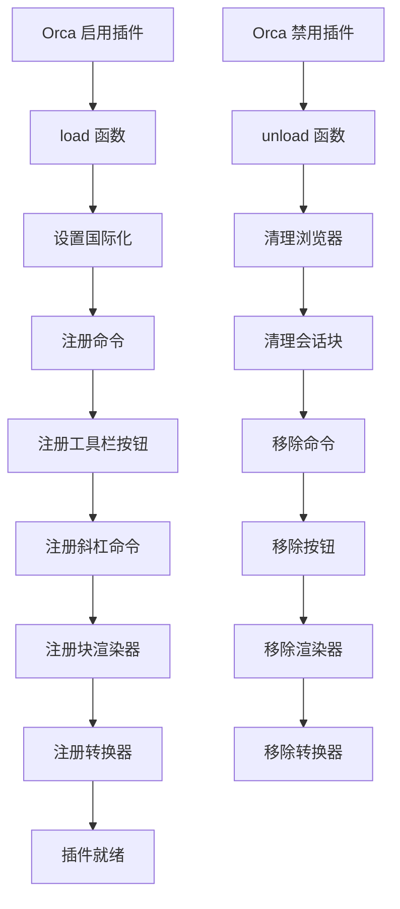

# SRS 插件入口与命令模块

## 概述

本模块是插件的入口点，负责注册命令、工具栏按钮、斜杠命令、块渲染器和转换器。

### 核心价值

- 集中管理插件生命周期
- 提供多种入口触发 SRS 功能
- 确保资源正确清理

## 技术实现

### 核心文件

- [main.ts](file:///d:/orca插件/虎鲸标记%20内置闪卡/src/main.ts)（load、unload 函数及命令注册）

### 生命周期



### 注册的命令

| 命令 ID                            | 类型       | 说明           |
| ---------------------------------- | ---------- | -------------- |
| `${pluginName}.startReviewSession` | 普通命令   | 开始复习会话   |
| `${pluginName}.scanCardsFromTags`  | 普通命令   | 扫描带标签的块 |
| `${pluginName}.openCardBrowser`    | 普通命令   | 打开卡片浏览器 |
| `${pluginName}.makeCardFromBlock`  | 编辑器命令 | 将块转为卡片   |

### 工具栏按钮

| 按钮 ID                       | 图标          | 说明           |
| ----------------------------- | ------------- | -------------- |
| `${pluginName}.reviewButton`  | `ti ti-cards` | 开始 SRS 复习  |
| `${pluginName}.browserButton` | `ti ti-list`  | 打开卡片浏览器 |

### 斜杠命令

| 命令 ID                  | 标题             | 关联命令           |
| ------------------------ | ---------------- | ------------------ |
| `${pluginName}.review`   | 开始 SRS 复习    | startReviewSession |
| `${pluginName}.makeCard` | 转换为记忆卡片   | makeCardFromBlock  |
| `${pluginName}.scanTags` | 扫描带标签的卡片 | scanCardsFromTags  |
| `${pluginName}.browser`  | 打开卡片浏览器   | openCardBrowser    |

### 块渲染器

| 类型                 | 组件                     | 说明         |
| -------------------- | ------------------------ | ------------ |
| `srs.card`           | SrsCardBlockRenderer     | 卡片块渲染   |
| `srs.review-session` | SrsReviewSessionRenderer | 复习会话渲染 |

### 转换器

用于将 SRS 块导出为纯文本：

```typescript
// srs.card 转换
"[SRS 卡片]\n题目: ${front}\n答案: ${back}";

// srs.review-session 转换
"[SRS 复习会话面板块]";
```

## load 函数

```typescript
export async function load(_name: string) {
  pluginName = _name

  // 1. 设置国际化
  setupL10N(orca.state.locale, { "zh-CN": zhCN })

  // 2. 注册命令
  orca.commands.registerCommand(...)
  orca.commands.registerEditorCommand(...)

  // 3. 注册工具栏按钮
  orca.toolbar.registerToolbarButton(...)

  // 4. 注册斜杠命令
  orca.slashCommands.registerSlashCommand(...)

  // 5. 注册块渲染器
  orca.renderers.registerBlock(...)

  // 6. 注册转换器
  orca.converters.registerBlock(...)
}
```

## unload 函数

```typescript
export async function unload() {
  // 清理卡片浏览器
  closeCardBrowser()

  // 清理复习会话块
  await cleanupReviewSessionBlock(pluginName)

  // 移除所有注册的组件
  orca.commands.unregisterCommand(...)
  orca.toolbar.unregisterToolbarButton(...)
  orca.slashCommands.unregisterSlashCommand(...)
  orca.renderers.unregisterBlock(...)
  orca.converters.unregisterBlock(...)
}
```

## 使用方式

### 命令面板

1. 按 `Ctrl+P` / `Cmd+P` 打开命令面板
2. 输入 "SRS" 搜索相关命令

### 斜杠命令

1. 在编辑器中输入 `/`
2. 选择 SRS 分组下的命令

### 工具栏

1. 点击顶部工具栏的卡片图标开始复习
2. 点击列表图标打开浏览器

## 扩展点

1. **更多命令**：可扩展统计、导入导出等命令
2. **右键菜单**：可扩展块右键菜单
3. **快捷键**：可扩展全局快捷键

## 相关文件

| 文件                                                                                     | 说明       |
| ---------------------------------------------------------------------------------------- | ---------- |
| [main.ts](file:///d:/orca插件/虎鲸标记%20内置闪卡/src/main.ts)                           | 插件入口   |
| [libs/l10n.ts](file:///d:/orca插件/虎鲸标记%20内置闪卡/src/libs/l10n.ts)                 | 国际化工具 |
| [translations/zhCN.ts](file:///d:/orca插件/虎鲸标记%20内置闪卡/src/translations/zhCN.ts) | 中文翻译   |
