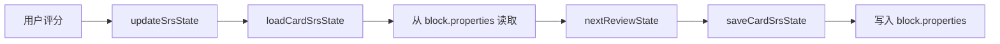

# SRS 数据存储模块

## 概述

本模块负责 SRS 卡片状态的持久化读写，通过 Orca 的块属性系统将卡片的复习状态存储到块中。

### 核心价值

- 将 SRS 状态与 Orca 块系统无缝集成
- 支持读取、保存和更新卡片状态
- 自动初始化新卡片的状态

## 技术实现

### 核心文件

- [storage.ts](file:///d:/orca插件/虎鲸标记%20内置闪卡/src/srs/storage.ts)

### 存储机制

SRS 状态通过 Orca 的块属性（`block.properties`）存储：

| 属性名             | 类型     | 说明                  |
| ------------------ | -------- | --------------------- |
| `srs.isCard`       | Boolean  | 标记块是否为 SRS 卡片 |
| `srs.stability`    | Number   | 记忆稳定度            |
| `srs.difficulty`   | Number   | 记忆难度              |
| `srs.interval`     | Number   | 间隔天数              |
| `srs.due`          | DateTime | 下次复习时间          |
| `srs.lastReviewed` | DateTime | 上次复习时间          |
| `srs.reps`         | Number   | 复习次数              |
| `srs.lapses`       | Number   | 遗忘次数              |

### 核心函数

#### `loadCardSrsState(blockId): Promise<SrsState>`

从块属性中读取 SRS 状态。

```typescript
const state = await loadCardSrsState(blockId);
console.log(`下次复习：${state.due}`);
```

#### `saveCardSrsState(blockId, newState): Promise<void>`

将 SRS 状态保存到块属性。

```typescript
await saveCardSrsState(blockId, newState);
```

#### `writeInitialSrsState(blockId, now?): Promise<SrsState>`

为新卡片写入初始状态。

```typescript
const initial = await writeInitialSrsState(blockId);
```

#### `updateSrsState(blockId, grade): Promise<{state, log}>`

一步完成：读取状态 → 计算新状态 → 保存。

```typescript
const result = await updateSrsState(blockId, "good");
console.log(`新间隔：${result.state.interval} 天`);
```

### 数据流



### 属性类型映射

使用 Orca 编辑器命令保存属性时的类型编码：

| 类型值 | 类型名称 | 用途     |
| ------ | -------- | -------- |
| 2      | String   | 文本值   |
| 3      | Number   | 数值     |
| 4      | Boolean  | 布尔值   |
| 5      | DateTime | 日期时间 |

## 使用场景

### 1. 评分后更新状态

```typescript
// 用户点击 "Good" 按钮
const result = await updateSrsState(blockId, "good");
orca.notify("success", `下次复习：${result.state.due}`);
```

### 2. 检查卡片是否需要复习

```typescript
const state = await loadCardSrsState(blockId);
const now = new Date();
if (state.due <= now) {
  console.log("卡片已到期，需要复习");
}
```

## 扩展点

1. **批量操作**：可扩展批量读写多张卡片
2. **导出备份**：可扩展将状态导出为 JSON
3. **状态重置**：可扩展重置卡片进度

## 相关文件

| 文件                                                                         | 说明         |
| ---------------------------------------------------------------------------- | ------------ |
| [storage.ts](file:///d:/orca插件/虎鲸标记%20内置闪卡/src/srs/storage.ts)     | 存储核心实现 |
| [algorithm.ts](file:///d:/orca插件/虎鲸标记%20内置闪卡/src/srs/algorithm.ts) | 算法调用     |
| [types.ts](file:///d:/orca插件/虎鲸标记%20内置闪卡/src/srs/types.ts)         | 类型定义     |
