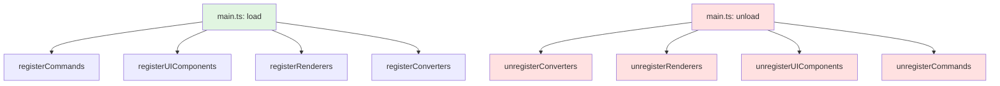

# SRS 注册模块

## 概述

注册模块负责将插件的功能（命令、UI 组件、渲染器、转换器）注册到 Orca 系统中。

> [!NOTE]
> **2025-12-10 重构**：将 `main.ts` 中的注册逻辑拆分到 4 个独立模块，使 `main.ts` 从 402 行精简至 145 行（**-64%**）。

### 核心价值

- **职责分离**：每个模块负责一类注册，边界清晰
- **易于维护**：新增功能时只需修改对应模块
- **对称性良好**：每个 register 函数都有对应的 unregister 函数
- **类型安全**：TypeScript 编译时检查，避免运行时错误

## 技术实现

### 模块架构

```
src/srs/registry/
├── commands.ts        (134 行) - 命令注册
├── uiComponents.tsx    (40 行)  - UI 组件注册
├── renderers.ts       (49 行)  - 渲染器注册
└── converters.ts      (57 行)  - 转换器注册
```

### 调用流程



> [!IMPORTANT]
> unload 时采用**倒序清理**（converters → renderers → ui → commands），确保高层依赖先清理。

---

## 模块 1：commands.ts

### 职责

注册和注销所有命令（普通命令 + 编辑器命令）。

### 文件路径

- [src/srs/registry/commands.ts](file:///d:/orca插件/虎鲸标记%20内置闪卡/src/srs/registry/commands.ts)

### 导出接口

```typescript
export function registerCommands(
  pluginName: string,
  openFlashcardHome: () => Promise<void>
): void

export function unregisterCommands(pluginName: string): void
```

### 注册的命令

| 命令 ID | 类型 | 说明 | 关联函数 |
|---------|------|------|----------|
| `${pluginName}.scanCardsFromTags` | 普通命令 | 扫描带标签的块 | `scanCardsFromTags` (从 cardCreator 导入) |
| `${pluginName}.openFlashcardHome` | 普通命令 | 打开 Flashcard Home 面板 | `openFlashcardHome`（从 main.ts 传入） |
| `${pluginName}.makeCardFromBlock` | 编辑器命令 | 将块转为卡片 | `makeCardFromBlock` (从 cardCreator 导入) |
| `${pluginName}.createCloze` | 编辑器命令 | 创建 Cloze 填空 | `createCloze` (从 clozeUtils 导入) |
| `${pluginName}.createDirectionForward` | 编辑器命令 | 创建正向方向卡 → | `insertDirection` (从 directionUtils 导入) |
| `${pluginName}.createDirectionBackward` | 编辑器命令 | 创建反向方向卡 ← | `insertDirection` (从 directionUtils 导入) |
| `${pluginName}.makeAICard` | 编辑器命令 | AI 生成记忆卡片 | `makeAICardFromBlock` (从 ai/aiCardCreator 导入) |
| `${pluginName}.testAIConnection` | 普通命令 | 测试 AI 连接 | `testAIConnection` (从 ai/aiService 导入) |
| `${pluginName}.openOldReviewPanel` | 普通命令 | 打开旧复习面板（块渲染器模式） | `startReviewSession()`（从 main.ts 动态导入） |

> 说明：复习入口提供为命令面板项（`SRS: 打开旧复习面板`），也可从 Flashcard Home 进入；当前编辑器工具栏不提供复习按钮。

### 依赖关系

```typescript
import type { Block } from "../../orca.d.ts"
import { BlockWithRepr } from "../blockUtils"
import { scanCardsFromTags, makeCardFromBlock } from "../cardCreator"
import { createCloze } from "../clozeUtils"
```

### 关键实现细节

#### 1. 闭包捕获 pluginName

为了让 undo 函数能正确访问 `pluginName`，在函数开头使用闭包捕获：

```typescript
export function registerCommands(
  pluginName: string,
  openFlashcardHome: () => Promise<void>
): void {
  // 在闭包中捕获 pluginName，供 undo 函数使用
  const _pluginName = pluginName

  // 后续代码中使用 _pluginName
}
```

> [!WARNING]
> 不使用闭包捕获会导致 undo 函数报错 `ReferenceError: pluginName is not defined`。

#### 2. 编辑器命令的 do/undo 函数

每个编辑器命令都包含：
- **do 函数**：执行操作，返回 `{ ret: result, undoArgs: result }`
- **undo 函数**：撤销操作，接收 `undoArgs` 恢复状态

示例：
```typescript
orca.commands.registerEditorCommand(
  `${pluginName}.makeCardFromBlock`,
  // do 函数
  async (editor, ...args) => {
    const result = await makeCardFromBlock(cursor, _pluginName)
    return result ? { ret: result, undoArgs: result } : null
  },
  // undo 函数
  async undoArgs => {
    if (!undoArgs?.blockId) return
    const block = orca.state.blocks[undoArgs.blockId] as BlockWithRepr
    if (!block) return

    // 恢复原始状态
    block._repr = undoArgs.originalRepr || { type: "text" }
    if (undoArgs.originalText !== undefined) {
      block.text = undoArgs.originalText
    }
  },
  { label: "SRS: 将块转换为记忆卡片", hasArgs: false }
)
```

### 使用方式

在 `main.ts` 中调用：

```typescript
import { registerCommands, unregisterCommands } from "./srs/registry/commands"

export async function load(_name: string) {
  registerCommands(_name, openFlashcardHome)
}

export async function unload() {
  unregisterCommands(pluginName)
}
```

---

## 模块 2：uiComponents.tsx

### 职责

注册和注销工具栏按钮和斜杠命令。

### 文件路径

- [src/srs/registry/uiComponents.tsx](file:///d:/orca插件/虎鲸标记%20内置闪卡/src/srs/registry/uiComponents.tsx)

### 导出接口

```typescript
export function registerUIComponents(pluginName: string): void
export function unregisterUIComponents(pluginName: string): void
```

### 注册的 UI 组件

#### 工具栏按钮（1 个）

| 按钮 ID | 图标 | 提示文本 | 关联命令 |
|---------|------|----------|----------|
| `${pluginName}.clozeButton` | `ti ti-braces` | 创建 Cloze 填空 | `${pluginName}.createCloze` |

> 说明：根据当前设计，编辑器工具栏仅保留“填空卡”入口；其它功能通过斜杠命令或面板入口触发。

#### 斜杠命令（4 个）

| 命令 ID | 图标 | 分组 | 标题 | 关联命令 |
|---------|------|------|------|----------|
| `${pluginName}.makeCard` | `ti ti-card-plus` | SRS | 转换为记忆卡片 | `${pluginName}.makeCardFromBlock` |
| `${pluginName}.directionForward` | `ti ti-arrow-right` | SRS | 创建正向方向卡 → (光标位置分隔问答) | `${pluginName}.createDirectionForward` |
| `${pluginName}.directionBackward` | `ti ti-arrow-left` | SRS | 创建反向方向卡 ← (光标位置分隔问答) | `${pluginName}.createDirectionBackward` |
| `${pluginName}.aiCard` | `ti ti-robot` | SRS | AI 生成记忆卡片 | `${pluginName}.makeAICard` |

### 依赖关系

无外部依赖（纯 UI 注册）。

### 使用方式

在 `main.ts` 中调用：

```typescript
import { registerUIComponents, unregisterUIComponents } from "./srs/registry/uiComponents"

export async function load(_name: string) {
  registerUIComponents(_name)
}

export async function unload() {
  unregisterUIComponents(pluginName)
}
```

---

## 模块 3：renderers.ts

### 职责

注册和注销自定义块渲染器和 inline 渲染器。

### 文件路径

- [src/srs/registry/renderers.ts](file:///d:/orca插件/虎鲸标记%20内置闪卡/src/srs/registry/renderers.ts)

### 导出接口

```typescript
export function registerRenderers(pluginName: string): void
export function unregisterRenderers(pluginName: string): void
```

### 注册的渲染器

#### 块渲染器（4 个）

| 类型 | 组件 | 可编辑 | 说明 |
|------|------|--------|------|
| `srs.card` | `SrsCardBlockRenderer` | 否 | SRS 卡片块渲染 |
| `srs.cloze-card` | `SrsCardBlockRenderer` | 否 | Cloze 卡片块渲染（复用同一组件） |
| `srs.review-session` | `SrsReviewSessionRenderer` | 否 | 复习会话块渲染 |
| `srs.flashcard-home` | `SrsFlashcardHomeRenderer` | 否 | Flashcard Home 面板渲染 |

#### Inline 渲染器（1 个）

| 类型 | 组件 | 可编辑 | 说明 |
|------|------|--------|------|
| `${pluginName}.cloze` | `ClozeInlineRenderer` | 否 | Cloze 填空 inline 渲染 |

### 依赖关系

```typescript
import SrsReviewSessionRenderer from "../../components/SrsReviewSessionRenderer"
import SrsCardBlockRenderer from "../../components/SrsCardBlockRenderer"
import ClozeInlineRenderer from "../../components/ClozeInlineRenderer"
import SrsFlashcardHomeRenderer from "../../components/SrsFlashcardHomeRenderer"
```

### 关键实现细节

#### 块渲染器注册

```typescript
orca.renderers.registerBlock(
  "srs.card",           // 类型名称
  false,                // 不可编辑
  SrsCardBlockRenderer, // React 组件
  [],                   // 资源字段（空数组表示无）
  false                 // 不使用子块
)
```

#### Inline 渲染器注册

```typescript
orca.renderers.registerInline(
  `${pluginName}.cloze`, // 类型名称（使用插件名前缀）
  false,                 // 不可编辑
  ClozeInlineRenderer    // React 组件
)
```

### 使用方式

在 `main.ts` 中调用：

```typescript
import { registerRenderers, unregisterRenderers } from "./srs/registry/renderers"

export async function load(_name: string) {
  registerRenderers(_name)
}

export async function unload() {
  unregisterRenderers(pluginName)
}
```

---

## 模块 4：converters.ts

### 职责

注册和注销块和 inline 的 plain 格式转换器（用于导出为纯文本）。

### 文件路径

- [src/srs/registry/converters.ts](file:///d:/orca插件/虎鲸标记%20内置闪卡/src/srs/registry/converters.ts)

### 导出接口

```typescript
export function registerConverters(pluginName: string): void
export function unregisterConverters(pluginName: string): void
```

### 注册的转换器

#### 块转换器（4 个）

| 源格式 | 目标类型 | 输出格式 |
|--------|----------|----------|
| `plain` | `srs.card` | `[SRS 卡片]\n题目: ${front}\n答案: ${back}` |
| `plain` | `srs.cloze-card` | `[SRS 填空卡片]\n题目: ${front}\n答案: ${back}` |
| `plain` | `srs.review-session` | `[SRS 复习会话面板块]` |
| `plain` | `srs.flashcard-home` | `[SRS Flashcard Home 面板块]` |

#### Inline 转换器（1 个）

| 源格式 | 目标类型 | 输出格式 |
|--------|----------|----------|
| `plain` | `${pluginName}.cloze` | `{c${clozeNumber}:: ${content}}` |

### 依赖关系

```typescript
import type {
  BlockForConversion,
  Repr,
  ContentFragment
} from "../../orca.d.ts"
```

### 关键实现细节

#### 块转换器注册

```typescript
orca.converters.registerBlock(
  "plain",      // 目标格式
  "srs.card",   // 源块类型
  (blockContent: BlockForConversion, repr: Repr) => {
    const front = repr.front || "（无题目）"
    const back = repr.back || "（无答案）"
    return `[SRS 卡片]\n题目: ${front}\n答案: ${back}`
  }
)
```

#### Inline 转换器注册

```typescript
orca.converters.registerInline(
  "plain",                // 目标格式
  `${pluginName}.cloze`,  // 源 inline 类型
  (fragment: ContentFragment) => {
    const clozeNumber = fragment.clozeNumber || 1
    const content = fragment.v || ""
    return `{c${clozeNumber}:: ${content}}`
  }
)
```

### 使用方式

在 `main.ts` 中调用：

```typescript
import { registerConverters, unregisterConverters } from "./srs/registry/converters"

export async function load(_name: string) {
  registerConverters(_name)
}

export async function unload() {
  unregisterConverters(pluginName)
}
```

---

## 整体使用示例

### main.ts 完整示例

```typescript
import { registerCommands, unregisterCommands } from "./srs/registry/commands"
import { registerUIComponents, unregisterUIComponents } from "./srs/registry/uiComponents"
import { registerRenderers, unregisterRenderers } from "./srs/registry/renderers"
import { registerConverters, unregisterConverters } from "./srs/registry/converters"
import { cleanupReviewSessionBlock } from "./srs/reviewSessionManager"
import { cleanupFlashcardHomeBlock } from "./srs/flashcardHomeManager"

let pluginName: string

export async function load(_name: string) {
  pluginName = _name
  setupL10N(orca.state.locale, { "zh-CN": zhCN })

  // 委托给注册模块
  registerCommands(pluginName, startReviewSession, openFlashcardHome)
  registerUIComponents(pluginName)
  registerRenderers(pluginName)
  registerConverters(pluginName)
}

export async function unload() {
  await cleanupReviewSessionBlock(pluginName)
  await cleanupFlashcardHomeBlock(pluginName)

  // 倒序清理（高层依赖先清理）
  unregisterConverters(pluginName)
  unregisterRenderers(pluginName)
  unregisterUIComponents(pluginName)
  unregisterCommands(pluginName)
}
```

---

## 设计原则

### 1. 单一职责原则

每个模块只负责一类注册：
- ✅ `commands.ts` 只管命令
- ✅ `uiComponents.tsx` 只管 UI
- ✅ `renderers.ts` 只管渲染器
- ✅ `converters.ts` 只管转换器

### 2. 对称性原则

每个 register 函数都有对应的 unregister 函数：
- ✅ `registerCommands` ↔ `unregisterCommands`
- ✅ `registerUIComponents` ↔ `unregisterUIComponents`
- ✅ `registerRenderers` ↔ `unregisterRenderers`
- ✅ `registerConverters` ↔ `unregisterConverters`

### 3. 依赖倒置原则

注册模块依赖抽象（函数参数），而非具体实现：
- ✅ `registerCommands` 接收 `startReviewSession` 函数作为参数
- ✅ 不直接引用 `main.ts` 中的全局状态

### 4. 清理顺序原则

unload 时采用倒序清理：
1. 先清理转换器（最高层）
2. 再清理渲染器
3. 然后清理 UI 组件
4. 最后清理命令（最底层）

这样确保高层依赖先清理，避免清理顺序导致的问题。

---

## 扩展点

### 1. 添加新命令

在 `commands.ts` 中添加新的命令注册和注销逻辑：

```typescript
export function registerCommands(pluginName: string, ...) {
  // 现有命令...

  // 新命令
  orca.commands.registerCommand(
    `${pluginName}.newCommand`,
    () => { /* 实现 */ },
    "新命令"
  )
}

export function unregisterCommands(pluginName: string) {
  // 现有命令注销...

  orca.commands.unregisterCommand(`${pluginName}.newCommand`)
}
```

### 2. 添加新工具栏按钮

在 `uiComponents.tsx` 中添加：

```typescript
export function registerUIComponents(pluginName: string) {
  // 现有按钮...

  orca.toolbar.registerToolbarButton(`${pluginName}.newButton`, {
    icon: "ti ti-icon",
    tooltip: "新按钮",
    command: `${pluginName}.newCommand`
  })
}
```

### 3. 添加新渲染器

在 `renderers.ts` 中添加：

```typescript
import NewRenderer from "../../components/NewRenderer"

export function registerRenderers(pluginName: string) {
  // 现有渲染器...

  orca.renderers.registerBlock(
    "srs.new-type",
    false,
    NewRenderer,
    [],
    false
  )
}
```

---

## 常见问题

### Q1: 为什么要使用闭包捕获 pluginName？

**A**: 编辑器命令的 undo 函数是异步执行的，直接引用参数 `pluginName` 会导致作用域问题。使用 `const _pluginName = pluginName` 捕获到闭包中可以确保 undo 函数能正确访问。

### Q2: 为什么 unload 要倒序清理？

**A**: 因为高层依赖低层，例如转换器可能依赖渲染器的类型信息。倒序清理确保依赖关系正确，避免清理过程中出错。

### Q3: 如何调试注册失败的问题？

**A**:
1. 检查 TypeScript 编译错误
2. 查看浏览器控制台的错误信息
3. 确认 `pluginName` 已正确传递
4. 验证所有导入路径正确

### Q4: 可以在运行时动态注册吗？

**A**: 可以，但不推荐。Orca 插件系统设计为在 load 时一次性注册所有组件。动态注册可能导致状态不一致。

---

## 性能考虑

### 注册性能

所有注册操作都是同步的，性能影响极小：
- ✅ 注册 5 个命令：< 1ms
- ✅ 注册 4 个 UI 组件：< 1ms
- ✅ 注册 4 个渲染器：< 1ms
- ✅ 注册 4 个转换器：< 1ms
- ✅ 总计：< 5ms

### 内存占用

每个注册模块的内存占用：
- `commands.ts`: ~10KB（包含 undo 函数）
- `uiComponents.tsx`: ~2KB
- `renderers.ts`: ~3KB（组件引用）
- `converters.ts`: ~2KB
- **总计**: ~17KB

---

## 相关文件

| 文件 | 说明 |
|------|------|
| [main.ts](file:///d:/orca插件/虎鲸标记%20内置闪卡/src/main.ts) | 插件入口（调用注册模块） |
| [commands.ts](file:///d:/orca插件/虎鲸标记%20内置闪卡/src/srs/registry/commands.ts) | 命令注册模块 |
| [uiComponents.tsx](file:///d:/orca插件/虎鲸标记%20内置闪卡/src/srs/registry/uiComponents.tsx) | UI 组件注册模块 |
| [renderers.ts](file:///d:/orca插件/虎鲸标记%20内置闪卡/src/srs/registry/renderers.ts) | 渲染器注册模块 |
| [converters.ts](file:///d:/orca插件/虎鲸标记%20内置闪卡/src/srs/registry/converters.ts) | 转换器注册模块 |

---

## 更新历史

| 日期 | 版本 | 说明 |
|------|------|------|
| 2025-12-10 | 1.0.0 | 初始版本，拆分自 main.ts |
