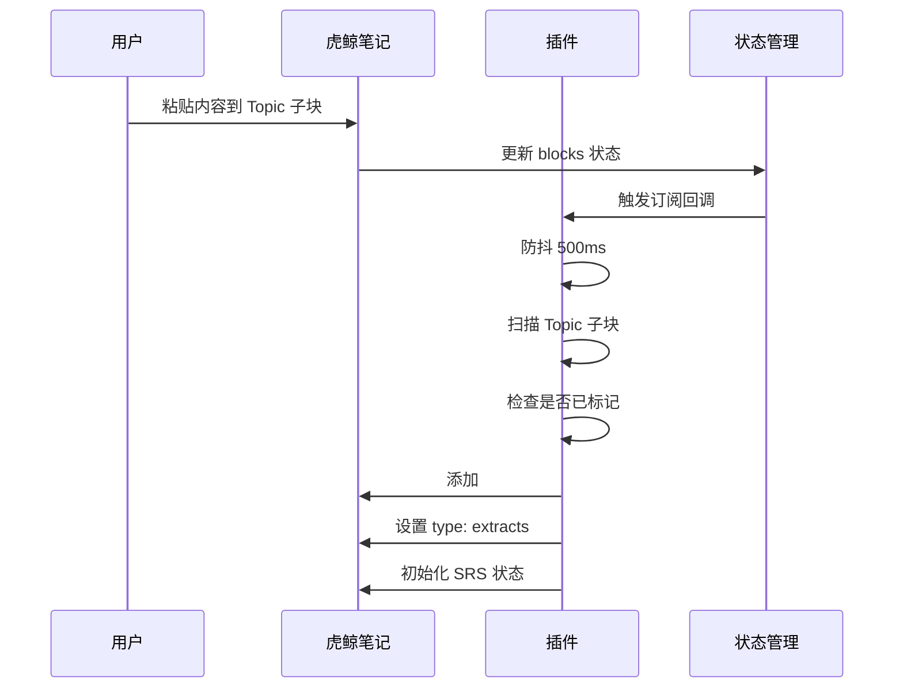

# 渐进阅读模块

## 概述

渐进阅读（Incremental Reading）是 SuperMemo 18 的核心功能之一。本模块实现了其 MVP 版本，支持将长文阅读内容转化为可复习的 Extract 卡片。

### 核心概念

- **Topic（主题）**: 包含阅读材料的页面，标记为 `#card, type: 渐进阅读`
- **Extract（摘录）**: Topic 下的子块，自动标记为 `#card, type: extracts`，进入 FSRS 复习队列

### 设计原则

1. **最激进简化**: 不引入优先级队列，复用现有 FSRS 算法
2. **自动化**: Topic 的子块自动成为 Extract，无需手动操作
3. **零感知**: 用户粘贴内容后，插件自动完成标记

---

## 功能模块

### Step 1: Topic 识别与扫描

**目标**: 识别 `type: 渐进阅读` 的页面，扫描其所有子块。

#### 核心函数

| 函数 | 说明 |
|------|------|
| `isIncrementalReadingTopic(block)` | 判断块是否为渐进阅读 Topic |
| `collectIncrementalReadingTopics(pluginName)` | 收集所有 Topic 块 |
| `getTopicChildBlocks(topicBlock)` | 获取 Topic 的所有子块 |
| `scanIncrementalReadingTopics(pluginName)` | 扫描并统计 Topic 及其子块 |

#### 命令

```
/扫描渐进阅读Topic
```

执行后显示：
- Topic 数量
- 潜在 Extract 数量
- 每个 Topic 的子块数量明细

#### 卡片类型扩展

`deckUtils.ts` 中的 `CardType` 类型已扩展：

```typescript
type CardType = "basic" | "cloze" | "direction" | "渐进阅读" | "extracts"
```

---

### Step 2: Extract 自动标记

**目标**: 自动为 Topic 的子块添加 `#card, type: extracts` 标签。

#### 自动化机制

插件启动时会自动监听 `orca.state.blocks` 的变化。当检测到 Topic 下新增子块时，自动执行标记：

1. 添加 `#card` 标签，设置 `type: extracts`
2. 设置 `_repr` 为 `srs.extract-card`
3. 初始化 SRS 状态（立即可复习）

#### 核心函数

| 函数 | 说明 |
|------|------|
| `markBlockAsExtract(blockId, pluginName)` | 为单个块添加 Extract 标记 |
| `markTopicChildrenAsExtracts(topicBlock, pluginName)` | 批量标记 Topic 的子块 |
| `markAllExtractCandidates(pluginName)` | 标记所有 Topic 的子块 |
| `startAutoMarkExtract(pluginName)` | 启动自动标记监听器 |
| `stopAutoMarkExtract(pluginName)` | 停止自动标记监听器 |

#### 命令

```
/标记渐进阅读Extract
```

手动触发标记，适用于首次批量处理。

#### 自动标记流程



---

## 复习流程

Extract 卡片进入复习队列后，使用现有的复习界面：

1. **Front**: 显示 Extract 的完整文本内容
2. **Back**: 显示提示 "理解并回忆这段内容"
3. **评分**: 使用标准 FSRS 评分（Again/Hard/Good/Easy）

---

## 相关文件

### 核心文件

| 文件 | 说明 |
|------|------|
| `src/srs/incrementalReadingUtils.ts` | Topic 扫描和 Extract 标记函数 |
| `src/srs/incrementalReadingAutoMark.ts` | 自动标记监听器 |
| `src/srs/deckUtils.ts` | 卡片类型定义（含渐进阅读/extracts） |
| `src/srs/storage.ts` | SRS 状态存储（含 ensureExtractSrsState） |
| `src/srs/cardCollector.ts` | 卡片收集（含 Extract 类型处理） |
| `src/srs/registry/commands.ts` | 命令注册 |
| `src/main.ts` | 插件入口（启动/停止自动标记） |

---

## 使用指南

### 创建渐进阅读 Topic

1. 在虎鲸笔记中创建一个页面
2. 为该页面添加 `#card` 标签
3. 设置标签属性 `type: 渐进阅读`

### 添加 Extract 内容

1. 在 Topic 页面下创建子块
2. 粘贴或输入阅读摘录
3. 插件自动标记为 Extract（500ms 延迟）

### 开始复习

1. 打开 Flashcard Home
2. Extract 卡片会显示在待复习列表中
3. 开始复习，根据理解程度评分

---

## 配置说明

### 自动标记设置

自动标记默认启用，无需额外配置。防抖时间固定为 500ms。

### 已处理块缓存

插件使用 `Set<DbId>` 记录已处理的块，避免重复标记。插件卸载时自动清空。

---

## 测试验证

### 功能测试点

1. **Topic 识别**: 创建 `type: 渐进阅读` 的页面，执行扫描命令
2. **子块扫描**: 在 Topic 下添加子块，检查扫描结果
3. **自动标记**: 粘贴内容到 Topic 子块，检查是否自动添加标签
4. **复习队列**: 打开 Flashcard Home，检查 Extract 是否出现
5. **复习流程**: 开始复习，验证 Extract 卡片的显示和评分

### 边界情况

- Topic 无子块：扫描结果显示 0 个 Extract
- 子块已标记：跳过已标记的块
- 非 Topic 子块：不自动标记

---

## 更新记录

- 2025-12-18: 创建渐进阅读 MVP 模块
  - 实现 Step 1: Topic 识别与扫描
  - 实现 Step 2: Extract 自动标记
  - 集成自动化监听器
