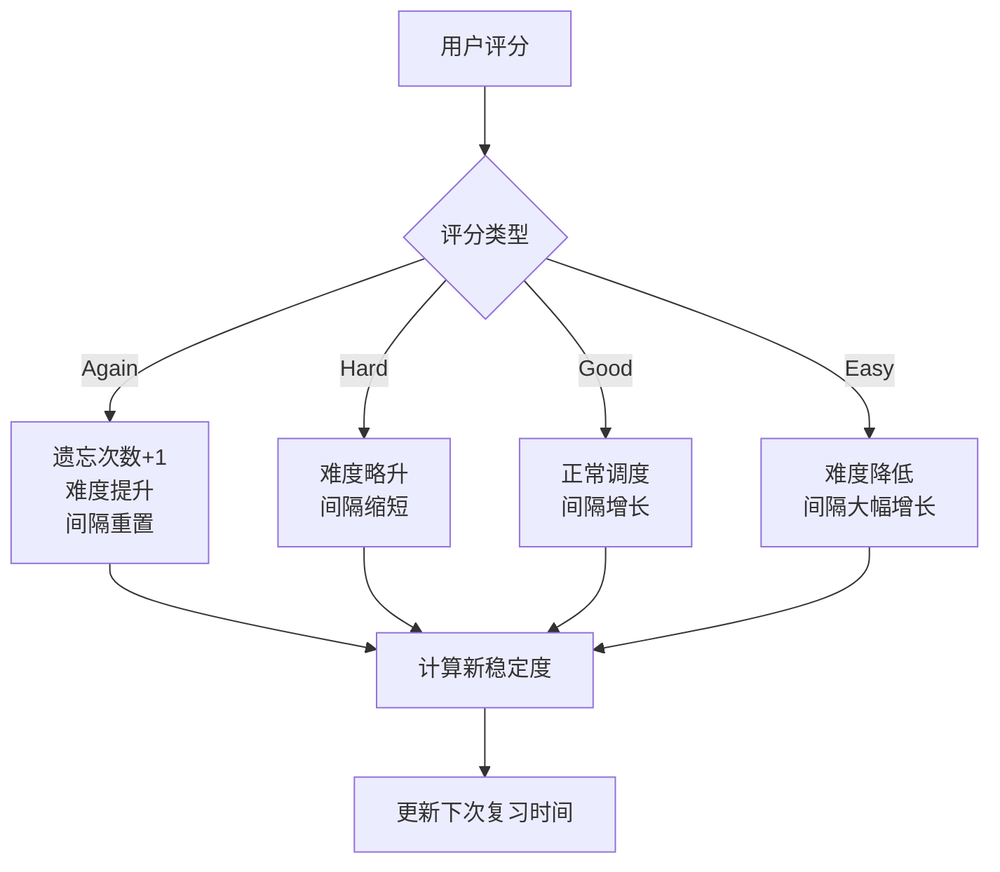

# SRS 记忆算法模块

## 概述

本模块实现了基于 **FSRS（Free Spaced Repetition Scheduler）** 的间隔复习算法，负责计算卡片的下一次复习时间、记忆稳定度和难度等核心参数。

### 核心价值

- 使用科学的遗忘曲线模型安排复习时间
- 根据用户评分动态调整间隔和难度
- 支持四级评分：Again（忘记）、Hard（困难）、Good（良好）、Easy（简单）

## 技术实现

### 核心文件

- [algorithm.ts](file:///d:/orca插件/虎鲸标记%20内置闪卡/src/srs/algorithm.ts)
- [types.ts](file:///d:/orca插件/虎鲸标记%20内置闪卡/src/srs/types.ts)

### 依赖

- `ts-fsrs`：FSRS 算法的 TypeScript 实现库

### 数据结构

```typescript
// 卡片状态（SrsState）
type SrsState = {
  stability: number; // 记忆稳定度，越大代表遗忘速度越慢
  difficulty: number; // 记忆难度，1-10 越大越难
  interval: number; // 间隔天数
  due: Date; // 下次应复习的具体时间
  lastReviewed: Date | null; // 上次复习时间
  reps: number; // 已复习次数
  lapses: number; // 遗忘次数（Again 会增加）
  resets?: number; // 用户主动重置次数，评分后继续保留
  state?: State; // FSRS 内部状态
};

// 评分等级
type Grade = "again" | "hard" | "good" | "easy";
```

### 核心函数

#### `createInitialSrsState(now?: Date): SrsState`

创建新卡片的初始状态。

#### `nextReviewState(prevState, grade, now?): { state, log }`

根据用户评分计算下一次复习状态：

- 输入：上一次状态、评分等级、当前时间
- 输出：新状态和复习日志
- `resets` 不参与 FSRS 排期计算，但会从上一次状态原样继承，避免重置历史在评分后归零

### 算法流程


```mermaid
flowchart TD
    A[用户评分] --> B{评分类型}
    B -->|Again| C[遗忘次数+1<br/>难度提升<br/>间隔重置]
    B -->|Hard| D[难度略升<br/>间隔缩短]
    B -->|Good| E[正常调度<br/>间隔增长]
    B -->|Easy| F[难度降低<br/>间隔大幅增长]
    C --> G[计算新稳定度]
    D --> G
    E --> G
    F --> G
    G --> H[更新下次复习时间]
```

### 评分影响

| 评分  | 难度影响 | 间隔影响     | 遗忘计数 |
| ----- | -------- | ------------ | -------- |
| Again | ↑ 增加   | 重置为短间隔 | +1       |
| Hard  | ↑ 略增   | 缩短         | 不变     |
| Good  | 不变     | 正常增长     | 不变     |
| Easy  | ↓ 降低   | 大幅增长     | 不变     |

## 使用示例

```typescript
import { createInitialSrsState, nextReviewState } from "./srs/algorithm";

// 创建新卡片
const initialState = createInitialSrsState();

// 用户评分为 Good
const { state: newState, log } = nextReviewState(initialState, "good");

console.log(`下次复习：${newState.due}`);
console.log(`间隔：${newState.interval} 天`);
```

## 扩展点

1. **自定义参数**：经 `validateFsrsConfig` 校验后，由 `generatorParameters()` 创建 `FSRS` 实例
2. **复习日志**：`nextReviewState` 返回的 `log` 可用于统计分析
3. **预测功能**：`previewIntervals` / `previewDueDates` 与正式评分共用 `pluginName` 校验路径

## F2-08：FSRS 设置完整校验与统一运行时参数

### 校验规则（`src/srs/settings/reviewSettingsSchema.ts`）

| 字段 | 接受条件 | 回退默认 |
| --- | --- | --- |
| `review.fsrsWeights` | **string**；恰好 **21** 个 trim 后 token；`Number(token)` 且 `Number.isFinite`（拒绝 `1abc` / 空 token / NaN / ±Infinity / 17·19·20·22 个） | `DEFAULT_FSRS_WEIGHTS`（与 `ts-fsrs@5.2.3` 的 `default_w` 数值一致） |
| `review.fsrsRequestRetention` | 有限 number，闭区间 **0.7..0.99** | `0.9` |
| `review.fsrsMaximumInterval` | 有限整数，闭区间 **1..36500** | `36500` |

- 字段 **`undefined`（未设置）**：静默使用默认，**不**产生 issue。
- 其它非法值：逐项写入 `FsrsSettingIssue`（`field` / `rawSummary` / 中文 `reason` / `fallback`），并回退默认。
- **禁止**把原始非法值传入 `generatorParameters` / `FSRS`；不依赖 ts-fsrs 静默 clip/migrate。

### 算法入口（`src/srs/algorithm.ts`）

- `getFsrsInstance(pluginName)`：读 raw settings → `validateFsrsConfig` → 仅用 **生效后的规范化参数** 比较 cache 并创建/复用实例。
- 存在 issues 且带 `pluginName` 时：`orca.notify("warn", ...)`；按非法配置指纹去重（同配置预览四评分不重复弹通知；非法 A→B 各通知一次）。**无 issues**（合法或未设置静默默认）时**重置**去重状态，故 非法 A → 合法 → 非法 A 会通知两次。`notify` 失败只 `console.error`，仍使用安全默认；重置去重不影响 FSRS 生效参数 cache。
- `clearFsrsRuntimeState()`：清空 warning 指纹 + 重置默认实例（供恢复默认命令在 `setSettings` 成功后调用）。
- `previewIntervals` / `previewDueDates` / `nextReviewState` 第三参均为 `pluginName`，保证预览与正式评分同参。

### 恢复默认

- 命令：`${pluginName}.resetFsrsSettings`（label：`SRS: 恢复 FSRS 默认设置`）
- 写入：`orca.plugins.setSettings("app", pluginName, getDefaultFsrsSettingsPatch())` 三项默认
- 成功/失败均 `orca.notify`；失败 `console.error`，不假装成功

## 测试验证

- `runExamples()` 函数提供了四种典型场景的测试用例
- 测试场景：新卡首次评 Good、复习队列评 Hard、遗忘后评 Again、成熟卡评 Easy
- F2-08：`reviewSettingsSchema.test.ts`、`algorithm.fsrsSettings.test.ts`、`resetFsrsSettings.test.ts`、`fsrsPreviewPluginName.harness.test.ts`

## 相关文件

| 文件 | 说明 |
| --- | --- |
| `src/srs/algorithm.ts` | FSRS 算法核心实现与运行时 cache |
| `src/srs/settings/reviewSettingsSchema.ts` | 设置 Schema + FSRS 纯校验 |
| `src/srs/types.ts` | 类型定义 |
| `src/srs/storage.ts` | 状态持久化（调用算法） |
