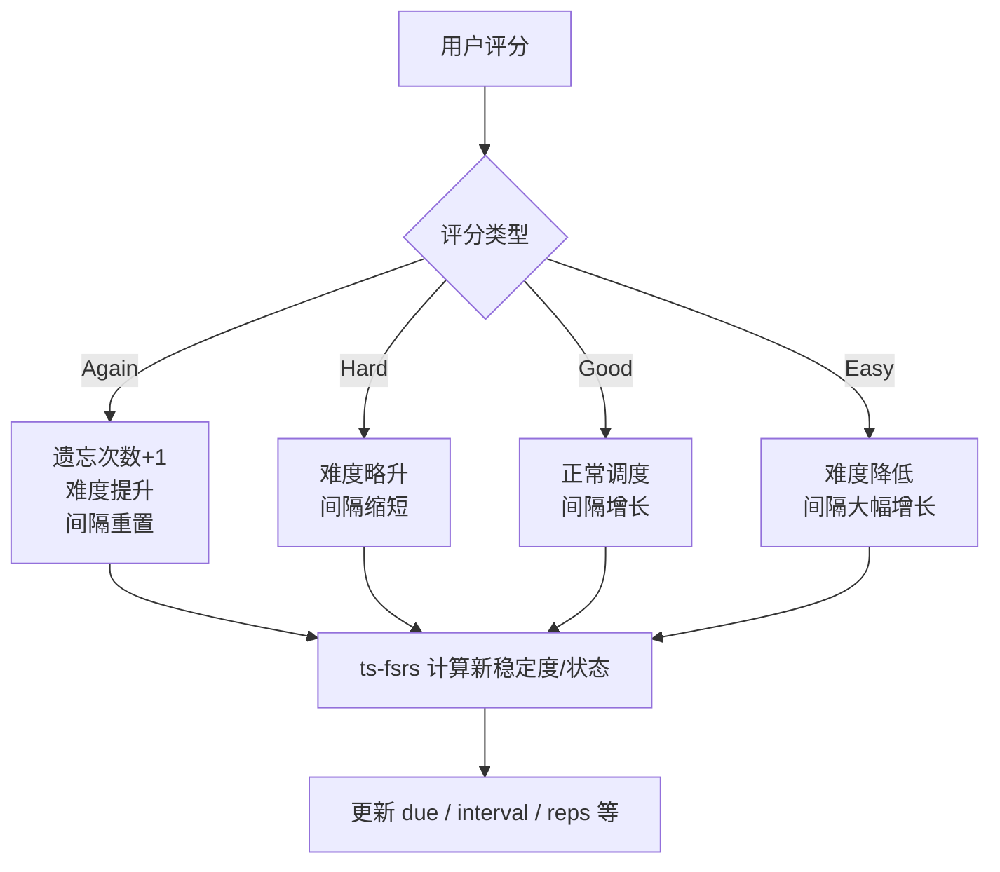

# SRS 记忆算法模块

> **文档同步日期：2026-07-13**  
> 变更说明：校正 `nextReviewState` / 预览函数的 `pluginName` 参数位置；对齐 F2-08 校验与运行时 cache；修正相关文件路径。

## 概述

本模块实现了基于 **FSRS（Free Spaced Repetition Scheduler）** 的间隔复习算法，负责计算卡片的下一次复习时间、记忆稳定度和难度等核心参数。

### 核心价值

- 使用科学的遗忘曲线模型安排复习时间
- 根据用户评分动态调整间隔和难度
- 支持四级评分：Again（忘记）、Hard（困难）、Good（良好）、Easy（简单）
- 设置非法时严格校验并回退安全默认，禁止把原始非法值传入 `ts-fsrs`

## 技术实现

### 核心文件

- `src/srs/algorithm.ts` — FSRS 运行时实例、评分、预览
- `src/srs/settings/reviewSettingsSchema.ts` — 复习设置 Schema + `validateFsrsConfig`
- `src/srs/types.ts` — `SrsState` / `Grade`
- `src/srs/registry/commands.ts` — 恢复 FSRS 默认设置命令（`resetFsrsSettingsToDefaults`）

### 依赖

- `ts-fsrs`（项目锁定与默认权重对齐 **ts-fsrs@5.2.3** 的 `default_w`，UI 标注 FSRS v6 / **恰好 21** 个权重）

### 数据结构

```typescript
// 卡片状态（SrsState）— 定义于 types.ts
type SrsState = {
  stability: number; // 记忆稳定度，越大代表遗忘速度越慢
  difficulty: number; // 记忆难度，1-10 越大越难
  interval: number; // 间隔天数（FSRS scheduled_days）
  due: Date; // 下次应复习的具体时间
  lastReviewed: Date | null; // 上次复习时间
  reps: number; // 已复习次数
  lapses: number; // 遗忘次数（Again 会增加）
  resets?: number; // 用户主动重置次数，评分后继续保留
  state?: State; // FSRS 内部状态 New/Learning/Review/Relearning
};

// 评分等级
type Grade = "again" | "hard" | "good" | "easy";
```

`Grade` → `ts-fsrs` `Rating`：`again→Again` / `hard→Hard` / `good→Good` / `easy→Easy`。

### 核心函数

#### `createInitialSrsState(now?: Date): SrsState`

基于 `createEmptyCard(now)` 创建新卡片初始状态。

#### `resetCardState(prevState, now?): SrsState`

重置为新卡，但 `resets = (prev.resets ?? 0) + 1`。

#### `nextReviewState(prevState, grade, now?, pluginName?): { state, log }`

根据用户评分计算下一次复习状态：

- 若传入 `pluginName`，经 `getFsrsInstance(pluginName)` 读设置 → 校验 → 使用**生效参数**实例
- 将 `SrsState` 转为 `ts-fsrs` `Card`（保留 `state`，避免 Learning/Relearning 丢失）
- 调用 `fsrsInstance.next(...)`
- **`resets` 不参与 FSRS 计算**，从上一次状态原样继承

> 注意参数顺序：`now` 为第 3 参，`pluginName` 为第 **4** 参。  
> `previewIntervals` / `previewDueDates` 的 `pluginName` 为第 **3** 参（无单独 `now` 之外的插槽差异时以函数签名为准）。

#### `previewIntervals(prevState, now?, pluginName?): Record<Grade, number>`

对四档评分各跑一遍 `nextReviewState`，返回 `due - now` 的毫秒间隔（≥0）。

#### `previewDueDates` / `formatInterval` / `formatIntervalChinese`

预览到期时间与人类可读间隔（分钟/小时/天/月/年）。

#### 运行时实例管理

| 函数 | 说明 |
|------|------|
| `getFsrsInstance(pluginName?)` | 有 pluginName 时读 raw settings 并 `resolveAndApplyFsrsConfig` |
| `getEffectiveFsrsParams(pluginName?)` | 返回规范化生效参数 |
| `applyValidatedFsrsConfig` / `resolveAndApplyFsrsConfig` | 仅用校验后的参数比较 cache 并创建/复用 `FSRS` |
| `updateFsrsParams(weightsStr, retention, maxInterval, options?)` | 接受可能非法 raw，内部严格校验 |
| `clearFsrsRuntimeState()` | 清空 warning 指纹 + 重置为项目默认实例 |
| `clearFsrsWarningFingerprint()` | 仅清指纹（测试） |
| `peekValidatedFsrsConfig(pluginName)` | 重新校验 settings，不应用、不 warn |

### 算法流程


```mermaid
flowchart TD
    A[用户评分] --> B{评分类型}
    B -->|Again| C[遗忘次数+1<br/>难度提升<br/>间隔重置]
    B -->|Hard| D[难度略升<br/>间隔缩短]
    B -->|Good| E[正常调度<br/>间隔增长]
    B -->|Easy| F[难度降低<br/>间隔大幅增长]
    C --> G[ts-fsrs 计算新稳定度/状态]
    D --> G
    E --> G
    F --> G
    G --> H[更新 due / interval / reps 等]
```

### 评分影响（产品语义摘要）

| 评分  | 难度影响 | 间隔影响     | 遗忘计数 |
| ----- | -------- | ------------ | -------- |
| Again | ↑ 增加   | 重置为短间隔 | +1       |
| Hard  | ↑ 略增   | 缩短         | 不变     |
| Good  | 视算法   | 正常增长     | 不变     |
| Easy  | ↓ 降低   | 大幅增长     | 不变     |

具体数值完全由 `ts-fsrs` 与当前权重/`request_retention`/`maximum_interval` 决定。

## 使用示例

```typescript
import { createInitialSrsState, nextReviewState, previewIntervals } from "./srs/algorithm";

const initialState = createInitialSrsState();
const { state: newState, log } = nextReviewState(initialState, "good", new Date(), pluginName);

console.log(`下次复习：${newState.due}`);
console.log(`间隔：${newState.interval} 天`);

const previews = previewIntervals(initialState, new Date(), pluginName);
```

## F2-08：FSRS 设置完整校验与统一运行时参数

### 校验规则（`src/srs/settings/reviewSettingsSchema.ts`）

| 字段 | 接受条件 | 回退默认 |
| --- | --- | --- |
| `review.fsrsWeights` | **string**；恰好 **21** 个 trim 后 token；`Number(token)` 且 `Number.isFinite`（拒绝 `1abc` / 空 token / NaN / ±Infinity / 非 21 个） | `DEFAULT_FSRS_WEIGHTS`（与 `ts-fsrs@5.2.3` 的 `default_w` 数值一致） |
| `review.fsrsRequestRetention` | 有限 number，闭区间 **0.7..0.99** | `0.9` |
| `review.fsrsMaximumInterval` | 有限整数，闭区间 **1..36500** | `36500` |

- 字段 **`undefined`（未设置）**：静默使用默认，**不**产生 issue。
- 其它非法值：逐项写入 `FsrsSettingIssue`（`field` / `rawSummary` / 中文 `reason` / `fallback`），并回退默认。
- **禁止**把原始非法值传入 `generatorParameters` / `FSRS`；不依赖 ts-fsrs 静默 clip/migrate。
- 纯入口：`validateFsrsConfig(raw)` → `ValidatedFsrsConfig`；`readAndValidateFsrsSettings(pluginName)` 从 settings 读 raw 再校验。
- 恢复默认写入：`getDefaultFsrsSettingsPatch()` 返回三项默认 key/value。

### 设置 Schema 其它复习项

| 键 | 默认 | 说明 |
|----|------|------|
| `review.disableNotifications` | false | 关闭 SRS 通知 |
| `review.newCardsPerDay` | 30 | 每日新卡上限（额度校验在 budget 模块） |
| `review.reviewCardsPerDay` | 200 | 每日复习卡上限 |

`getReviewSettings(pluginName)` 返回**原始读取**；正式评分/预览必须走 algorithm 的 validated 路径，勿把原始 FSRS 字段直接喂给 `generatorParameters`。

### 算法入口与通知去重

- `getFsrsInstance(pluginName)`：读 raw settings → `validateFsrsConfig` → 仅用**生效后的规范化参数**比较 cache 并创建/复用实例。
- 存在 issues 且会 warn 时：`orca.notify("warn", ...)`；按非法配置指纹去重（同配置预览四评分不重复弹通知；非法 A→B 各通知一次）。**无 issues**（合法或未设置静默默认）时**重置**去重状态，故 非法 A → 合法 → 非法 A 会通知两次。`notify` 失败只 `console.error`，仍使用安全默认；重置去重不影响 FSRS 生效参数 cache。
- `clearFsrsRuntimeState()`：清空 warning 指纹 + 重置默认实例（供恢复默认命令在 `setSettings` 成功后调用）。
- 预览与正式评分须传入同一 `pluginName`，保证同参。

### 恢复默认

- 命令 id：`${pluginName}.resetFsrsSettings`（label：`SRS: 恢复 FSRS 默认设置`）
- 实现：`resetFsrsSettingsToDefaults`（`src/srs/registry/commands.ts`）
  - `orca.plugins.setSettings("app", pluginName, getDefaultFsrsSettingsPatch())`
  - 成功后 `clearFsrsRuntimeState()`
- 成功/失败均 `orca.notify`；失败 `console.error`，不假装成功

## 测试验证

- `runExamples()`（若存在）/ 单元测试覆盖典型评分场景
- F2-08：`reviewSettingsSchema.test.ts`、`algorithm.fsrsSettings.test.ts`、`resetFsrsSettings.test.ts`、`fsrsPreviewPluginName.harness.test.ts`
- 其它：`algorithm.test.ts`

## 扩展点

1. **自定义参数**：经 `validateFsrsConfig` 校验后，由 `generatorParameters()` 创建 `FSRS` 实例
2. **复习日志（两套结构）**：
   - `nextReviewState` 仍返回 ts-fsrs 侧的 `log`（算法库内部结构），**正式评分路径不消费、不落盘该 `log`**
   - 持久化由 `reviewCardGrading.gradeReviewCard` **自行构造**项目 `ReviewLogEntry`（identity、grade、duration、interval、state 等），再 `saveAndFlushReviewLog` → `reviewLogStorage`
   - 扩展统计/字段时改 `ReviewLogEntry` 与评分路径，不要假设 FSRS `log` 会写入存储
3. **预测功能**：`previewIntervals` / `previewDueDates` 与正式评分共用 `pluginName` 校验路径

## 相关文件

| 文件 | 说明 |
| --- | --- |
| `src/srs/algorithm.ts` | FSRS 算法核心与运行时 cache |
| `src/srs/settings/reviewSettingsSchema.ts` | 设置 Schema + FSRS 纯校验 |
| `src/srs/types.ts` | `SrsState` / `Grade` |
| `src/srs/storage.ts` | 状态持久化（调用 `nextReviewState`） |
| `src/srs/reviewCardGrading.ts` | 正式评分路径 |
| `src/srs/registry/commands.ts` | 恢复 FSRS 默认命令 |
| `src/srs/reviewSessionBudget.ts` | 每日新卡/复习卡额度（非 FSRS 权重，但是同一 settings 域） |
