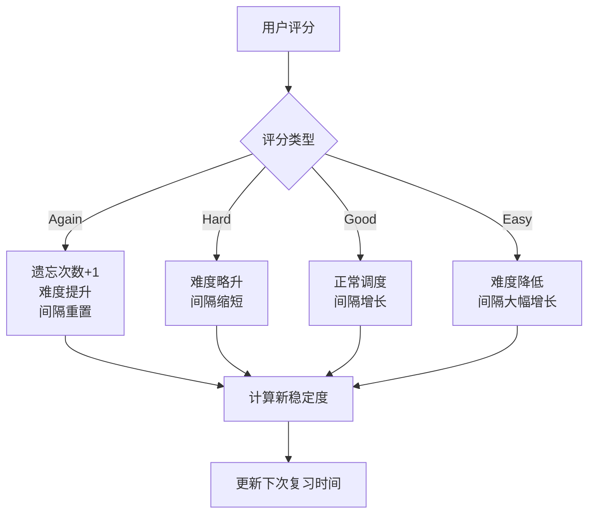

# SRS 记忆算法模块

## 概述

本模块实现了基于 **FSRS（Free Spaced Repetition Scheduler）** 的间隔复习算法，负责计算卡片的下一次复习时间、记忆稳定度和难度等核心参数。

### 核心价值

- 使用科学的遗忘曲线模型安排复习时间
- 根据用户评分动态调整间隔和难度
- 支持四级评分：Again（忘记）、Hard（困难）、Good（良好）、Easy（简单）

## 技术实现

### 核心文件

- [algorithm.ts](file:///d:/orca插件/虎鲸标记%20内置闪卡/src/srs/algorithm.ts)
- [types.ts](file:///d:/orca插件/虎鲸标记%20内置闪卡/src/srs/types.ts)

### 依赖

- `ts-fsrs`：FSRS 算法的 TypeScript 实现库

### 数据结构

```typescript
// 卡片状态（SrsState）
type SrsState = {
  stability: number; // 记忆稳定度，越大代表遗忘速度越慢
  difficulty: number; // 记忆难度，1-10 越大越难
  interval: number; // 间隔天数
  due: Date; // 下次应复习的具体时间
  lastReviewed: Date | null; // 上次复习时间
  reps: number; // 已复习次数
  lapses: number; // 遗忘次数（Again 会增加）
  state?: State; // FSRS 内部状态
};

// 评分等级
type Grade = "again" | "hard" | "good" | "easy";
```

### 核心函数

#### `createInitialSrsState(now?: Date): SrsState`

创建新卡片的初始状态。

#### `nextReviewState(prevState, grade, now?): { state, log }`

根据用户评分计算下一次复习状态：

- 输入：上一次状态、评分等级、当前时间
- 输出：新状态和复习日志

### 算法流程



### 评分影响

| 评分  | 难度影响 | 间隔影响     | 遗忘计数 |
| ----- | -------- | ------------ | -------- |
| Again | ↑ 增加   | 重置为短间隔 | +1       |
| Hard  | ↑ 略增   | 缩短         | 不变     |
| Good  | 不变     | 正常增长     | 不变     |
| Easy  | ↓ 降低   | 大幅增长     | 不变     |

## 使用示例

```typescript
import { createInitialSrsState, nextReviewState } from "./srs/algorithm";

// 创建新卡片
const initialState = createInitialSrsState();

// 用户评分为 Good
const { state: newState, log } = nextReviewState(initialState, "good");

console.log(`下次复习：${newState.due}`);
console.log(`间隔：${newState.interval} 天`);
```

## 扩展点

1. **自定义参数**：可通过 `generatorParameters()` 调整 FSRS 默认参数
2. **复习日志**：`nextReviewState` 返回的 `log` 可用于统计分析
3. **预测功能**：可扩展预测不同评分下的间隔变化

## 测试验证

- `runExamples()` 函数提供了四种典型场景的测试用例
- 测试场景：新卡首次评 Good、复习队列评 Hard、遗忘后评 Again、成熟卡评 Easy

## 相关文件

| 文件                                                                         | 说明                   |
| ---------------------------------------------------------------------------- | ---------------------- |
| [algorithm.ts](file:///d:/orca插件/虎鲸标记%20内置闪卡/src/srs/algorithm.ts) | FSRS 算法核心实现      |
| [types.ts](file:///d:/orca插件/虎鲸标记%20内置闪卡/src/srs/types.ts)         | 类型定义               |
| [storage.ts](file:///d:/orca插件/虎鲸标记%20内置闪卡/src/srs/storage.ts)     | 状态持久化（调用算法） |
