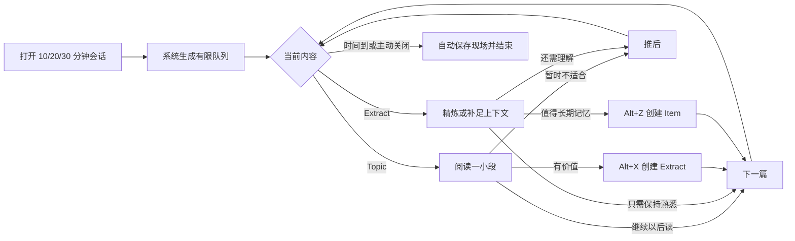

# 渐进阅读低压体验优化计划

> **文档类型：历史计划 + 分阶段实施记录（非现行实现手册）**  
> **文档同步日期：2026-07-13** — 仅补充状态对照；正文规划叙述保留作演进史料。  
> 现行行为以 [`渐进阅读.md`](渐进阅读.md)、[`渐进阅读_BookIR.md`](渐进阅读_BookIR.md) 为准。

> 历史状态备注：二次验收整改完成（2026-07-10），待 Orca 实机复验。  
> 核心目标（计划原文）：在保留 Topic、Extract、IR 排期和 Orca 原生编辑能力的基础上，把渐进阅读会话升级为接近 SuperMemo 18 的低决策、可随时中断、自动治理积压的阅读流程。

## 状态说明（2026-07-13 对照代码）

本文件描述的是**优化计划与分阶段交付记录**。下表标明计划条目与当前代码的关系；**勿将全文当作「全部未做」或「全部完成」**。

### 已在代码落地（有文件证据）

| 计划能力 | 实现位置（证据） |
| --- | --- |
| 会话组件拆分（Shell/Header/Reading/Action/Postpone/Summary） | `src/components/incremental-reading/IRSession*.tsx`、`IRActionBar.tsx`、`IRPostponeMenu.tsx` |
| 统一工作区（资料库 + 专注阅读） | `workspace/IRWorkspaceShell.tsx`、`IRModeSwitcher.tsx`、`useIRWorkspace*.ts` |
| 时间盒 10/20/30 + 计时 | `useIRSessionTimer.ts`、`irTypes.IRTimeBudgetMinutes`、`IRReadingView` 启动页 |
| 断点捕获/版本/flush/恢复 | `useIRReadingBreakpoint.ts`、`irBreakpointStorage.ts`、`irBreakpoint*.ts` |
| 快捷键规则（Alt+X/Z 可重绑定；Enter 仅会话 Hook） | `irShortcutsRegistry.ts`、`useIRShortcuts.ts`、`irShortcutRules.ts` |
| 原子 Extract→Cloze | `irConversionService.ts`、`irConversionBlockState.ts`、`irClozeCommandService.ts` |
| 时间预算队列 + Topic 保护 + 新 Extract 配额 | `irQueuePolicy.ts` |
| 自动推后批次 + 撤销（进程内批次表） | `irOverloadService.ts`；字段 `ir.autoPostponeBatchId` |
| 重要性调整比例修正间隔 | `incrementalReadingStorage.updatePriority`、`irQueuePolicy.adjustIntervalForPriorityChange` |
| `ir.stage` 真实推进 | `irStageTransitions.ts`、`irSessionService.ts` |
| 漏斗诊断 | `irFunnelDiagnostics.ts`、`IRFunnelDiagnosticsPanel.tsx` |
| 混合学习固定快照队列 | `irMixedQueuePolicy.ts`、`IRMixedReviewPane.tsx`、`irSessionLaunchMode.ts` |
| 收集 empty/error 区分 + 进度「已完成/计划」 | `irCollectResult.ts`、`irSessionProgress.ts` |
| IR 索引 + 成本校准 + 跨块摘录规划 | `irIndex.ts`、`irCostCalibration.ts`、`irRichExtract.ts` |
| 会话指标 | `irMetrics.ts` |
| 资料库三级来源树 / 时间带 | `irSourceTreeBuilder.ts`、`IRTimeNavigationBar.tsx`、`IRLibrary*.tsx` |

### 部分落地 / 有已知偏差

| 项 | 状态 |
| --- | --- |
| 自动推后跨插件重载撤销 | 批次 Map 在进程内存；重载后历史批次不可撤销（阶段 2 偏差仍成立） |
| Extract→Q&A 独立事务 | 仅 Cloze 完整；Q&A 未做对等路径 |
| 制卡「可撤销栈」 | 失败补偿 + Orca 原生命令栈，无独立跨步骤 undo 栈 |
| 富文本/图片 WYSIWYG 传播 | 规划与纯文本合并为主，非完整结构复制 |
| 忽略选区 / 删除已读 / 按标题批量拆分 | 有规划函数，无完整会话 UI |
| 一万条 IR 规模实机性能 | 未在本文档环境做规模验收 |
| 会话动作 100% 撤销覆盖 | 自动推后可撤销；归档/制卡等未全覆盖独立 undo |

### 仍属计划或非目标（未当作已完成）

| 项 | 说明 |
| --- | --- |
| 复刻 SuperMemo 全窗口/命令 | §3 非目标 |
| ML 排期模型 | 非目标 |
| 将全部调度参数开放为设置 | 仅部分进入 `incrementalReadingSettingsSchema` |
| AI 自动估值/批量制卡 | 非目标 |
| 音频/视频/PDF 新媒介 | 非目标；书籍路径见 Book IR + EPUB |
| 组件级 React Testing Library 会话测试 | 仓库以逻辑/服务单测为主 |
| Orca 实机「只键盘连做 20 条」等手测清单 | §16.4 仍依赖用户环境验收 |

### 阶段完成度速览

| 阶段 | 计划标题 | 代码侧结论 |
| --- | --- | --- |
| 0 | 行为基线与测试护栏 | 已落地（进度/收集态/指标/基线测试） |
| 1 | 可信中断与低操作会话 | 已落地（断点/快捷键/原子制卡/动作栏） |
| 2 | 时间盒与自动过载治理 | 已落地（队列策略/自动推后/摘要）；批次持久化有偏差 |
| 3 | 统一漏斗与混合学习 | 主体已落地；混合学习 2026-07 正式实现；Q&A/完整 undo 仍弱 |
| 4 | 富文本与规模化 | 部分落地（索引/校准/跨块规划）；完整富文本 UI 与规模验收未闭合 |

下文从「验收整改记录」起为**计划原文与实施当时记录**，其中路径与默认值若与现行代码冲突，以 `渐进阅读.md` 为准。

---

## 验收整改记录（2026-07-10）

针对验收阻断项的修复：

1. **自动顺延**：`ir.autoPostponeBatchId` 已写入 `saveIRState`；先快照后写入，失败回滚；撤销重读磁盘字段。
2. **原子制卡**：转化前快照正文、标签、原有 SRS/来源属性与 IR；失败执行精确补偿；成功只删除调度字段并保留 `ir.source*`；真实验证 #card、`type=cloze` 与对应 cloze SRS。
3. **断点恢复**：`useIRReadingBreakpoint.restore` 调用 `scrollIntoView` + `setSelectionFromCursorData`；关闭 flush 失败不静默关闭。
4. **快捷键**：移除 Enter/Shift+Enter 的全局 `shortcuts.assign`；会话动作仅 DOM Hook + panel 隔离；按钮、链接、菜单项不拦截 Enter；Alt+X/Z 尊重用户重绑定。
5. **收集失败**：标签查询失败抛错；`loadIRState` 失败抛错；零张成功且存在失败时进入错误态。
6. **跨块摘录**：兄弟链 + 首尾 offset + 中间全文。
7. **推后三档**：`postponeDaysForChoice` → `postpone(blockId, days)`。
8. **索引/校准**：所有创建/完成路径维护索引；仅信任最近全量校验时间，增量修改不延长可信期；队列用校准成本；下一篇记录停留样本。

二次验收还修正了时间盒 `reset()` 未更新计时起点的问题，并将 Cloze 标签或 SRS 初始化失败改为显式失败，避免半成功通知。

## 1. 背景

当前插件已经具备渐进阅读的主要基础设施：

- Topic 与 Extract 两类渐进阅读对象
- `ir.priority`、`ir.due`、`ir.intervalDays` 等排期状态
- Topic 与 Extract 混排、每日上限和溢出推后
- 阅读断点、上下文预览和原生块编辑器
- Extract 制卡入口、管理面板和书籍批量初始化

现阶段的主要问题集中在会话层。用户需要持续理解调度字段，并在“已读、靠前、靠后、优先级切换、制卡、推后、读完、删除”等动作之间判断差异。系统虽然能够保存和排期，仍有一部分调度责任留在用户脑中。

低压渐进阅读需要建立三种信任：

1. **现场可信**：随时中断，下次一定能回到正确位置。
2. **队列可信**：积压由系统治理，高价值内容仍会稳定出现。
3. **动作可信**：每个高频动作语义单一，执行成功后结果可预期、可撤销。

本计划聚焦这三种信任，不重复《[渐进阅读_优化路线.md](渐进阅读_优化路线.md)》中已经完成的字段和基础排期工作。

## 2. 优化目标

### 2.1 用户体验目标

- 用户打开会话后可以立即阅读，不需要先处理设置或积压。
- 高频流程可以只用键盘完成。
- 用户可以在任意时刻关闭面板，无需手动记录阅读位置。
- Topic、Extract 和 Item 形成连续漏斗，制卡过程中不会丢失原文状态。
- 到期数量很大时，界面仍给出有限、可完成的工作量。
- 用户看到的是“下一步做什么”，调度内部字段退居诊断层。

### 2.2 产品指标

| 指标 | 目标 |
| --- | --- |
| 打开会话到开始阅读 | 不超过 1 次主动操作 |
| 单篇切换到下一篇 | 1 次按键或点击 |
| 创建 Extract | 选中文本后 1 次按键 |
| Extract 转 Item | 选中文本后最多 2 次操作 |
| 中断恢复成功率 | 95% 以上 |
| 会话内主要动作撤销能力 | 100% 覆盖删除以外的破坏性动作 |
| Topic 最长连续无曝光天数 | 在有 Topic 到期时不超过配置上限 |
| 空队列误报 | 数据读取失败时不得显示“暂无到期内容” |

### 2.3 工程目标

- 将 759 行的会话组件按职责拆分，单个新组件原则上不超过 300 行。
- 将队列选择、会话动作、断点保存和 Item 转化拆成独立可测试模块。
- 所有排期修改都返回明确结果，失败时保留原状态。
- 队列策略使用纯函数实现，能够进行确定性测试和历史回放。

## 3. 非目标

以下内容不进入第一轮优化：

- 复刻 SuperMemo 全部窗口和命令体系
- 引入复杂的机器学习排期模型
- 重写现有 SRS 算法
- 将所有调度参数开放为设置项
- 使用 AI 自动决定知识价值或自动批量制卡
- 在核心会话稳定前扩展音频、视频、PDF 等新媒介

## 4. 设计原则

### 4.1 中断是正常动作

阅读一两个段落后切换内容应当是默认行为。系统需要保存现场并安排下次出现，不要求用户把文章“读完”。

### 4.2 高频动作优先于高级控制

界面优先呈现“下一篇、摘录、记住”三个动作。优先级、指定日期、归档和删除放入次级操作区。

### 4.3 重要性与出现时间分离

- 重要性回答“它长期值得投入多少注意力”。
- 下次出现时间回答“我什么时候适合再看它”。

调整重要性不应无条件重置已经形成的阅读间隔。

### 4.4 系统主动治理低价值积压

自动推后应保护高优先级内容，为 Topic 保留最低曝光机会，并提供清晰摘要和撤销入口。日常使用不要求用户逐批确认。

### 4.5 先成功创建，再清理来源状态

Extract 转 Item 必须采用事务式顺序。只有 Item 创建、来源关联和 SRS 初始化全部成功后，才能结束 Extract 的 IR 状态。

### 4.6 默认值承担复杂性

普通用户只需选择会话时长。随机度、配额、保护阈值等高级参数使用可靠默认值，并收进管理面板。

## 5. 目标工作流



### 5.1 Topic 流程

1. 自动恢复到上次阅读点。
2. 用户阅读一至数个段落。
3. 遇到有价值内容时创建 Extract。
4. 按“下一篇”保存现场并安排下次出现。
5. 文章失去价值时归档，缺少前置知识时推后。

### 5.2 Extract 流程

1. 显示 Extract 及必要的来源上下文。
2. 用户缩短、改写或补足指代。
3. 信息已经理解且值得长期记忆时创建 Cloze 或 Q&A。
4. Item 创建成功后，默认结束该 Extract 的 IR 状态。
5. Extract 仍包含多个知识点时继续保留，等待下次加工。

### 5.3 结束会话

- 用户可以随时关闭，无需清空队列。
- 当前阅读点在关闭前强制保存。
- 未处理内容保持原排期，不批量标记为已读。
- 系统展示本次完成量、创建的 Extract/Item 数和自动顺延摘要。

## 6. 交互设计

### 6.1 主操作模型

| 动作 | 对 Topic | 对 Extract | 是否离开当前内容 |
| --- | --- | --- | --- |
| 下一篇 | 保存断点，增长间隔 | 保存当前加工状态，增长间隔 | 是 |
| 摘录 | 从选区创建 Extract | 从选区继续拆分 Extract | 否 |
| 记住 | 可选，仅用于短且清晰的选区 | 创建 Cloze/Q&A | 成功后是 |
| 推后 | 指定稍后、本周或更久 | 指定稍后、本周或更久 | 是 |
| 归档 | 清除 IR 身份，保留内容 | 清除 IR 身份，保留内容 | 是 |
| 删除 | 删除块，必须确认 | 删除块，必须确认 | 是 |

“靠前/靠后”和“优先级切换”退出主操作区。重要性在次级菜单中使用低、中、高三档显示，内部继续映射到 `ir.priority` 数值。

### 6.2 快捷键

快捷键需要通过 Orca 的快捷键 API 注册，并允许用户在 Orca 中重新绑定。

| 默认快捷键 | 动作 | 适用范围 |
| --- | --- | --- |
| `Alt+X` | 创建 Extract | 编辑器存在有效选区时 |
| `Alt+Z` | 创建 Cloze | 编辑器存在有效选区时 |
| `Enter` | 下一篇 | 编辑器没有文本输入意图时 |
| `Shift+Enter` | 推后菜单 | 会话内 |
| `Alt+P` | 调整重要性 | 会话内 |
| `Esc` | 退出编辑态或关闭次级菜单 | 会话内 |

需要制定输入冲突规则：

- 光标位于文本编辑器且没有选区时，`Enter` 保持插入新块或换行的原生行为。
- 存在文本选区或焦点位于会话外壳时，`Enter` 执行“下一篇”。
- 所有会话快捷键在弹窗、输入框和组合输入期间停用。

### 6.3 会话布局

从上到下调整为：

1. 精简标题栏：已完成数、剩余时间、关闭按钮。
2. 来源与面包屑：单行显示，可展开上下文。
3. 阅读内容：占据主要空间。
4. ~~插件自定义选区浮动工具栏：摘录、Cloze、Q&A。~~（已移除：与 Orca 选区工具栏重复；摘录保留 `Alt+X` 与底部动作栏入口，Cloze 保留 Orca 工具栏按钮、`Alt+Z` 与底部动作栏入口）
5. 底部固定动作栏：下一篇、摘录|记住、推后、更多。

以下字段默认不在阅读会话中展示：

- `ir.intervalDays`
- `ir.postponeCount`
- `ir.stage`
- `ir.lastAction`
- 精确的 `ir.priority` 数值

这些字段继续保留在管理面板和诊断视图中。

## 7. 阅读断点设计

### 7.1 保存时机

在以下事件后保存断点：

- 创建 Extract 或高亮成功后
- 文本选区稳定后
- 执行“下一篇、推后、归档”前
- 当前卡片切换前
- 面板关闭或组件卸载前
- 用户滚动停止后，当前没有文本选区时

### 7.2 无选区断点

使用 `IntersectionObserver` 观察当前阅读容器中的块元素。滚动停止后，选择最接近容器上方阅读基准线的可见块作为 `resumeBlockId`。该方案只依赖已经渲染的 Orca Block DOM，不引入未知 Orca API。

### 7.3 保存一致性

- 高频滚动保存使用防抖。
- 切换卡片前等待最后一次强制保存完成。
- 保存失败时保留当前内容，并显示可重试状态。
- 同一张卡片的并发保存通过递增版本号或单通道队列串行化，旧响应不得覆盖新断点。

### 7.4 恢复策略

1. 优先恢复完整 selection。
2. selection 无效时恢复 `resumeBlockId`。
3. 目标块不存在时恢复到最近仍存在的祖先块。
4. 全部失败时从 Topic 顶部开始，并显示一次性提示。

## 8. 队列与过载治理

### 8.1 从卡片上限过渡到时间预算

保留 `dailyLimit` 作为安全上限，新增会话时间预算：

- 快速：10 分钟
- 标准：20 分钟，默认值
- 深度：30 分钟
- 自定义：高级选项

第一版可以使用静态成本估算：

| 内容类型 | 基础成本 |
| --- | --- |
| 短 Extract | 30 秒 |
| 长 Extract | 60 秒 |
| 短 Topic | 90 秒 |
| 长 Topic | 180 秒 |
| SRS Item | 使用现有复习时长估算 |

后续再使用历史停留时间更新估算，不作为第一版阻塞项。

### 8.2 队列保护规则

队列选择按以下顺序执行：

1. 保护高优先级且已逾期的内容。
2. 为 Topic 保留最低槽位，避免 Extract 积压完全阻塞新阅读。
3. 为新 Extract 保留少量“趁热加工”槽位。
4. 按重要性、逾期程度和类型配额填充剩余预算。
5. 在同一优先级附近加入少量稳定随机性，降低长期排序偏差。

建议默认保护值：

- Topic 最低占比：10%，至少 1 条
- 新 Extract 占比上限：20%
- 随机探索比例：5%
- 高优先级保护线：`ir.priority >= 80`

这些数值先作为内部常量验证，稳定后再决定是否开放设置。

### 8.3 自动推后

自动推后只处理以前日期遗留的低优先级积压，不推后当天首次到期内容。这样低优先级 Topic 仍有机会自然进入当天队列。

会话开始时系统执行：

1. 计算时间预算内的保护队列。
2. 找出不在保护队列中的旧积压。
3. 按重要性分散到未来日期。
4. 写入批次 ID，保留本次变更前的排期快照。
5. 展示“已自动顺延 N 条，撤销”。

撤销仅恢复本次自动推后批次，不能覆盖用户随后对同一卡片做出的新操作。

### 8.4 重要性与间隔

调整 `ir.priority` 时采用比例修正，保留现有间隔增长成果：

```text
nextInterval = currentInterval * priorityAdjustmentFactor
```

第一版建议将修正限制在 `0.6..1.6`，避免优先级调整把 30 天间隔直接重置为 1 天。具体映射应通过队列模拟测试确定。

## 9. Topic、Extract 与 Item 漏斗

### 9.1 阶段状态

保留现有 `ir.stage` 字段，并让会话动作实际推进它：

| 当前阶段 | 触发动作 | 下一阶段 |
| --- | --- | --- |
| `topic.preview` | 首次下一篇或创建 Extract | `topic.work` |
| `topic.work` | 继续阅读 | `topic.work` |
| `extract.raw` | 用户编辑并离开 | `extract.refined` |
| `extract.refined` | 打开制卡工具 | `extract.item_candidate` |
| `extract.item_candidate` | 制卡取消 | `extract.refined` |
| 任意阶段 | 归档或完成转化 | 清除 IR 状态 |

阶段用于推荐下一动作和分析漏斗，不用于阻止用户操作。

### 9.2 原子制卡事务

新增统一的 `convertExtractToItem` 服务，执行顺序如下：

1. 校验 Extract、选区和目标卡片类型。
2. 创建或转换目标 Item。
3. 初始化 SRS 状态。
4. 写入来源关系和上下文引用。
5. 验证新 Item 可以被卡片收集器读取。
6. 按用户策略结束或保留 Extract。
7. 写入可撤销记录。

任一步失败时：

- Extract 的 `#card`、`ir.*` 和正文保持不变。
- 删除本次产生的不完整 Item。
- 错误消息说明失败阶段，并允许重试。

### 9.3 来源关系

Item 至少保留：

- 来源 Extract ID
- 来源 Topic ID
- 来源书籍或页面标题
- 创建时使用的文本片段

来源显示应简洁，点击后可以回到 Topic 对应上下文。

## 10. Extract 能力优化

### 10.1 第一阶段

- 为 `createExtract` 配置真实快捷键。
- Extract 成功后自动更新 Topic read-point。
- 继承 Topic 重要性和来源元数据。
- 创建失败时回滚原文高亮，或明确保留高亮的原因。

### 10.2 后续阶段

- 支持跨 fragment 选区。
- 支持跨相邻块选择并保持块结构。
- 保留粗体、链接、高亮和行内引用。
- 传播图片及其来源。
- 提供“忽略选区”和“删除已读部分”。
- 提供按标题或段落批量拆分 Topic 的能力。

自动标记 Topic 直接子块为 Extract 的功能继续默认关闭。后续可收紧规则，只处理明确导入批次或用户主动选择的子块，避免标题、备注和元数据进入阅读队列。

## 11. 管理面板调整

管理面板承担治理和诊断，不参与每日高频阅读。

保留：

- 到期、逾期和未来排期统计
- 批量重要性调整
- 提前学习
- 来源书籍和批次筛选

新增：

- 自动推后历史与撤销状态
- Topic 饥饿风险提示
- 长期未加工 Extract
- 漏斗阶段分布
- 读取错误和无效状态诊断

移出会话：

- 精确间隔
- 推后次数
- 内部阶段和最近动作
- 溢出批量治理按钮

## 12. 模块拆分计划

建议新增以下结构：

```text
src/components/incremental-reading/
  IRSessionShell.tsx          # 会话生命周期与布局
  IRSessionHeader.tsx         # 时间与完成进度
  IRReadingPane.tsx           # 当前内容、上下文和恢复
  IRActionBar.tsx             # 下一篇、摘录|记住、推后、更多
  # IRSelectionToolbar.tsx 曾规划为插件自定义选区工具栏，后因与 Orca 选区工具栏重复而移除
  IRPostponeMenu.tsx          # 推后时间选择
  IRSessionSummary.tsx        # 会话结束摘要

src/hooks/
  useIRShortcuts.ts           # 会话快捷键与输入冲突处理
  useIRReadingBreakpoint.ts   # 断点捕获、保存和恢复
  useIRSessionTimer.ts        # 时间预算

src/srs/incremental-reading/
  irTypes.ts                  # IR 领域类型
  irQueuePolicy.ts            # 纯函数队列选择
  irSessionService.ts         # 下一篇、推后、归档
  irConversionService.ts      # Extract 到 Item 事务
  irBreakpointStorage.ts      # 断点序列化与版本控制
  irOverloadService.ts        # 自动推后与撤销批次
  irMetrics.ts                # 会话指标
```

迁移原则：

- 逐个抽取职责，保持旧导出路径兼容。
- 先为现有行为补测试，再迁移实现。
- `IncrementalReadingSessionRenderer` 继续作为 Orca 块渲染入口。
- `incrementalReadingStorage.ts` 暂时保留兼容导出，最终只负责状态持久化。

## 13. 数据模型变化

### 13.1 建议新增字段

| 字段 | 类型 | 用途 |
| --- | --- | --- |
| `ir.breakpointVersion` | number | 防止旧断点保存覆盖新状态 |
| `ir.lastProcessedAt` | Date \| null | 区分真正加工与被动曝光 |
| `ir.sourceTopicId` | DbId \| null | 维持 Extract 来源层级 |
| `ir.autoPostponeBatchId` | string \| null | 支持自动推后撤销 |

会话计时、已处理数量等短期状态保存在会话管理器中，不写入每张卡片。

### 13.2 兼容与迁移

- 缺失新字段时使用默认值，不影响旧 Topic/Extract 收集。
- `ensureIRState` 采用惰性迁移，不执行一次性全库阻塞扫描。
- 旧 `ir.resumeBlockId` 继续作为恢复兜底。
- 无来源字段的 Extract 在首次处理时向上查找最近 Topic 并补齐。
- 自动推后快照设置保留期限，过期后只保留统计摘要。

## 14. 性能与可靠性

### 14.1 收集性能

当前收集过程会对每个带标签块顺序执行状态初始化和读取。卡片量增长后会直接增加打开会话的等待时间。

优化顺序：

1. 收集阶段只读取已有属性，不在只读查询中迁移数据。
2. 对需要迁移的卡片使用有限并发后台补齐。
3. 维护 IR 卡片 ID 索引，避免每次遍历全部 `#card`。
4. 会话先渲染首批内容，其余队列异步补充。

### 14.2 错误状态

必须区分：

- 确实没有到期内容
- 查询失败
- 部分卡片读取失败
- 全部卡片状态无效

收集失败不得通过空数组伪装成“暂无到期内容”。部分失败时允许开始会话，同时提供诊断入口。

### 14.3 可撤销性

以下操作需要撤销支持：

- 创建 Extract
- Extract 转 Item
- 自动推后批次
- 归档
- 调整重要性

删除块继续使用 Orca 原生删除和撤销能力。

## 15. 分阶段实施计划

### 阶段 0：行为基线与测试护栏

目标：在改动 UI 前固定当前行为，并建立体验指标。

任务：

- 为当前会话动作补组件测试。
- 为 Topic 饥饿场景补队列测试。
- 为制卡失败保留 Extract 补事务测试。
- 记录会话加载时间、动作失败率和断点恢复率。
- 修正当前进度始终趋向 `1 / 剩余数` 的显示逻辑。

交付物：

- 会话行为测试基线
- 指标事件定义
- 正确的“已完成 / 本次计划”进度

验收：

- 新增测试稳定通过。
- 不改变现有卡片排期结果。
- 能区分空队列和加载失败。

#### 实施结果（阶段 0）

- **完成日期**：2026-03-28
- **完成内容**：
  - 进度语义改为「已完成 / 本次计划」（`irSessionProgress`）
  - 收集结果区分 empty / error / partial（`irCollectResult`；`collectIRCards` 失败抛错）
  - 指标事件与聚合（`irMetrics`）
  - 会话动作基线、Topic 饥饿、制卡失败保留 Extract 的测试
- **主要文件**：`src/srs/incremental-reading/irSessionProgress.ts`、`irMetrics.ts`、`irCollectResult.ts`、`irSessionActionsLogic.ts`、对应 `*.test.ts`、`incrementalReadingCollector.ts`
- **测试结果**：相关新增测试通过；全量 175 tests passed
- **构建结果**：`npm run build` 通过
- **与原计划的偏差**：组件级 React 测试改为纯逻辑/服务测试（仓库无 Testing Library）
- **仍需手工验证**：会话进度文案在真实 Orca 面板中的观感

### 阶段 1：可信中断与低操作会话

目标：用户可以只依赖“下一篇、摘录、记住”完成日常阅读。

任务：

- 拆分会话组件和动作栏。
- 实现 `useIRReadingBreakpoint`。
- 在切换、推后和关闭前强制保存断点。
- 注册 Extract、Cloze 和会话快捷键。
- 隐藏会话中的内部调度字段。
- 将重要性和推后移入次级菜单。
- 实现原子 Extract 转 Cloze。

验收：

- 连续处理 20 条内容可以不使用鼠标。
- 关闭并重开后恢复到最后可见块。
- 制卡失败不会清除 Extract 状态。
- 主界面同时可见的高频动作不超过 3 个。

#### 实施结果（阶段 1）

- **完成日期**：2026-03-28
- **完成内容**：
  - 会话拆分为 `IRSessionShell` + Header/ReadingPane/ActionBar/Toolbar/Postpone/Summary
  - `useIRReadingBreakpoint`：防抖、可见块、flush、版本通道
  - `useIRShortcuts`：Enter/Alt+X/Alt+Z 与 IME/编辑器冲突规则
  - Orca `shortcuts.assign` 默认绑定 + 会话命令
  - 隐藏内部调度字段；重要性/推后进次级区
  - `convertExtractToItem` 原子事务（失败保留 Extract）
- **主要文件**：`src/components/incremental-reading/*`、`src/hooks/useIR*.ts`、`irConversionService.ts`、`irBreakpointStorage.ts`、`irShortcutsRegistry.ts`、`commands.ts`
- **测试结果**：转化回滚/断点版本/快捷键规则测试通过
- **构建结果**：通过
- **与原计划的偏差**：会话 Enter 仍以 document 监听 + 命令事件双通道实现；完整「仅快捷键连做 20 条」需 Orca 内手测
- **仍需手工验证**：断点恢复、快捷键与中文输入法、主栏三动作

### 阶段 2：时间盒与自动过载治理

目标：用户不再以“清空到期数字”为会话结束条件。

任务：

- 增加 10/20/30 分钟会话入口。
- 实现基于成本的队列预算。
- 增加 Topic 最低曝光保护。
- 增加新 Extract 趁热加工配额。
- 实现旧积压自动推后及撤销批次。
- 调整优先级时保留已有间隔成果。
- 增加会话结束摘要。

验收：

- 任意积压规模下，生成队列都不超过时间预算和安全上限。
- 有到期 Topic 时不会被逾期 Extract 无限期阻塞。
- 自动推后只影响低优先级旧积压。
- 用户可以一键撤销本次自动推后。

#### 实施结果（阶段 2）

- **完成日期**：2026-03-28
- **完成内容**：
  - 会话入口 10/20/30 分钟时间盒
  - `selectQueueWithPolicy` 成本预算 + Topic 最低曝光 + 新 Extract 配额 + 探索比例
  - `applyAutoPostpone` / `undoAutoPostponeBatch`（仅旧积压、批次撤销、用户后改跳过）
  - `updatePriority` 比例修正间隔；`IRSessionSummary` 结束摘要
- **主要文件**：`IRSessionRenderer.tsx`、`irQueuePolicy.ts`、`irOverloadService.ts`、`incrementalReadingStorage.ts`（updatePriority）、`IRSessionSummary.tsx`
- **测试结果**：队列预算/Topic 保护/推后撤销/间隔修正测试通过
- **构建结果**：通过
- **与原计划的偏差**：自动推后批次目前为进程内内存 Map（插件重载后无法跨会话撤销历史批次）
- **仍需手工验证**：大积压下 Topic 曝光、撤销按钮、结束摘要数字

### 阶段 3：统一漏斗与混合学习

目标：阅读、精炼和记忆形成连续知识流。

任务：

- 让 `ir.stage` 随动作自动推进。
- 完成 Extract 转 Cloze/Q&A。
- 传播 Topic、书籍和原文引用。
- 在统一会话中可配置地混入 SRS Item。
- 增加稳定随机探索比例。
- 管理面板增加漏斗诊断。

验收：

- Item 可以追溯到 Extract 和 Topic。
- Extract 转 Item 全流程可以撤销。
- 混合队列不破坏现有 SRS 到期语义。
- 阶段统计与真实动作一致。

#### 实施结果（阶段 3）

- **完成日期**：2026-03-28
- **完成内容**：
  - `ir.stage` 由 `markAsRead`/stage transitions/session service 真实推进
  - Extract→Cloze 写入来源 Extract/Topic/书籍/文本片段
  - Extract 创建写入 `ir.sourceTopicId`
  - 稳定随机探索比例（队列策略内）
  - 管理面板漏斗诊断（阶段分布、饥饿风险、陈旧 Extract）
- **主要文件**：`irStageTransitions.ts`、`irConversionService.ts`、`extractUtils.ts`、`IRFunnelDiagnosticsPanel.tsx`、`irFunnelDiagnostics.ts`
- **测试结果**：阶段转换/来源/漏斗诊断测试通过
- **构建结果**：通过
- **与原计划的偏差**：
  - 混合学习（统一会话混入 SRS 复习）已于 2026-07 正式实现：`mixedLearningEnabled` 默认关闭，支持 20% / 30% / 40% 占比，仅混入会话启动时已到期且未暂停的复习卡；独立 SRS 复习入口保留
  - Extract→Q&A 未做独立事务路径（Cloze 已完成；Q&A 工具栏入口预留）
  - 制卡撤销依赖失败补偿 + Orca 原生命令栈，未单独做跨步骤 undo 栈
- **仍需手工验证**：Item 属性中的来源字段、stage 在管理面板分布与操作一致性

### 阶段 4：富文本处理与规模化

目标：降低导入长文和大规模资料库的维护成本。

任务：

- 支持跨 fragment 和跨块 Extract。
- 支持富文本、图片和引用传播。
- 增加忽略、删除已读部分和批量拆分。
- 建立 IR 索引和增量收集。
- 首屏队列分批加载。
- 根据真实停留时间校准成本估算。

验收：

- 大型 Topic 的常见选区可以直接提取。
- 一万条 IR 数据规模下，会话首屏加载时间仍在目标范围内。
- 后台迁移不会阻塞会话打开。

#### 实施结果（阶段 4）

- **完成日期**：2026-03-28
- **完成内容**：
  - 跨 fragment / 跨块 Extract 规划与接入（`irRichExtract` + `extractUtils`）
  - 有限并发收集（concurrency=8）、惰性 ensure、以 load 为准
  - IR 本地索引（`irIndex`）
  - 停留时间成本校准模块（`irCostCalibration`）
  - 忽略/删除已读范围的纯逻辑规划 API（UI 批量拆分未做完整交互）
- **主要文件**：`irRichExtract.ts`、`extractUtils.ts`、`incrementalReadingCollector.ts`、`irIndex.ts`、`irCostCalibration.ts`
- **测试结果**：富文本规划/索引/收集测试通过
- **构建结果**：通过
- **与原计划的偏差**：
  - 图片/链接/高亮的完整结构传播仅统计与纯文本合并，未做 WYSIWYG 级 fragment 复制
  - 「忽略选区 / 删除已读 / 按标题批量拆分」仅有规划函数，无完整会话 UI
  - 一万条规模未在本环境实测（需用户库手测）
- **仍需手工验证**：跨样式选区摘录、大库首屏耗时、索引命中后的收集路径

## 16. 测试计划

### 16.1 单元测试

- 时间预算队列选择
- Topic 最低曝光保护
- 稳定随机排序
- 重要性调整后的间隔修正
- 自动推后选择范围
- 自动推后撤销冲突
- 阶段状态转换
- 断点版本冲突
- Item 转化回滚

### 16.2 组件测试

- 三个主动作的显示条件
- 编辑器输入与会话快捷键冲突
- 进度和剩余时间更新
- 断点保存失败状态
- 制卡成功、取消和失败
- 空队列、部分失败和完全失败
- 窄面板下动作栏与正文布局

### 16.3 集成测试

- Topic 中创建 Extract 后进入队列
- Extract 转 Cloze 后进入 SRS 收集器
- 关闭会话后重新打开并恢复位置
- 提前学习卡片在每日上限下仍进入队列
- 自动推后后撤销并恢复原 due
- 老数据惰性迁移

### 16.4 手工验收场景

1. 连续阅读一篇长 Topic，滚动后直接关闭，再次打开检查恢复位置。
2. 连续创建 10 个 Extract，检查来源、优先级和分散排期。
3. 制卡过程中模拟失败，确认 Extract 仍可继续处理。
4. 制造 100 条逾期 Extract 和 5 条到期 Topic，检查 Topic 仍有曝光。
5. 开始 10 分钟会话，中途退出，确认没有“未完成债务”提示。
6. 只用键盘完成 Topic 阅读、Extract 创建、Cloze 创建和下一篇切换。

## 17. 观测指标

第一版只记录本地聚合指标，不保存正文或选区内容：

- 会话开始、结束和持续时间
- 计划条数与实际处理条数
- Topic、Extract、Item 的处理数量
- Extract 和 Item 创建成功率
- 推后、归档和删除比例
- 断点保存与恢复成功率
- 自动推后数量及撤销比例
- 单条内容平均停留时间
- 队列加载耗时和失败数量

指标用于判断默认值是否合适，不用于评价用户的完成度。

## 18. 风险与控制

| 风险 | 影响 | 控制措施 |
| --- | --- | --- |
| 快捷键与编辑器冲突 | 误切换或无法输入 | 明确焦点规则，允许重绑定，补组合输入测试 |
| 自动推后损害信任 | 用户找不到预期内容 | 只处理旧积压，保护高优先级，提供批次撤销 |
| 制卡事务跨多个 Orca 命令 | 产生半成品 | 分阶段验证，失败补偿，来源状态最后清理 |
| 混合队列改变 SRS 习惯 | 用户节奏被打乱 | 默认低比例试运行，可关闭，保留独立复习入口 |
| 新字段增加属性噪声 | 管理成本上升 | 仅持久化跨会话必要字段，短期状态留在内存 |
| 大库惰性迁移产生瞬时负载 | 打开会话变慢 | 有限并发、后台迁移、首批优先渲染 |

## 19. 完成定义

每个阶段完成需同时满足：

- 对应功能已经实现，文档与行为一致。
- 新增和既有测试全部通过。
- `npm run build` 通过。
- 在 Orca 中完成本阶段手工验收场景。
- 没有静默失败或以空队列掩盖读取异常。
- 破坏性操作具备确认、撤销或事务回滚中的至少一种保障。
- 相关模块没有继续堆入现有超大组件。

## 20. 推荐执行顺序

1. 修正进度语义，补会话和队列测试。
2. 抽取断点 Hook，建立切换前强制保存。
3. 拆分动作栏，注册真实快捷键。
4. 实现 Extract 到 Cloze 的原子事务。
5. 引入时间预算和 Topic 最低曝光保护。
6. 实现自动推后批次及撤销。
7. 推进阶段状态和来源关系。
8. 小比例试运行混合队列。
9. 扩展富文本 Extract 和大库性能。

前四步完成后，用户已经能够获得最明显的低压体验提升。后续阶段建立在真实使用数据上迭代，避免过早增加算法复杂度。

## 21. 参考资料

- [SuperMemo: Incremental reading](https://supermemo.guru/wiki/Incremental_reading)
- [SuperMemo: Incremental reading step by step](https://supermemo.guru/wiki/Incremental_reading_step_by_step)
- [SuperMemo: Minimum definition of incremental reading](https://supermemo.guru/wiki/Minimum_definition_of_incremental_reading)
- [SuperMemo incremental reading manual](https://super-memory.com/help/read.htm)
- [渐进阅读.md](渐进阅读.md)
- [渐进阅读_优化路线.md](渐进阅读_优化路线.md)
